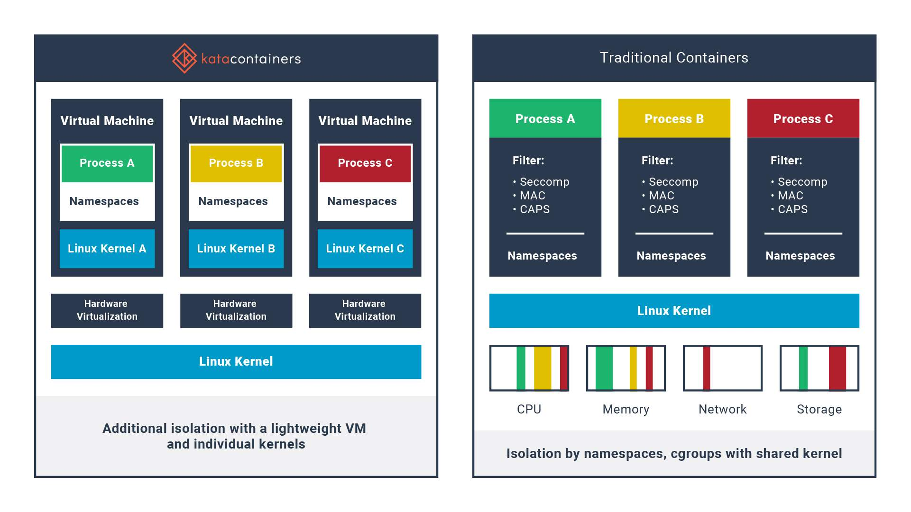
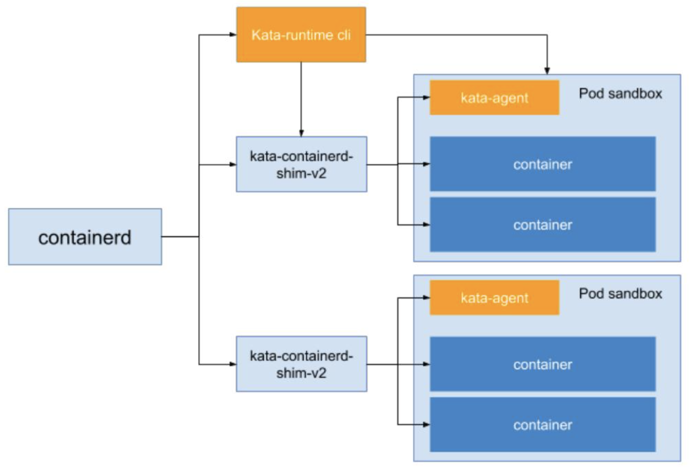

# 7.5.3 安全容器运行时：Kata Containers 

尽管容器有许多技术优势，然而传统以 runc 为代表基于共享内核技术进行的软隔离还是存在一定的风险性。如果某个恶意程序利用系统缺陷从容器中逃逸，就会对宿主机造成严重威胁，尤其是公有云环境，安全威胁很可能会波及到其他用户的数据和业务。

将虚拟机的安全优势与容器的高速及可管理性相结合，为用户提供标准化、安全、高性能的容器解决方案，这就是 Kata Containers 出现的背景。

Kata Containers 安全容器的诞生解决了许多普通容器场景无法解决的问题，例如多租户安全保障、不同 SLO 混部容器混合部署、可信/不可信容器混合部署等等。在这些优势的基础上，Kata Containers 也在虚拟化上也追求极致的轻薄，从而让整体资源消耗和弹性能力接近 runc 容器方案，以此达到 Secure as VM、Fast as Container 的技术目标

Kata Containers 的特点包括：

- 容器和虚拟机二合一：Kata Containers 结合了容器和虚拟机的优点，既具有高性能和高效管理的特点，又拥有独立隔离性和安全性；
- 安全性：Kata Containers 使用轻量级虚拟化技术，为每个容器创建一个轻量级虚拟机，可以实现容器级别的隔离和安全；
- 可扩展性：Kata Containers 支持与多种容器管理工具，如 Docker 和 Kubernetes 集成，可以与现有的容器环境无缝集成；
- 兼容性：Kata Containers 能够支持 OCI（Open Container Initiative）规范，与现有的容器镜像和工具兼容。

	
Kata Containers 与传统容器技术的对比

	

## 1. Kata Containers in  Kubernetes

Kata Containers  运行符合 OCI 规范，同时兼容 Kubernetes CRI （虚拟机级别的 Pod 实现）。为了高效地和 Kubernetes CRI 集成，现在的 Kata-Container 为了缩短容器的调用链直接将 containerd-shim 和 kata-shim 以及 kata-proxy 融合到一起。

CRI 和 Kata Containers 的集成下图所示：

	

