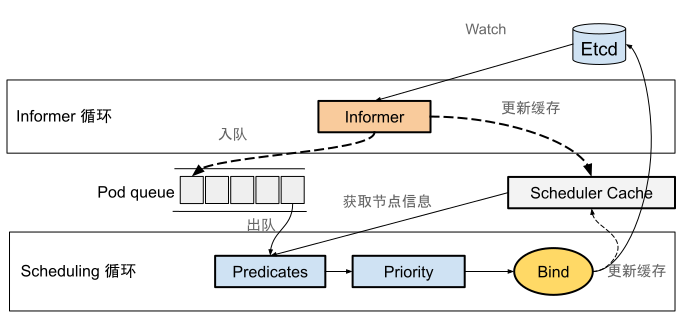
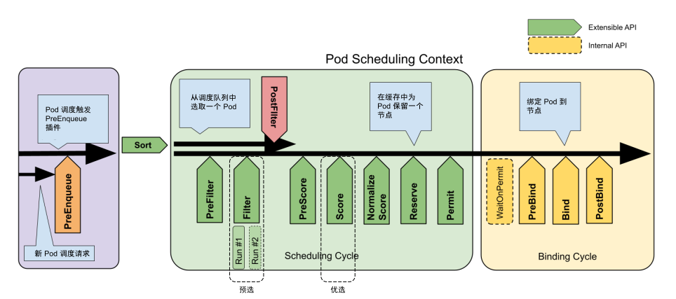

# 7.7.3 调度器与扩展设计

如果集群只有几十个节点，为新创建的 Pod 找到最合适的节点并不困难，但当节点规模达到几千台甚至更多时，问题就变得复杂了：
- 首先，Pod 的创建/更新和节点资源无时无刻不在发生变化，如果每次调度都需要数千次远程请求获取相关信息，势必因耗时过长，导致调度失败率过高。
- 另一方面，调度器频繁的网络请求极容易使其成为集群的性能瓶颈。

:::tip <a/>
为了充分利用硬件资源，通常会将各种类型(CPU 密集、IO 密集、批量处理、低延迟作业)的 workloads 运行在同一台机器上，这种方式减少了硬件上的投入，但也使调度问题更加复杂。

随着集群规模的增大，需要调度的任务的规模也线性增大，由于调度器的工作负载与集群大小大致成比例，调度器有成为可伸缩性瓶颈的风险。

:::right
—— from Omega 论文
:::

Omega 论文中提出了一种基于共享状态（图 7-1 中的 Scheduler Cache）的双循环调度机制，用来解决大规模集群的调度效率问题。双循环的调度机制不仅应用在 Google 的 Omega 系统中，也被 Kubernetes 继承下来。

Kubernetes 默认调度器（kube-scheduler）双循环调度机制如图 7-36 所示。

:::center
  <br/>
  图 7-36 默认调度器 kube-scheduler 的双循环调度机制
:::

根据图 7-37 可以看出，Kubernetes 调度的核心在于两个互相独立的控制循环。

第一个控制循环称为“Informer 循环”。该循环的主要逻辑是启动一系列 Informer 监听（Watch）API 资源（主要是 Pod 和 Node）状态的变化。当 API 资源变化时，触发 Informer 回调函数进一步处理。如一个待调度 Pod 被创建后，触发 Pod Informer 回调函数，该回调函数将 Pod 入队到调度队列中（PriorityQueue），待下一阶段处理。

当 API 资源变化时，Informer 的回调函数还承担对调度器缓存（即 Scheduler Cache）更新的职责，该操作的目的是尽可能将 Pod、Node 的信息缓存化，以便提升后续阶段调度算法的执行效率。

第二个控制循环称为“Scheduling 循环”。该循环主要逻辑是不断地从调度队列（PriorityQueue）中出队一个 Pod。然后，触发两个最核心的调度阶段：预选阶段（图 7-31 中的 Predicates）和优选阶段（图 7-31 中的 Priority）。

这里有必要补充调度器的扩展机制。Kubernetes 从 v1.15 版本起，为默认调度器（kube-scheduler）设计了可扩展的机制 —— Scheduling Framework。这个设计的主要目的，是在调度器生命周期的关键点上（图7-37 中绿色矩形箭头框），向外暴露可以扩展和实现自定义调度逻辑的接口。

:::tip <a/>
需要注意的是，上述可扩展的机制是使用标准 Go 语言插件机制实现的，需要按照规范编写 Go 代码，通过静态编译集成进去。它的通用性和前文提到的 CNI、CSI 或者 CRI 无法相提并论。
:::

:::center
  <br/>
   图 7-37 Pod 的调度上下文以及调度框架公开的扩展点
:::

本文一直强调“**默认**调度器”，指的是本文所阐述的调度逻辑由 Kubernetes 内置一批插件完成。如果你编写自己的调度插件注册到 Scheduling Framework 的扩展点，也就跟默认调度逻辑没有关系了。

我们回到调度处理逻辑中，先来看预选阶段的处理。

预选阶段的主要逻辑是在调度器生命周期的 PreFilter 和 Filter 阶段，调用相关的过滤插件筛选出符合 Pod 要求的 Node 节点集合。

Kubernetes 默认调度器中内置的一批筛选插件，如下所示。
```go
// k8s.io/kubernetes/pkg/scheduler/algorithmprovider/registry.go
func getDefaultConfig() *schedulerapi.Plugins {
  ...
  Filter: &schedulerapi.PluginSet{
      Enabled: []schedulerapi.Plugin{
        {Name: nodeunschedulable.Name},
        {Name: noderesources.FitName},
        {Name: nodename.Name},
        {Name: nodeports.Name},
        {Name: nodeaffinity.Name},
        {Name: volumerestrictions.Name},
        {Name: tainttoleration.Name},
        {Name: nodevolumelimits.EBSName},
        {Name: nodevolumelimits.GCEPDName},
        {Name: nodevolumelimits.CSIName},
        {Name: nodevolumelimits.AzureDiskName},
        {Name: volumebinding.Name},
        {Name: volumezone.Name},
        {Name: interpodaffinity.Name},
      },
    },
}
```

上述插件本质上是按照 Scheduling Framework 规范实现 Filter 方法，根据方法内预设的策略筛选节点。

内置筛选插件的筛选策略，可总结为下述三类：

  - **通用过滤策略**：负责最基础的筛选策略。例如，检查节点可用资源是否满足 Pod 请求（request），检查 Pod 申请的宿主机端口号（spec.nodeport）是否跟节点中端口号冲突。对应的插件有 noderesources、nodeports 等。
  - **节点相关的过滤策略**：与节点相关的筛选策略。例如，检查 Pod 中污点容忍度（tolerations）是否匹配节点的污点（taints）；检查待调度 Pod 节点亲和性设置（nodeAffinity）是否和节点匹配；检查待调度 Pod 与节点中已有 Pod 之间亲和性（Affinity）和反亲和性（Anti-Affinity）的关系。对应的插件有 tainttoleration、interpodaffinity、nodeunschedulable 等。
  - **Volume 相关的过滤策略**：例如，检查 Pod 挂载的 PV 是否冲突（AWS EBS 类型的 Volume 不允许被两个 Pod 同时使用）。或者是检查一个节点上某个类型的 PV 是否超过了一定数目。对应的插件 nodevolumelimits、volumerestrictions 等。

预选阶段执行完毕之后，得到一个可供 Pod 调度的所有节点列表。如果这个列表是空的，代表这个 Pod 不可调度。至此，预选阶段宣告结束，接着进入优选阶段。

优选阶段设计和预选阶段的实现逻辑基本一致，即调用相关的打分插件，对预选阶段得到的节点进行排序，选择出一个评分最高的节点来运行 Pod。

Kubernetes 默认调度器中内置的打分插件如下所示，打分插件与筛选插件稍有不同，它多一个权重属性。

```go
// k8s.io/kubernetes/pkg/scheduler/algorithmprovider/registry.go
func getDefaultConfig() *schedulerapi.Plugins {
  ...
  Score: &schedulerapi.PluginSet{
      Enabled: []schedulerapi.Plugin{
        {Name: noderesources.BalancedAllocationName, Weight: 1},
        {Name: imagelocality.Name, Weight: 1},
        {Name: interpodaffinity.Name, Weight: 1},
        {Name: noderesources.LeastAllocatedName, Weight: 1},
        {Name: nodeaffinity.Name, Weight: 1},
        {Name: nodepreferavoidpods.Name, Weight: 10000},
        {Name: defaultpodtopologyspread.Name, Weight: 1},
        {Name: tainttoleration.Name, Weight: 1},
      },
    }
    ...
}
```

优选阶段最重要的优选策略是 NodeResources.LeastAllocated，它的计算公式大致如下：

$
\text{score} = \frac{\frac{\left( \text{capacity}_{\text{cpu}} - \sum_{\text{pods}}\text{requested}_{\text{cpu}} \right) \times 10 }{\text{capacity}_{\text{cpu}}}  +  {\frac{ \left( \text{capacity}_{\text{memeory}} - \sum_{\text{pods}}(\text{requested}_{\text{memeory}})\right) \times 10 }{\text{capacity}_{\text{memeory}}}   }}{2}
$

可以看到，上述公式实际上是根据节点中 CPU 和内存资源剩余量来打分，使得 Pod 倾向于被调度到资源使用较少的节点，避免某些节点资源过载而其他节点资源闲置。

与 NodeResources.LeastAllocated 一起搭配的，还有 NodeResources.BalancedAllocation 策略，它的计算公式如下。

$
\text{score} = 10 - \text{variance}(\text{cpuFraction}, \text{memoryFraction}, \text{volumeFraction}) \times 10
$

这里的 Fraction 指的是资源的利用比例。笔者以 cpuFraction 为例，它的计算公式是：

$
\text{cpuFraction} =  \frac{\text{ Pod 的 CPU 请求}}{\text{节点中 CPU 总量}}
$

memoryFraction、volumeFraction 也是类似的概念。Fraction 算法的主要作用是：计算资源使用比例的方差，来评估节点的资源（CPU、内存、volume）分配均衡程度，避免出现 CPU 被大量分配，但内存大量剩余的情况。方差越小，说明资源分配越均衡，因此得分越高。

除了上述两种优选策略外，还有 InterPodAffinity（根据 Pod 之间的亲和性和反亲和性规则来打分）、Nodeaffinity（根据节点的亲和性规则来打分）、ImageLocality（根据节点中是否缓存容器镜像打分）、NodePreferAvoidPods（基于节点的注解信息打分）等等，笔者就不再一一解释了。

值得一提的是，上述打分插件的权重可以在调度器配置文件中设置，重新调整它们在调度决策中的影响力。例如，如果你希望更重视 NodePreferAvoidPods 插件的打分结果，可以为该插件设置更高的权重。如下所示：

```yaml
apiVersion: kubescheduler.config.k8s.io/v1
kind: KubeSchedulerConfiguration
profiles:
- schedulerName: default-scheduler
  plugins:
    score:
      enabled:
      - name: NodePreferAvoidPods
        weight: 10000
      - name: InterPodAffinity
        weight: 1
      ...
```

经过优选阶段之后，调度器根据预定的打分策略为每个节点分配一个分数，最终选择出分数最高的节点来运行 Pod。如果存在多个节点分数相同，调度器则随机选择其中一个。

经过预选筛选，优选的打分之后，调度器已选择出调度的最终目标节点。最后一步是通知目标节点中的 Kubelet 创建 Pod 了。

这一阶段，调度器并不会直接与 Kubelet 通信，而是将 Pod 对象的 nodeName 字段的值，修改为上述选中 Node 的名字即可。Kubelet 会持续监控 Etcd 中 Pod 信息的变化，然后执行一个称为“Admin”的本地操作，确认资源是否可用、端口是否冲突，实际上就是通用过滤策略再执行一遍，再次确认 Pod 是否能在该节点运行。

不过，从调度器更新 Etcd 中的 nodeName，到 Kueblet 检测到变化，再到二次确认是否可调度。这一系列的过程，会持续一段不等的时间。如果等到一切工作都完成，才宣告调度结束，那势必影响整体调度的效率。

调度器采用了乐观绑定（Optimistic Binding）的策略来解决上述问题。首先，调度器同步更新 Scheduler Cache 里的 Pod 的 nodeName 的信息，并发起异步请求 Etcd 更新 Pod 的 nodeName 信息，该步骤在调度生命周期中称 Bind 步骤。如果调度成功了，那 Scheduler Cache 和 Etcd 中的信息势必一致。如果调度失败了（也就是异步更新失败），也没有太大关系，Informer 会持续监控 Pod 的变化，将调度成功却没有创建成功的 Pod 清空 nodeName 字段，并重新同步至调度队列。

至此，整个 Pod 调度生命周期宣告结束。
