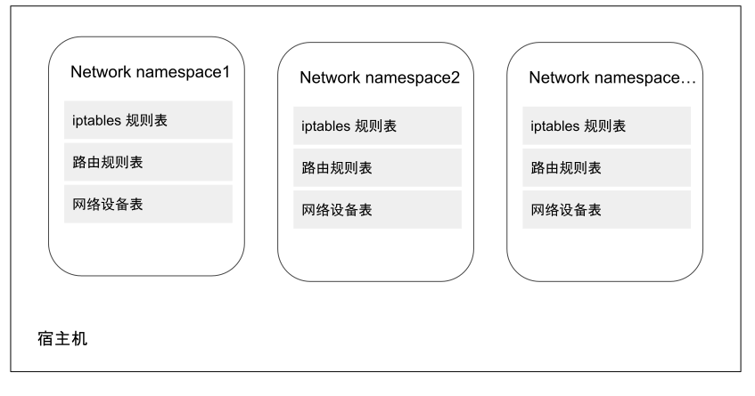

# Linux 网络虚拟化

虚拟化容器是以 Linux 名称空间的隔离性为基础来实现的，那解决隔离的容器之间、容器与宿主机之间、乃至跨物理网络的不同容器间通信问题的责任，很自然也落在了 Linux 网络虚拟化技术的肩上。

Linux 网络虚拟化的主要技术是网络命名空间以及各类虚拟设备，例如 veth、Linux Bridge、tap/tun 等。虚拟化的本质是现实世界的映射，这些虚拟设备像现实世界中的物理设备一样彼此协作，将各个独立的网络命名空间连接起来，构建出不受物理环境约束的各类动态网络拓扑架构。

## 网络命名空间

网络命名空间（Network Namespace）是 Linux Kernel 提供的用于实现网络虚拟化的核心，它能创建多个隔离的网络空间，该网络空间内的防火墙、网卡、路由表、邻居表、协议栈与外部独立，不管是虚拟机还是容器，当运行在独立的命名空间时，就像是一台单独的物理主机。

<div  align="center">
	
	<p>图 2-21 网络命名空间</p>
</div>

由于每个容器都有自己的网络服务，在网络命名空间的作用下，这就使得一个主机内运行两个同时监听 80 端口的 Nginx 服务成为可能（当然，外部访问还需宿主机 NAT）。

Linux ip 工具的子命令 netns 集成了网络命名空间的增删查改功能，笔者这里使用 ip 命令进行操作实践，以便读者了解其过程。

创建新的网络命名空间。

```plain
ip netns add ns1
```

当 ip 命令创建一个网络命名空间时，系统会在 /var/run/netns 生成一个挂载点。挂载点的作用是方便对命名空间进行管理，另一方面也使得命名空间即使没有进程运行也能持续存在。

查询该命名空间的基本信息，由于没有任何配置，因此该命名空间下只有一块状态为 DOWN 的本地回环设备 lo。

```plain
$ ip netns exec ns1 ip link list 
1: lo: <LOOPBACK> mtu 65536 qdisc noop state DOWN mode DEFAULT group default qlen 1000
    link/loopback 00:00:00:00:00:00 brd 00:00:00:00:00:00
```

继续查看该命名空间下 iptables 规则配置，由于是一个初始化的命名空间，所以也并没有任何规则。

```plain
$ ip netns exec ns1 iptables -L -n
Chain INPUT (policy ACCEPT)
target     prot opt source               destination         

Chain FORWARD (policy ACCEPT)
target     prot opt source               destination         

Chain OUTPUT (policy ACCEPT)
target     prot opt source               destination 
```

由于不同的命名空间之间相互隔离，所以同一个宿主机之内的命名空间并不能直接通信，如果想与外界（例如其他网络命名空间、宿主机）进行通信，就需要在命名空间里面插入虚拟网卡（veth），然后再连接到虚拟交换机（Linux Bridge）。没错，这些操作完全和物理环境中的局域网配置一样，只不过全部是虚拟的，用软件实现的而已。

## 虚拟网卡

目前主流的虚拟网卡有 tun/tap 和 veth 两种，在时间上 tun/tap 出现的更早。tun/tap 不是一个设备，而是两个相对独立的虚拟网络设备，其中 tap 模拟了以太网设备，操作的是数据帧，工作在 L3，tun 则模拟了网络层设备，操作的是 IP 报文。

使用 tun/tap 设备的目的是实现把来自于协议栈的数据包先交由某个打开 /dev/net/tun 字符设备的用户进程处理后，再把数据包重新发回到链路中。
我们可以把 tun/tap 理解为一端连着网络协议栈，另一端连着用户态程序。tun/tap 设备可以将 TCP/IP 协议栈处理好的网络包发送给任何一个使用 tun/tap 驱动的进程，只要协议栈中的数据包能被用户态程序截获并加工处理，就能实现例如数据压缩、流量加密、透明代理等功能。

<div  align="center">
	
	<p>图 2-25 VPN 中数据流动示意图</p>
</div>

tun/tap 设备通常用作 overlay 网络传输，如图示例，应用程序通过 tun 发送数据包，tun 设备如果发现另一读被 VPN 程序打开，便会通过字符设备发送给 VPN，VPN 收到数据包，重新修改成新报文，然后作为报文体，再封装到另一个发送给 B 地址的新报文中，这种将一个数据包封装到另一个数据包的处理方式被称为 “隧道”，隧道技术是构建虚拟逻辑网络的经典做法。OpenVPN、Vtun、Flannel 等都是基于 tun/tap 实现隧道封装的，在后续章节讲到的 VXLAN 网卡也是一种 tun 设备。

使用 tun/tap 设备传输数据需要经过两次协议栈，会有多次的封包解包，一定的性能损耗，这也是大家所说 Flannel UDP 模式性能较低的原因。


veth 是另一种主流的虚拟网卡方案，在 Linux Kernel 2.6 版本支持网络命名空间的同时，也提供了专门的虚拟 Veth（Virtual Ethernet，虚拟以太网）设备，用来让两个隔离的网络命名空间可以互相通信。

严格来说，veth 一对设备，因而也常被称作 veth pair。简单理解 veth 就是一根带两个 Ethernet 网卡的`网线`，从一头发数据，另一头收数据，如果 veth-1 和 veth-2 是一对 veth 设备，veth-1 发送的数据会由 veth-2 收到，反之亦然。

<div  align="center">
	
	<p>图 2-22</p>
</div>

因为 veth 这个特性，它常常充当着一个桥梁，连接着宿主机内的虚拟网络，典型的例子像两个隔离的网络命名空间之间的连接、Bridge（Linux 网桥） 和 OVS （Open vSwitch）之间的连接等，通过这种方式，从而构建出复杂的虚拟网络拓扑架构。

<div  align="center">
	
	<p>图 2-23</p>
</div>

我们在 Kubernetes 集群中的宿主机总能看到一堆 veth 开头的网卡设备信息，这些就是为不同 Pod 之间通信而创建的虚拟网卡，在 Kubernetes 宿主机中查看网卡设备。

```plain
$ ip addr
7: veth9c0be5b3@if2: <BROADCAST,MULTICAST,UP,LOWER_UP> mtu 1450 qdisc noqueue master cni0 state UP group default 
    link/ether e2:7c:c8:36:d7:14 brd ff:ff:ff:ff:ff:ff link-netnsid 2
    inet6 fe80::e07c:c8ff:fe36:d714/64 scope link 
       valid_lft forever preferred_lft forever
```
## Linux 网桥

既然有了虚拟网卡，很自然就想到让网卡接入交换机，以实现多个容器间的互相连接。在物理网络中，如果需要连接多个主机，我们会使用网桥（也可以理解为交换机）设备组成一个小型局域网。在 Linux 网络虚拟化系统中，也提供了网桥虚拟实现 Linux Bridge。

Linux Bridge 是 Linux Kernel 2.2 版本开始提供的二层转发工具，与物理交换机机制一致，能够接入任何二层的网络设备（无论是真实的物理设备，例如 eth0 或者虚拟设备，例如 veth、tap 等）。不过 Linux Bridge 与普通物理交换机还有有一点不同，普通的交换机只会单纯地做二层转发，Linux Bridge 却还能把发给它的数据包再发送到主机的三层协议栈中。

部署 Docker 或者 Kubernetes 时，宿主机内的 cni0、docker0 就是它们创建的 Linux 网桥设备。

<div  align="center">
    
    <p>图 2-24 conntrack 示例</p>
</div>


## 网络 - VXLAN

有了各类虚拟设备之后，下一步就是要使用这些设备组成网络。传统的物理拓扑结构相对固定，很难支持云原生时代下逻辑拓扑结构频繁变动的要求，例如灾难恢复、业务迁移等敏捷需求，跨集群甚至跨多个计算中心的可迁移性。SDN（Software Definded Network，软件定义网络）在云计算和分布式时代下应运而生。

SDN 的核心思想是在物理网络之上，再构建一层虚拟化的网络，通过上层控制平面参与对网络的控制管理，以满足业务网络运维的需求。SDN 位于下层的物理网络被称为 Underlay，它着重解决网络的连通性，位于上层的逻辑网络被称为 overlay，它着重为应用提供与软件需求相符的传输服务和拓扑结构。由于跨主机的通信绝大多数都是 overlay 网络，所以在本节，笔者以 VXLAN 为例介绍 overlay 网络原理。

<div  align="center">
	
	<p>图 2-26 SDN 网络模型</p>
</div>

VXLAN 你可能没有听说过，但 VLAN（Virtual Local Area Network，虚拟局域网）相信只要从事计算机行业的人都有所了解，VLAN 是一种早期的网络虚拟化技术，由于二层网络本身特性决定它非常依赖广播，但当设备非常多、广播又非常频繁的时候，很容易形成广播风暴，因此 VLAN 的首要职责是划分广播域，将同一个物理网络的设备区分出来。具体的做法是在以太网的报头增加 VLAN tag，让所有广播只针对相同的 VLAN tag 的设备生效，这样就缩小了广播域，也提高了安全性和可管理性。

不过 VLAN 有一个非常明显的缺陷，就是 VLAN tag 的设计，当时的网络工程师未曾想到云计算在现在会如此普及，只有 12 位来存储 VLAN ID，标准定义中 VLAN 的数量只有 4000 个左右，这显然无法支持大型数据中心数以万记的设备数，另外，VLAN 的二层范围一般较小且固定，也无法支持虚拟机大范围的动态迁移。

为了解决上面这些问题，IETF 定义了 XXLAN 规范，这是三层虚拟化网络（Network Virtualization over Layer 3，NVO3）的标准技术规范之一，是一种典型的 overlay 网络。VXLAN 完美地弥补了 VLAN 的上述不足，一方面通过 VXLAN 中的 24 比特 VNI 字段（如图 1-5 所示）提供多达 16M 租户的标识能力，远大于 VLAN 的 4000；另一方面，VXLAN 本质上在两台交换机之间构建了一条穿越数据中心基础 IP 网络的虚拟隧道，将数据中心网络虚拟成一个巨型“二层交换机”，满足虚拟机大范围动态迁移的需求。

<div  align="center">
	
	<p>图 2-27 VXLAN 报文结构</p>
</div>

虽然从名字上看，VXLAN 是 VLAN 的一种扩展协议，但 VXLAN 内在已经与 VLAN 迥然不同，VXLAN 本质上是一种隧道封装技术，它使用 TCP/IP 协议栈的惯用手法“封装/解封装技术”，将 L2 的以太网帧（Ethernet frames）封装成 L4 的 UDP 数据报，然后在 L3 的网络中传输，效果就像 L2 的以太网帧在一个广播域中传输一样，不再受数据中心传输的限制。VXLAN 的通信原理如下图所示，VXLAN 每个边缘入口都部署了一个 VTEP（VXLAN Tunnel Endpoints，VXLAN 隧道端点），VTEP 是 VXLAN 隧道的起点和终点，VXLAN 对用户原始数据帧的封装和解封装均在 VTEP 上进行，VTEP 既可以是一台独立的网络设备，也可以是在服务器中的虚拟交换机。源服务器发出的原始数据帧，在 VTEP 上被封装成 VXLAN 格式的报文，并在 IP 网络中传递到另外一个 VTEP 上，并经过解封转还原出原始的数据帧，最后转发给目的服务器。

<div  align="center">
	
	<p>图 2-28 VXLAN 通信概览</p>
</div>

VXLAN 对网络基础设施的要求很低，不需要专门的硬件只要三层可达的网络就可以部署 VXLAN。从 Linux Kernel 3.2 起，一台 Linux 主机经过简单配置之后，就可以把 Linux Bridge 作为 VETP 设备使用。VXLAN 带来了很高的灵活性、扩展性和可管理性，已经成为当前构建数据中心的主流技术，绝大多数的公有云（阿里云、华为云、AWS等）的 VPC 都是用 VXLAN 来作为数据转发层面。

