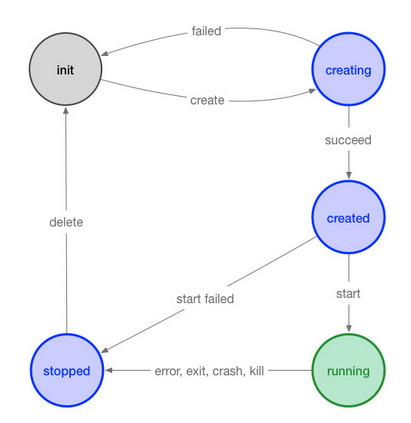

# 7.5.1 底层容器运行时

底层容器运行时主要关注如何与操作系统交互，实现 OCI 运行时规范，利用符合标准的文件等资源运行容器。专注于管理容器的生命周期（创建，运行，销毁等）。

	
图：容器的生命周期

	

目前常见的底层容器运行时实现有：

- **runc** 目前应用最广泛的运行时，由 Docker 中 libcontainer 进化而来 。
- **crun** RedHat 推出的轻量级 OCI 运行时，C 语言编写，与 runc 比较效率更高、资源更省。

除以上基于内核抽象的运行时外，还有一些沙盒和虚拟化的运行时，这些运行时能隔离宿主和容器化进程，并同时遵循 OCI 规范。

- **kata Containers** 由 Clear Containers 和 Hyper.sh 的 runv 合并而来，口号是 Secure as VM、Fast as Container。
- **gVisor** Google 提供的安全隔离的轻量级容器运行时沙箱实现，资源占用较少、不需要运行完整 VM 的容器并提供安全隔离。