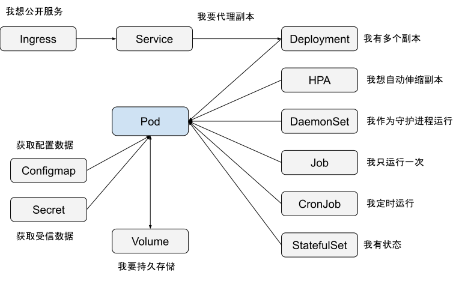

# 7.2 容器的原理与应用

字面上，“容器”这个词难以让人形象地理解其真正含义，Kubernetes 中最核心的概念“Pod”也是如此。

仅靠几句简单的解释并不足以让人充分理解这些概念，甚至可能引发误解。例如，业内常常将容器与轻量级虚拟机混为一谈，如果容器类似于虚拟机，那么应该存在一种通用的方法，能够无缝地将虚拟机内的应用迁移至容器中，但现实中并不存在这种方法。

本节，笔者将从最初的文件系统隔离开始，逐步介绍容器在不同历史阶段的作用，以帮助深入理解容器技术的发展及 Pod 的设计背景。

## 7.2.1 文件系统隔离

容器的起源可以追溯到 1979 年 UNIX 系统中引入的 chroot 命令[^1]。chroot 是“change root”的缩写，它允许管理员将进程的根目录锁定在特定位置，从而限制进程对文件系统的访问范围。

chroot 的隔离功能对安全性至关重要，例如可以创建一个蜜罐，用于安全地运行和监控可疑代码或程序。因此，chroot 环境也被形象地称为“jail”（监狱），而突破 chroot 的过程则被称为“越狱”。

时至今日，chroot 命令仍然活跃于主流的 Linux 系统中。在绝大部分 Linux 系统中，只需几步操作，就可以为进程创建一个文件隔离环境。

```bash
$ mkdir -p new-root/{bin,lib64,root}
$ cp /bin/bash new-root/bin
$ cp /lib64/{ld-linux-x86-64.so*,libc.so*,libdl.so.2,libreadline.so*,libtinfo.so*} new-root/lib64
$ sudo chroot new-root
```
尽管这个隔离环境功能有限，仅提供了 bash 和一些内置函数。但也足以说明它的作用：“运行在 new-root 根目录下的进程，其文件系统与宿主机隔离了”。

```bash
bash-4.2# cd bin 
bash-4.2# pwd
/bin
```
:::tip 额外知识

除了 /bin 之外，如果我们将程序依赖的 /etc、/proc 等目录一同打包进去，实际上就得到了一个 rootfs 文件。因为 rootfs 包含的不仅是应用，还有整个操作系统的文件和目录，这意味着应用及其所有依赖都被封装在一起，这正是容器被广泛宣传为一致性解决方案的由来。
:::

我们再运行一个 docker，看看两者之间的区别。

```bash
$ docker run -t -i ubuntu:18.04 /bin/bash

root@028f46a5b7db:/# cd bin
root@028f46a5b7db:/bin# pwd
/bin
```
虽然 chroot 看起来与容器相似，都是创建与宿主机隔离的文件系统环境，但这并不意味着 chroot 就是容器。chroot 只是改变了进程的根目录，并未创建真正独立、安全的隔离环境。在 Linux 系统中，从低层次的资源（如网络、磁盘、内存、处理器）到操作系统控制的高层次资源（如 UNIX 分时、进程 ID、用户 ID、进程间通信），都存在大量非文件暴露的操作入口。

因此，无论是 chroot，还是针对 chroot 安全问题改进后的 pivot_root，都无法实现对资源的完美隔离。

## 7.2.2 资源全方位隔离

chroot 最初的目的是为了实现文件系统的隔离，并非专门为容器设计。

后来 Linux 吸收了 chroot 的设计理念，先是在 2.4.19 引入了 Mount 命名空间，这样就可以隔离挂载文件系统。又想到进程间通信也需要隔离，就有了 IPC（Process ID）命名空间。同时，容器还需要一个独立的主机名以便在网络中标识自己，于是有了 UTC（UNIX Time-Sharing）命名空间。有了独立的主机名，自然还要有独立的 IP、端口、路由等，又有了 Network 命名空间。

从 Linux 内核 2.6.19 开始，陆续引入了 UTS、IPC、PID、Network 和 User 等命名空间。到 Linux 内核 3.8 版本时，Linux 已经实现了容器所需的六项基本资源隔离。

:::center
表 7-1 Linux 系统目前支持的八类命名空间（Linux 4.6 版本起，新增了 Cgroup 和 Time 命名空间）
:::

| 命名空间 | 隔离的资源 | 内核版本|
|:--|:--|:--|
| Mount| 隔离文件系统挂载点，功能大致类似 chroot | 2.4.19 |
| IPC| 隔离进程间通信，使进程拥有独立消息队列、共享内存和信号量 | 2.6.19|
| UTS| 隔离主机的 Hostname、Domain names，这样容器就可以拥有独立的主机名和域名，在网络中可以被视作一个独立的节点。 | 2.6.19 |
| PID| 隔离进程号，对进程 PID 重新编码，不同命名空间下的进程可以有相同的 PID | 2.6.24 |
| Network| 隔离网络资源，包括网络设备、协议栈（IPv4、IPv6）、IP 路由表、iptables、套接字（socket）等 | 2.6.29 |
| User| 隔离用户和用户组 | 3.8 |
| Cgroup| 使进程拥有一个独立的 cgroup 控制组。cgroup 非常重要，稍后笔者详细介绍。 | 4.6 |
| Time| 隔离系统时间，Linux 5.6 内核版本起支持进程独立设置系统时间 | 5.6 |


在 Linux 中，为进程设置各种命名空间非常简单，只需通过系统调用函数 clone 并指定相应的 flags 参数即可。

```c
int clone(int (*fn)(void *), void *child_stack,
         int flags, void *arg, ...
         /* pid_t *ptid, struct user_desc *tls, pid_t *ctid */ );
```

如下代码所示，通过调用 clone 函数并指定相应的 flags 参数创建一个子进程。新创建的子进程将“看到”一个全新的系统环境，所有的资源，包括进程挂载的文件目录、进程 PID、进程间通信资源、网络及网络设备、UTS 等，都将与宿主机隔离。

```c
int flags = CLONE_NEWNS | CLONE_NEWPID | CLONE_NEWIPC | CLONE_NEWNET | CLONE_NEWUTS;
int pid = clone(main_function, stack_size, flags | SIGCHLD, NULL); 
```

## 7.2.3 资源全方位限制

进程的资源隔离已经完成，如果再对使用资源进行额度限制，就能对进程的运行环境实现进乎完美的隔离。这就要用 Linux 内核的第二项技术 —— Linux Control Cgroup（Linux 控制组群，简称 cgroups）。

cgroups 是 Linux 内核中用于隔离、分配并限制进程组使用资源配额的机制。例如用来控制进程 CPU 占用时间、内存的大小、磁盘 I/O 速度等。该项目由 Google 工程师（主要是 Paul Menage 和 Rohit Seth）在 2000 年发起，当时取名字叫“进程容器”（Process container）。不过，在 Linux 内核中，容器（container）这个名词有许多不同的意义。为了避免与其他“容器”相关概念混淆，于是被重命名为 cgroups 。

2008 年，cgroups 合并到 Linux 内核 2.6.24 版本 后正式对外发布，这一阶段的 cgroups 被称为第一代 cgroups。2016 年 3 月发布的 Linux 内核 4.5 中引入了由 Facebook 工程师 Tejun Heo 重新编写的“第二代 cgroups”。相较于 v1 版本，第二代 cgroups 提供了更加统一的资源控制接口，使得对 CPU、内存、I/O 等资源的限制更加一致和统一。不过由于兼容性和稳定性原因，目前多数容器运行时（container runtime）默认使用的仍然是第一代 cgroups。

Linux 系统通过文件系统向用户暴露 cgroups 的操作接口，这些接口以文件和目录的形式组织在 /sys/fs/cgroup 路径下。在 Linux 中执行 ls /sys/fs/cgroup 命令，可以看到在该路径下有许多子目录，如 blkio、cpu、memory 等。

```bash
$ ll /sys/fs/cgroup
总用量 0
drwxr-xr-x 2 root root  0 2月  17 2023 blkio
lrwxrwxrwx 1 root root 11 2月  17 2023 cpu -> cpu,cpuacct
lrwxrwxrwx 1 root root 11 2月  17 2023 cpuacct -> cpu,cpuacct
drwxr-xr-x 3 root root  0 2月  17 2023 memory
...
```
在 cgroups 中，子目录也被称为控制组子系统（control group subsystems），它们明确了可以限制的资源类型。例如，内存子系统包含以下配置文件：
```bash
$ ls /sys/fs/cgroup/memory
cgroup.clone_children               memory.memsw.failcnt
cgroup.event_control                memory.memsw.limit_in_bytes
cgroup.procs                        memory.memsw.max_usage_in_bytes
cgroup.sane_behavior                memory.memsw.usage_in_bytes
```
这些文件各自具有不同的作用。例如，memory.kmem.limit_in_bytes 文件用于限制应用的总内存使用；memory.stat 用于统计内存使用情况；memory.failcnt 文件报告内存使用达到 memory.limit_in_bytes 设定的限制值的次数，等等。

目前，主流的 Linux 系统支持的控制组群子系统如表 7-2 所示。

:::center
表 7-2 cgroups 控制组群子系统
:::
| 控制组群子系统 | 功能|
|:--|:--|
|blkio | 控制并监控 cgroup 中的任务对块设备(例如磁盘、USB 等) I/O 的存取 |
| cpu | 控制 cgroups 中进程的 CPU 占用率 |
|cpuacct| 自动生成报告来显示 cgroup 中的进程所使用的 CPU 资源 |
| cpuset| 可以为 cgroups 中的进程分配独立 CPU 和内存节点 |
|devices | 控制 cgroups 中进程对某个设备的访问权限|
|freezer | 暂停或者恢复 cgroup 中的任务 |
| memory | 自动生成 cgroup 任务使用内存资源的报告，并限定这些任务所用内存的大小 |
|net_cls | 使用等级识别符（classid）标记网络数据包，这让 Linux 流量管控器（tc）可以识别从特定 cgroup 中生成的数据包 ，可配置流量管控器，让其为不同 cgroup 中的数据包设定不同的优先级|
| net_prio | 可以为各个 cgroup 中的应用程序动态配置每个网络接口的流量优先级 |
|perf_event | 允许使用 perf 工具对 crgoups 中的进程和线程监控|

Linux cgroups 的设计简单易用。对于 Docker 等容器系统，它们只需在每个子系统下为每个容器创建一个控制组（通过新建目录的方式），然后在容器进程启动后，将进程的 PID 写入对应控制组的 tasks 文件即可。

如下代码所示，我们创建了一个新的控制组（目录名为 $hostname），将进程（PID 为 3892）的内存限制为 1 GB，并限制其 CPU 使用时间为 1/4。

```bash
/sys/fs/cgroup/memory/$hostname/memory.limit_in_bytes=1GB // 容器进程及其子进程使用的总内存不超过 1GB
/sys/fs/cgroup/cpu/$hostname/cpu.shares=256 // CPU 时间总数为 1024，设置 256 后，限制进程最多只能占用 1/4 CPU 时间

echo 3892 > /sys/fs/cgroup/cpu/$hostname/tasks 
```

最后，笔者需要补充一点，实际上 cgroups 对资源的限制也存在不完善之处，最常提到的问题是 /proc 文件系统的问题。/proc 文件系统记录了 Linux 系统中一些特殊状态，如 CPU 使用情况和内存占用情况，这些数据也是 top 命令查看系统信息的主要来源。

问题在于，/proc 文件系统并不反映通过 cgroups 对进程施加的限制。因此，在容器内部执行 top 命令时，显示的信息是宿主机的数据，而不是容器内部的数据。在生产环境中，这个问题必须得到解决，不然会给系统带来很大的问题。现在，业内一般使用 LXCFS（FUSE filesystem for LXC）来维护一套专用于容器的 /proc 文件系统，解决这个问题。

至此，相信读者们一定理解容器是什么。容器并不是轻量化的虚拟机，也没有创建出真正的沙盒（容器之间共享系统内核，这也是为什么出现了如 kata 和 gVisor 等内核隔离的沙盒容器，7.4.5 节详细介绍）。容器只是利用命名空间、cgroups 等技术进行资源隔离和限制，并拥有独立的根目录（rootfs）的特殊进程。


## 7.2.4 设计容器协作的方式

既然容器是个特殊的进程，那联想到真正的操作系统内大部分进程也并非独自运行，而是以进程组有原则的组织在一起，共同协作完成某项工作。

登录到一台 Linux 机器，执行 pstree -g 命令展示当前系统中正在运行的进程树状结构。

```bash
$ pstree -g
    |-rsyslogd(1089)-+-{in:imklog}(1089)
    |  |-{in:imuxsock) S 1(1089)
    | `-{rs:main Q:Reg}(1089)
```
如上展示了 Linux 系统中负责处理日志的 rsyslogd 程序的进程树结构。可见 rsyslogd 的主程序 main 以及内核日志模块 imklog 等同属 1089 进程组，这些进程相互协作，共享 rsyslogd 程序的资源，共同完成 rsyslogd 程序的职责。

对于操作系统而言，这种进程组更方便管理，Linux 操作系统只需将信号（如 SIGKILL）发给一个进程组，该进程组中的所有进程都会终止运行。

那么，现在思考一个问题，如果把上面的进程用容器改造跑起来，该如何设计？如果是使用 Docker，自然会想到在 Docker 容器内运行两个进程：
- rsyslogd 执行业务；
- imklog 处理业务日志。

但这样设计会有一个问题：**容器里面 PID=1 的进程该是谁**？在 Linux 系统中，PID 为 1 的进程是 init，它是所有其他进程的祖先进程。它不断地检查进程状态，一旦某个子进程因为父进程错误提前退出而成为孤儿进程，init 就会收养这个子进程。所以，容器内启动的第一个进程也需要实现类似 init 功能，处理 SIGTERM\SIGINT 等信号，优雅结束容器内的进程。

Docker 问题的核心在于 **Docker 容器的设计本身是一种“单进程”模型**，Docker 只能通过监视 PID 为 1 的进程的运行状态来判断容器的工作状态是否正常（即在 dockerfile 中用 ENTRYPOINT 指定启动的进程）。如果确实需要在一个 Docker 容器中运行多个进程，最先启动的命令进程应该具有资源监控和回收等管理能力么，例如使用专为容器开发的 tinit 程序。

但进程间的协作不仅仅是处理资源回收那么简单，容器想要实现类似操作系统进程组那般互相协作，容器下一步的演进就是要找到与“进程组”相对应的概念，这是实现容器从隔离到协作的第一步。

## 7.2.5 超亲密容器组 Pod

Kubernetes 中对应“进程组”的设计概念叫 Pod，Pod 是一组紧密关联的容器集合，它们共享 IPC、Network、UTS 等命名空间，是 Kubernetes 最基本单位。

容器之间原本是被命名空间和 cgroups 隔开的，Pod 第一个要解决的问题是怎么去打破这个隔离，让 Pod 内的容器可以像进程组一样天然的共享资源和数据。Kubernetes 使用了一个特殊的容器（Infra Container）解决这个了问题。

Infra Container 是整个 Pod 中第一个启动的容器，它只有 300 KB 左右大小，主要负责申请容器组的 UTS、IPC、网络等命名空间，Pod 内其他容器通过 setns（Linux 系统调用，把进程加入到某个命名空间中）方式共享 Infra Container 容器的命名空间，其次它还可作为 init 进程，用来管理子进程、回收资源等。

:::tip 额外知识
Infra Container 的逻辑很简单，主要是对 SIGTERM、SIGINT、SIGCHILD 等系统信号进行处理。Infra Container 启动之后执行一个永远循环的 pause() 方法，所以也常被称为“pause 容器”。
:::

:::center
   <br/>
  图 7-4 Pod 内的容器通过 Infra Container 共享网络命名空间
:::

通过 Infra Container，同一 Pod 内的容器共享 UTS、Network、IPC、Time 命名空间。但注意，PID 命名空间和文件命名空间默认还是隔离的，这是因为：
- 容器之间也需要相互独立的文件系统以避免冲突。如果容器之间想要想要实现文件共享，Kubernetes 也提供了 Volume 支持（Volume 的概念将在本章 7.5 节介绍）。
- PID 隔离是因为如果某些容器进程不再具备 PID=1，容器可能会拒绝启动（例如使用 systemd 的容器）。

如果要共享 PID 命名空间，需要在声明 Pod 时，设置 ShareProcessNamespace 为 true，如下 yaml 所示。

```yaml
apiVersion: v1
kind: Pod
metadata:
  name: nginx
spec:
  shareProcessNamespace: true
  ...
```

Pod 内容器共享 PID 命名空间后，Infra Container 将作为 PID=1 的进程，并负责信号处理、子进程的资源回收等。

## 7.2.6 Pod 是 Kubernetes 的基本单位

解决了容器的协作问题，Kubernetes 的功能开始围绕容器和 Pod 不断向实际应用的场景扩展。

因为 Pod 不可能只有一个实例，为了管理多个 Pod 实例的运行，Deployment 这一概念应运而生。Deployment 负责确保指定数量的 Pod 副本始终运行，从而提供高可用性。Pod的IP地址是动态分配的，这意味着需要一个机制来提供稳定的网络访问入口，并在 Pod 实例之间实现负载均衡，这就是 Service 的作用。为了支持应用层协议，如 HTTP 或 HTTPS，并实现基于域名或路径的更细粒度的路由，Ingress 被引入，Ingress 充当反向代理，根据定义的规则将进入的请求路由到后端的 Service 或Pod，从而允许更复杂的流量管理和访问控制策略。

最终，围绕 Pod 绘制出图 7-5 所示 Kubernetes 核心功能全景图。

:::center
  <br/>
  图 7-5 Kubernetes 核心功能全景图
:::

## 7.2.7 Pod 是调度的原子单位

Pod 承担的另外一个重要职责是 —— 作为调度的原子单位。协同调度是非常麻烦的事情。举个例子说明，有以下两个亲和性容器：
- 第一个容器 Nginx（资源需求 1G 内存），它的职责接收请求，并将请求写入主机内的某个日志文件中。
- 第二个容器 LogCollector（资源需求 0.5 G 内存），它的职责是不断读取日志文件，并把日志转发到某个 ElasticSearch 集群中。

当前集群资源是这样一个情况：Node1 有 1.25G 可申请内存，Node2 有 2G 的可申请内存。假设这两个 Pod 因协作需要运行在一台机器上，如果调度器先把 Nginx 调度到 Node1，LogCollector 实际上是没办法调度到 Node1 上的，因为资源不足，调度的流程被阻塞。

虽然能通过新一轮的调度，最终解决，但思考“假如要解决数以万计规模的容器协同调度呢？”：

- 要么等待集群空余资源满足了亲和性约束容器的所需后，才开始统一调度。这是典型的成组调度的解法，但也带来新的问题，调度效率会损失、资源无法充分利用、互相等待还有可能产生死锁。
- 要么就想办法提高单任务调度的效率，通过新一轮的调度解决。Google Omega 系统介绍过一种基于共享状态，通过乐观锁解决因并发导致资源冲突的方式，但方案无疑非常复杂。

将运行资源的需求声明定义在 Pod 上，直接以 Pod 为最小的原子单位来实现调度的话，Pod 与 Pod 之间不存在什么超亲密关系，如果非要有什么关系，就通过网络联系。复杂的协同调度设计在 Kubernetes 中直接消失了。

## 7.2.8 容器的设计模式 Sidecar

通过组合多种不同角色的容器，共享资源、统一调度编排，在 Kubernetes 中是一种非常经典的容器设计模式 —— Sidecar（边车）模式。

Sidecar 模式其实就是在 Pod 里面定义一些专门的容器，通过职责分离与容器的隔离特性，降低容器的复杂度。通过图 7-6 所示的 Sidecar 容器（如日志记录、监控、安全性或数据同步 Sidecar 容器），能看到 Sidecar 模式通过增强或扩展主应用容器的功能，使开发一个高内聚、低耦合的软件变的更加容易。

:::center
  <br/>
  图 7-6 容器中的边车设计模型
:::

在本书第 8 章《服务网格技术》，笔者将以代理模式的 Sidecar 为例，进一步阐述这种设计模式。

[^1]: 2000 年，Linux 内核 2.3 版本引入 pivot_root 技术来实现文件隔离，pivot_root 把整个系统切换到一个新的 root 目录中，避免了 chroot 的安全性问题。现如今的容器技术 LXC、Docker 等等都是使用 pivot_root 实现文件隔离的。
