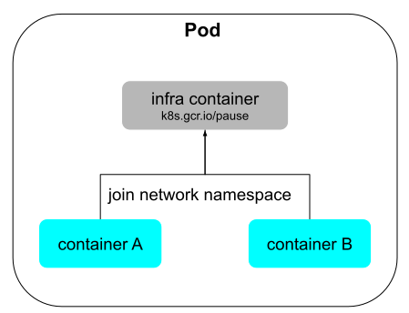
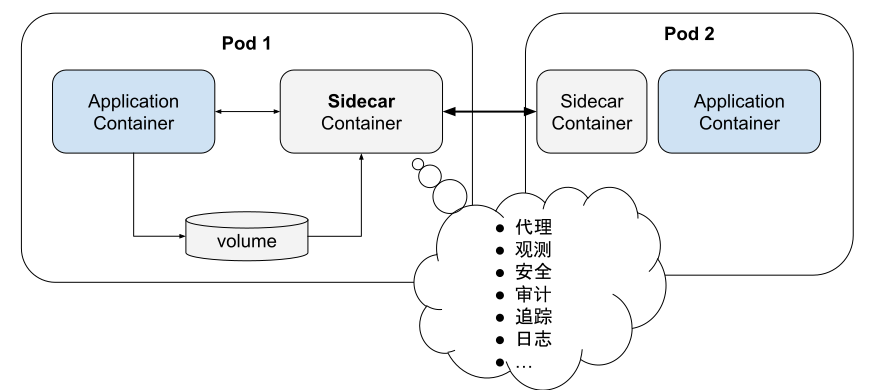

# 7.2 从 Container 到 Pod

从字面上，「Container」这个词很难让人形象地理解其真正含义，容器编排生态中的另外一个词 「Pod」也是如此。仅看一些概念性的解释并不能给我们清晰的认识，甚至会引起误解，例如把容器比作轻量化虚拟机(VM)。

:::tip 如果容器类似虚拟机
那就应该有一种普适的方法把虚拟机里面的应用无缝地迁移到容器中，可是现实世界中并没有这种方法。
:::

为了尽可能深入理解容器，我们从最原始的文件系统隔离讲起。

## 7.3.1 文件系统隔离

1979 年，Unix 系统引入了一个革命性的技术 —— chroot（chang root）。这个命令允许管理员将进程的根目录锁定在指定的位置，从而可以有效的限制该进程访问的文件系统范围。

chroot 隔离能力对安全性至关重要，比如创建一个隔离环境，用来安全地运行和监控可疑的代码或者程序，因此 chroot 之后的环境也被形象地称为监狱（jail）。

仅需几步，就能创建一个 chroot 环境。

```shell
$ mkdir -p new-root/{bin,lib64,root}
$ cp /bin/bash new-root/bin
$ cp /lib64/{ld-linux-x86-64.so*,libc.so*,libdl.so.2,libreadline.so*,libtinfo.so*} new-root/lib64
$ sudo chroot new-root
```

这个 jail 的用处不大，只有 bash 以及一些内置的函数，例如 cd、pwd 等。但也足以说明它的作用：运行在此 jail 下的进程的文件系统与宿主机隔离了。

```shell
bash-4.2# cd bin 
bash-4.2# pwd
/bin
```

:::tip rootfs

除了 /bin 之外，如果我们把程序依赖的 /etc，/proc 等等都打包进去，实际上就得到了一个 rootfs 文件。**由于 rootfs 里打包的不只是应用，而是整个操作系统的文件和目录，也就意味着，应用以及它运行所需要的所有依赖，都被封装在了一起**。

正是由于 rootfs 的存在，容器才有了一个被反复宣传至今的重要特性：一致性。
:::

我们再运行一个 docker，看看两者之间的区别。

```
$ docker run -t -i ubuntu:18.04 /bin/bash

root@028f46a5b7db:/# cd bin
root@028f46a5b7db:/bin# pwd
/bin
```
看起来跟 chroot 差不多，也是一个与宿主机隔离的文件系统环境，那这是否意味着 chroot 就是容器了呢？ 肯定不是：**chroot 只是改变了根目录，而非创建了真正的独立隔离、安全的环境**，chroot 后的进程可以通过几行代码就能从当前的 jail 中逃逸，而且文件系统、网络、设备等等都没有被隔离。

因此，缺少隔离和具备离开监狱的能力，就会导致许多与安全相关的问题。

## 7.3.2 资源全方位隔离

Chroot 最初的目的是为了实现文件的隔离，并非为了容器而设计。后来 Linux 吸收了这些理念，最初在 2.4.19 引入了 Mount 命名空间，这样就可以隔离挂载文件系统。

后来又想到进程间通信也需要隔离，又有了 IPC。同时，容器还需要一个独立的主机名以便在网络中标识自己，有了网络，自然要有独立的 IP、端口、路由等...。从 Linux 内核 2.6.19 起，又陆续添加了 UTS、IPC、PID、Network、User 等命名空间。至 Linux 内核 3.8 版本，Linux 已经完成容器所需的 6 项最基本资源隔离。

表 7-1 Linux 目前支持的八类名称空间

| 名称空间 | 隔离内容 | 内核版本|
|:--|:--|:--|
| Mount| 隔离文件系统挂载点 | 2.4.19 |
| IPC| 隔离进程间通信，使进程拥有独立消息队列、共享内存和信号量 | 2.6.19|
| UTS| 隔离主机的 Hostname、Domain names，这样容器就可以拥有独立的主机名和域名，在网络中可以被视作一个独立的节点。 | 2.6.19 |
| PID| 隔离进程号，对进程 PID 重新编码，不同的名称空间下的进程可以有相同的 PID | 2.6.24 |
| Network| 隔离网络资源，包括网络设备、协议栈（IPv4、IPv6）、IP 路由表、iptables、套接字（socket）等 | 2.6.29 |
| User| 隔离用户和用户组 | 3.8 |
| Cgroup| 使进程拥有一个独立的 cgroup 控制组 | 4.6 |
| Time| 隔离系统时间 | 5.6 |

名称空间使用的方式是通过系统调用，我们创建进程通常使用 fork()，但 fork 背后调用的是 clone()，clone 暴露的参数更多，它的函数定义如下。

```
int clone(int (*fn)(void *), void *child_stack,
         int flags, void *arg, ...
         /* pid_t *ptid, struct user_desc *tls, pid_t *ctid */ );
```

创建的子进程如果想要 mount 自己的根目录、设置自己的 hostname 以及做其他一些事情，就需要通过 flags 参数指定各类名称空间。

如下代码，创建一个新的子进程。

```
int flags = CLONE_NEWNS | CLONE_NEWPID | CLONE_NEWIPC | CLONE_NEWNET | CLONE_NEWUTS;
int pid = clone(main_function, stack_size, flags | SIGCHLD, NULL); 
```

新创建的这个进程将会“看到”一个全新的系统环境，这个环境内，进程的 PID 是 1，只能看到各自 Mount 名称空间里挂载的目录和文件，只能访问到各自 Network 名称空间里的网络设备。

## 7.3.3 资源全方位限制

进程的资源视图隔离已经完成，如果再对使用资源进行额度限制，那么就能对进程的运行环境实现一个进乎完美的隔离。这就要用 Linux 内核的第二项技术： Linux Control Cgroup（控制群组）—— 简称 cgroups。

:::tip cgroups（控制群组）

cgroups 是一种内核级别的资源管理机制，可以实现对 Linux 进程或者进程组的资源限制、隔离和统计功能，最早由 Google 工程师 Paul Menage 和 Rohit Seth 在 2006 年发起，在 2008年 合并到 2.6.24 版内核后正式对外发布，这一阶段的 cgroups 被称为第一代 cgroups。

2016年3月发布的 Linux 内核4.5版本中，搭载了由 Facebook 工程师 Tejun Heo 重新编写的 “第二代cgroups”，相较于 v1版本，Facebook 工程师编写的 cgroups 提供了更加统一的资源控制接口，使得对于CPU、内存、I/O等资源的限制更加一致和统一。不过由于兼容性和稳定性原因，目前多数容器运行时默认使用的是 第一代 cgroups。
:::

通过 /sys/fs/cgroup 查看系统支持的被限制的资源种类。

| 控制群组子系统 | 功能|
|:--|:--|
|blkio | 控制并监控 cgroup 中的任务对块设备(例如磁盘、USB 等) I/O 的存取 |
| cpu | 控制 cgroups 中进程的 CPU 占用率 |
|cpuacct| 自动生成报告来显示 cgroup 中的进程所使用的 CPU 资源 |
| cpuset| 可以为 cgroups 中的进程分配独立 CPU 和内存节点 |
|devices | 控制 cgroups 中进程对某个设备的访问权限|
|freezer | 暂停或者恢复 cgroup 中的任务 |
| memory | 自动生成 cgroup 任务使用内存资源的报告，并限定这些任务所用内存的大小 |
|net_cls | 使用等级识别符（classid）标记网络数据包，这让 Linux 流量管控器（tc）可以识别从特定 cgroup 中生成的数据包 ，可配置流量管控器，让其为不同 cgroup 中的数据包设定不同的优先级|
| net_prio | 可以为各个 cgroup 中的应用程序动态配置每个网络接口的流量优先级 |
|perf_event | 允许使用 perf 工具对 crgoups 中的进程和线程监控|

cgroups 的 API 通过内核文件系统操作接口（cgroupfs）暴露，用户态的程序可以通过操作这些文件实现资源管理。如下代码所示，创建控制组目录（$hostname），以及往各个子系统配置文件写入资源管理配置。

```
/sys/fs/cgroup/memory/$hostname/memory.limit_in_bytes=1GB // 容器进程及其子进程使用的总内存不超过 1GB
/sys/fs/cgroup/cpu/$hostname/cpu.shares=256 // CPU 总 slice 是 1024，因此限制进程最多只能占用 1/4 CPU 时间

echo 3892 > /sys/fs/cgroup/cpu/$hostname/tasks 
```

最后则是将进程 PID 写入 tasks 文件里，配置生效。

至此，相信读者们也一定理解容器是什么，容器不是轻量化的虚拟机，也没有创造出真正的沙盒（容器之间共享系统内核，这也是为什么又出现了 kata、gVisor 等内核隔离的沙盒容器），只是使用了名称空间、cgroups 等技术进行资源隔离、限制以及拥有独立 rootfs 的特殊进程。

## 7.3.4 设计容器协作的方式

既然容器是个特殊的进程，那联想到真正的操作系统内大部分的进程也并非独自运行，而是以进程组有原则的组织在一起，共同协作完成某项工作。

登录到一台 Linux 机器，展示当前系统中正在运行的进程树状结构，执行如下命令：

```
$ pstree -g
    |-rsyslogd(1089)-+-{in:imklog}(1089)
    |  |-{in:imuxsock) S 1(1089)
    | `-{rs:main Q:Reg}(1089)
```
如上，是 Linux 系统中负责处理日志的 rsyslogd 程序。可见 rsyslogd 的主程序 main 以及它要用到的内核日志模块 imklog 等同属 1089 进程组。这些进程相互协作，共享 rsyslogd 程序的资源，共同完成 rsyslogd 程序的职责。

对操作系统而言进程组更方便管理。Linux 操作系统只需将信号（如 SIGKILL）发给一个进程组，该进程组中的所有进程就都会收到这个信号而终止运行。

那么，现在思考一个问题：如果把上面的进程用容器改造跑起来，该如何设计？

如果是使用 Docker，自然会想到启动一个 Docker 容器，里面运行两个进程：rsyslogd 执行业务、imklog 处理业务日志。可是这样设计会有一个问题：**容器里面 PID=1 的进程该是谁**？这个问题的核心在于 **Docker 容器的设计本身是一种“单进程”模型**，Docker 只能通过监视 PID 为 1 的进程的运行状态来判断容器的工作状态是否正常（即由 ENTRYPOINT 启动的进程）。

:::tip 额外知识
在 Linux 系统中，PID 为 1 的进程是 init，它是所有其他进程的祖先进程。它不断地检查进程状态，一旦某个子进程因为父进程错误成为孤儿进程，init 就会回收这个子进程。所以，实现的容器中，启动的第一个进程也需要实现类似 init 功能，处理 SIGTERM\SIGINT 等信号，优雅地结束容器内的进程。

因此，如果确实需要在一个 Docker 容器中运行多个进程，最先启动的命令进程应该具有资源监控和回收等管理能力，譬如针对容器开发的 tinit。
:::

如果容器想要实现类似操作系统进程组那般互相协作，容器下一步的演进就是要找到与“进程组”相对应的概念，这是实现容器从隔离到协作的第一步。

## 7.3.5 超亲密容器组 Pod

Kubernetes 中这个设计叫做 Pod，Pod 是一组紧密关联的容器集合，它们共享 IPC、Network、UTS 等名称空间，是 Kubernetes 调度的基本单位。

容器之间原本是被 Linux Namespace 和 cgroups 隔开的，Pod 第一个要解决的问题是怎么去打破这个隔离，让 Pod 内的容器可以像进程组一样天然的共享资源和数据。

Kubernetes 中使用了一个特殊的容器（Infra Container）解决这个了问题。Infra Container 是整个 Pod 中第一个启动的容器，只有 300 KB 左右的 大小，它负责申请容器组的 UTS、IPC、网络等名称空间，Pod 内其他容器通过 setns（Linux 系统调用，把进程加入到某个名称空间中）方式共享 Infra Container 容器的命名空间，其他它还可作为 init 进程，用来管理子进程、回收资源等。

:::tip 额外知识
Infra Container 中的代码仅是注册 SIGTERM、SIGINT、SIGCHILD 等信号处理，启动之后执行一个永远循环的 pause（） 方法，所以也常被称为“pause 容器”。
默认情况下 infra 镜像的地址为 k8s.grc.io/pause.3.5，很多时候我们部署应用一直处于 Pending 状态 ，大部分原因就是这个镜像地址在国内无法访问造成。
:::

<div  align="center">
  
  <p>图 Kubernetes 架构</p>
</div>

此时，同一 Pod 内的容器共享以下名称空间：

- **UTS 名称空间**：所有容器都有相同的主机名和域名。
- **网络名称空间**：所有容器都共享一样的网卡、网络栈、IP 地址等。同一个 Pod 中不同容器占用的端口不能冲突（这也是 Kubernetes 中 endpoint 的由来）。
- **IPC 名称空间**：所有容器都可以通过信号量或者 POSIX 共享内存等方式通信。
- **时间名称空间**：所有容器都共享相同的系统时间。

不过 PID 名称空间和文件名称空间默认还是隔离的，这是因为容器之间也需要相互独立的文件系统以避免冲突。如果容器之间想要想要实现文件共享，使用共享存储卷即可，这也是 Kubernetes Volume 的由来。

PID 的隔离令每个容器都有独立的进程 ID 编号，如果要共享 PID 名称空间，需要设置 PodSpec 中的 ShareProcessNamespace 为 true，如下所示。
```
spec:
  shareProcessNamespace: true
```

设置之后，Infra Container 中的进程将作为 PID 1 进程，其他容器的进程作为它的子进程存在，后续将由 Infra Container 来负责信号处理、子进程的资源回收等。


## 7.3.6 Pod 是调度的原子单位

Pod 承担的另外一个重要职责是 - 作为调度的原子单位。

协同调度是非常麻烦的事情。举个例子说明，假如有两个亲和性容器：
- 第一个容器 Nginx（资源需求 1G 内存） 接收请求，并将请求写入日志文件。
- 第二个容器 LogCollector（资源需求 0.5 G 内存），它会把 Nginx 容器写的日志文件转发到后端的 ElasticSearch 中。

当前集群环境的可用资源是这样一个情况：Node1 1.25G 内存，Node2 2G 内存。

假如现在没有 Pod 概念，就只有两个亲密协同的容器，它们需要运行在一台机器上。如果调度器先把 Nginx 调度到了 Node1 上面，LogCollector 实际上是没办法调度到 Node1 上的，因为资源不够，这一轮的调度失败，需要重新再发起调度。假如有几十台 Node，数百个、数千个容器，要避免系统因为外部流量压力、代码缺陷、软件更新等等原因出现的中断，那么编排系统该如何高效的运作呢？

有两个比较典型的方案：

- 前面提到的 Mesos 系统中，它会先做资源囤积（resource hoarding），当所有设置了亲和性约束的任务都达到时，才开始统一调度，这是一个非常典型的成组调度的解法。这样也会带来新的问题，调度效率会损失，互相等待还有可能产生死锁。
- 另一个做法是 Google Omega 系统中的做法，他们在论文《Omega: Flexible, Scalable Schedulers for Large Compute Clusters》[^1] 中介绍了如何使用通过乐观并发（Optimistic Concurrency）、冲突回滚的方式做到高效率，但方案无疑非常复杂。

将运行资源的需求声明定义在 Pod 上，直接以 Pod 为最小的原子单位来实现调度的话，Pod 与 Pod 之间也不存在什么超亲密关系（非亲密关系的容器在不同的 Pod 内，通过网络联系），复杂的协同调度设计在 Kubernetes 中直接消失了。

## 7.3.7 容器的设计模式 Sidecar

通过组合两个不同角色的容器，共享资源，统一调度编排，像这样的一个概念，在 Kubernetes 里面就是一个非常经典的容器设计模式，叫做：“Sidecar（边车）”。

观察下面的这辆车，它有三个轮子。其中左边多出来的轮子和座位，就叫做边车。它是可拆卸的，加上之后，就可以带人兜风了。

:::center
  <br/>
  边车模型
:::


容器设计中的 Sidecar 其实在 Pod 里面定义一些专门的容器，这些容器通过提供额外的服务或功能（如日志记录、监控、安全性或数据同步）来增强或扩展主应用容器的功能， 而无需直接修改主应用代码

比如我们前面举的例子，LogCollector 就是 sidecar。

在 ServiceMesh 章节中，读者将会深入理解 Sidecar 的作用。

[^1]: 参见 https://static.googleusercontent.com/media/research.google.com/zh-CN//pubs/archive/41684.pdf