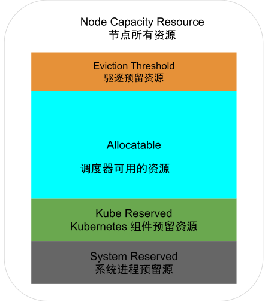

# 7.7.1 资源模型

## 1. 资源的分类

根据物理资源不足时应用表现的差异，Kubernetes 物理资源又可分为两类：

- **可压缩的资源**：此类资源匮乏时，容器内的进程会被限制，应用表现变得卡顿，业务延迟明显增加，但**容器进程不会被杀掉**。可压缩的资源典型代表是 CPU，CPU 资源其实准确来讲，指的是 CPU 时间。它的基本单位为 millicores，1 个核等于 1000 millicores。也代表了 kubernetes 可以将单位 CPU 时间细分为 1000 份。

- **不可压缩的资源**：此类资源容器之间无法共享，完全独占。这也就意味着资源一旦耗尽或者不足，容器内的进程一定因资源不足出现运行问题，并最终触发驱逐操作（稍后介绍）。
  不可压缩资源典型的是内存，内存基本单位是字节，计量方式有多种写法。如使用 M（Megabyte）、Mi（Mebibyte）以及不带单位的数字，以下表达式所代表的是相同的值。

  ```plain
  128974848, 129e6, 129M, 123Mi
  ```
  注意 Mebibyte 和 Megabyte 的区分，123 Mi = `123*1024*1024 B` 、123 M = `1*1000*1000 B`，显然使用带小 i 的更准确。

## 2. 资源扩展

在 Kubernetes 中，标准资源（如 CPU、内存、存储等）是由 Kubelet 自动报告的。但在某些情况下，节点可能会有一些特定的资源（如 GPU、FPGA、某些硬件加速器），Kubernetes 本身并没有识别和管理。

为了解决这个问题，Kubernetes 使用了一个特殊的机制（Extended Resource，扩展资源），用于让集群管理员声明、管理和使用除标准资源（如 CPU 和内存）之外的自定义资源。

为在一个节点上发布一种新的扩展资源，需要发送一个 HTTP PATCH 请求到 Kubernetes API server。例如：假设你的一个节点上带有四个 gpu 资源。下面是一个 PATCH 请求的示例，该请求为`/<your-node-name>`节点发布 4 个 gpu 资源。

```bash
PATCH /api/v1/nodes/<your-node-name>/status HTTP/1.1
Accept: application/json
Content-Type: application/json-patch+json
Host: k8s-master:8080

[
  {
    "op": "add",
    "path": "/status/capacity/nvidia.com~1gpu",
    "value": "4"
  }
]
```
需要注意的是，Kubernetes 并不了解 gpu 资源的含义和用途。前面的 PATCH 请求只是告诉 Kubernetes `<your-node-name>`节点拥有 4 个称之为 gpu 的东西。

然后，使用 kubectl describe node 命令查看节点资源配置情况。可以看到命令输出了刚才扩展的 nvidia.com/gpu 资源容量（capacity）为 4。

```bash
$ kubectl describe node <your-node-name>
...
Capacity:
  cpu: 2
  memory: 2049008Ki
  nvidia.com/gpu: 4
...
```

在定义 Pod 时，可以像请求标准资源（如 CPU 和内存）一样，请求这些自定义的 Extended Resource。以下是一个示例 Pod 的配置。

```yaml
apiVersion: v1
kind: Pod
metadata:
  name: gpu-pod
spec:
  containers:
    - name: cuda-container
      image: nvidia/cuda:10.0-base
      resources:
        limits:
          nvidia.com/gpu: 1
```
可以看到，上面 Pod resources 中，GPU 的资源名称为 nvidia.com/gpu，并且限制了它只能使用 1 个该资源。这意味着调度器会将这个 Pod 分配到一个有足够 nvidia.com/gpu 资源的节点上。当容器启动时，再通过挂载宿主机的 GPU 驱动，就能直接使用 GPU 资源了。

在 Kubernetes 支持的 GPU 方案中，你并不需要去操作上述 Extended Resource 的逻辑，Kubernetes 中，所有的硬件加速设备的管理都通过 Device Plugin 插件来支持，也包括对该硬件的 Extended Resource 进行汇报的逻辑。

各个硬件设备商开发的 Device Plugin 插件以 DaemonSet 方式运行在集群当中，Kubelet 通过 gRPC 接口与 Device Plugin 插件交互，实现设备发现、状态更新、资源上报等。最后，Pod 通过 resource request、limit 显示声明使用即可，如同 CPU、MEM 一样。

:::tip 问题

你注意到 Device Plugin 的问题了么？

Pod 只能过"nvidia.com/gpu:2" 这种简单的“计数形式”，来申请 2 块 GPU，但是关于 2 块卡分别是什么型号、是否拓扑最优、是否共享/独享等等内容，都没有能力进行选择。

在这些特殊场景的催化下，Nvidia、Intel 等头部厂商联合推出了 DRA（Dynamic Resource Allocation，动态资源分配）机制，用于解决现有 Device Plugin 的不足。

:::

## 3. 节点资源管理

由于每台节点上都运行着 kubelet、docker 或 containerd 等 Kubernetes 基础服务，因此在进行资源管理和调度时，需要为此类基础服务预留资源。预留之后的剩余资源才是 Pod 真正可以使用的。

为节点上的基础服务预留多少资源，我们可以使用如下 kubelet 预留的参数来控制：

- --kube-reserved=[cpu=100m][,][memory=100Mi][,][ephemeral-storage=1Gi]：预留给 kubernetes 组件 CPU、内存和存储资源。
- --system-reserved=[cpu=100mi][,][memory=100Mi][,][ephemeral-storage=1Gi]：预留给操作系统的 CPU、内存和存储资源。

需要注意的是，考虑到 Kubernetes 驱逐机制的存在，kubelet 会确保节点上的资源使用率不会达到 100%，因此 Pod 实际可用的资源会再少一些。

最终，一个节点资源分配如图 7-33 所示。节点可分配资源（Node Allocatable Resource）= 节点所有资源（Node Capacity） -（ Kubernetes 组件预留资源（Kube Reserved）-系统预留资源（System Reserved）- 为驱逐预留的资源（Eviction-Threshold）。

:::center
  <br/>
  图 7-33 Node 资源逻辑分配图
:::


