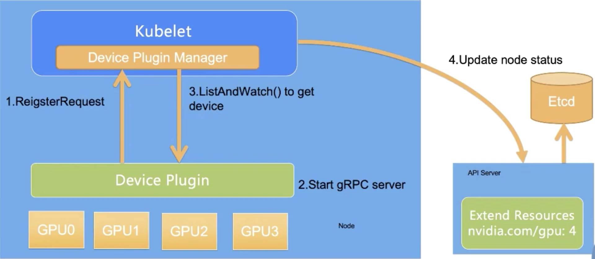

# 7.5.1 资源模型

与调度最具有紧密关系的资源就是 CPU 和内存，根据资源不足表现的差异，这两类资源又可分为：

- **可压缩的资源**：典型的是 CPU，此类资源超限时，容器进程使用 CPU 会被限制，应用表现变得卡顿，业务延迟明显增加，但**容器进程不会被杀掉**。CPU 资源其实准确来讲，指的是 CPU 时间。所以它的基本单位为 millicores，1 个核等于 1000 millicores。也代表了 kubernetes 可以将单位 CPU 时间细分为 1000 份。

- **不可压缩的资源**：典型的是内存，这类资源容器之间无法共享，完全独占。这也就意味着资源一旦耗尽或者不足，容器进程一定产生 OOM 问题（Out of Memory，内存溢出）并**被杀掉**。内存基本单位是字节，计量方式有多种写法，譬如使用 M（Megabyte）、Mi（Mebibyte）以及不带单位的数字，以下表达式所代表的是相同的值。


```plain
128974848, 129e6, 129M, 123Mi
```
注意 Mebibyte 和 Megabyte 的区分，123 Mi = `123*1024*1024B` 、123 M = `1*1000*1000 B`。1M < 1Mi，显然使用带小 i 的更准确。

## 异构资源

Kubernetes 默认仅支持 CPU、内存资源的调度，当容器需要运行特殊资源时，Kubernetes 就无能为力了。异构资源千千万，每种方法使用也不一样，譬如有 RoCE 网卡、GPU、NPU、FPGA 等各种硬件，仅单纯的 GPU 管理，就可以有“每个容器挂 1 个 GPU”，或者“几个容器共用 1 个GPU ”，甚至“1个GPU切分成多个vGPU分别给不同容器用”多种用法。

为了管理这些异构资源，Kubernetes 提供了 Device-plugin 插件。用户需要自己完成这个Device-plugin的开发对接，来实时通知K8s节点上面GPU的使用情况，辅助K8s按需分配GPU算力。


整个Device Plugin的工作流程可以分成两个部分：
- 一个是启动时刻的资源上报。其中ListAndWatch对应资源的上报，同时还提供健康检查的机制。当设备不健康的时候，可以上报给Kubernetes不健康设备的ID，让Device Plugin Framework将这个设备从可调度设备中移除
- 另一个是用户使用时刻的调度和运行。Allocate会被Device Plugin在部署容器时调用，传入的参数核心就是容器会使用的设备ID，返回的参数是容器启动时，需要的设备、数据卷以及环境变量。

:::center
  <br/>
:::


device plugin 交互实现整套机制，这套机制在 K8s 早期还是够用的，但也有局限性。

譬如大模型训练依赖高性能网络，而高性能网络的节点间通信需要用到 RDMA 协议和支持 RDMA 协议的网络设备，而这些设备又和 GPU 在节点上的系统拓扑层面是紧密协作的，这就要求在分配 GPU 和 RDMA 时需要感知硬件拓扑，尽可能就近分配这种设备

Kubernetes从 v1.26 开始引入DRA机制，DRA（Dynamic Resource Allocation，动态资源分配）是对现有Device Plugin机制的补充，并不是要替代Device Plugin机制。


## 节点可用资源

由于每台 node 上会运行 kubelet/docker/containerd 等 Kubernetes 相关基础服务，因此并不是一台 node 的所有资源都能给 Kubernetes 创建 Pod 用。 所以，Kubernetes 在资源管理和调度时，需要把这些基础服务的资源使用量预留出来。

预留的资源可以通过下面的参数控制：

- --kube-reserved=[cpu=100m][,][memory=100Mi][,][ephemeral-storage=1Gi]：控制预留给 kubernetes 集群组件的 CPU、memory 和存储资源
- --system-reserved=[cpu=100mi][,][memory=100Mi][,][ephemeral-storage=1Gi]：预留给系统的 CPU、memory 和存储资源


这两块预留之后的资源才是 Pod 真正能使用的，不过考虑到 eviction 机制，kubelet 会保证节点上的资源使用率不会真正到 100%，因此 Pod 的实际可使用资源会稍微再少一点。一个 Node 节点的资源逻辑分配如下图所示。

:::center
  <br/>
  图 7-1 Node 资源逻辑分配图
:::

节点的可用资源 Node Allocatable Resource = Node Capacity - Kube Reserved - System Reserved - Eviction-Threshold


