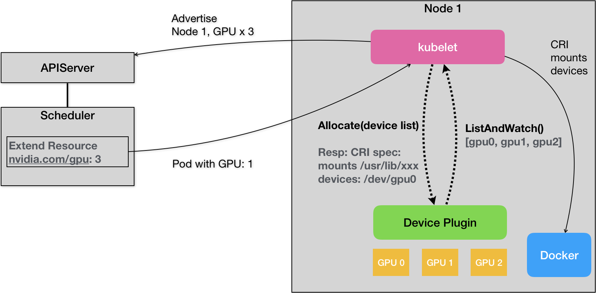

# 7.7.1 资源模型

## 1. 资源的分类
与调度最具有紧密关系的资源就是 CPU 和内存，根据资源不足表现的差异，这两类资源又可分为：

- **可压缩的资源**：典型的是 CPU，此类资源超限时，容器进程使用 CPU 会被限制，应用表现变得卡顿，业务延迟明显增加，但**容器进程不会被杀掉**。CPU 资源其实准确来讲，指的是 CPU 时间。所以它的基本单位为 millicores，1 个核等于 1000 millicores。也代表了 kubernetes 可以将单位 CPU 时间细分为 1000 份。

- **不可压缩的资源**：典型的是内存，这类资源容器之间无法共享，完全独占。这也就意味着资源一旦耗尽或者不足，容器进程一定产生 OOM 问题（Out of Memory，内存溢出）并**被杀掉**。内存基本单位是字节，计量方式有多种写法，譬如使用 M（Megabyte）、Mi（Mebibyte）以及不带单位的数字，以下表达式所代表的是相同的值。


```plain
128974848, 129e6, 129M, 123Mi
```
注意 Mebibyte 和 Megabyte 的区分，123 Mi = `123*1024*1024 B` 、123 M = `1*1000*1000 B`，显然使用带小 i 的更准确。

## 2. 支持异构资源

当容器运行需要一些特殊资源，Kubernetes 就无能为力了，为了支持异构计算和高性能网络，Kubernetes 提供了 Device Plugin 与各类高性能硬件集成。如此，设备厂商只需要实现相应的 API 接口，无需修改 Kubelet 主干代码，就可以实现譬如 RoCE 网卡、GPU、NPU、FPGA 等各种设备的扩展。

如下代码所示，在安装好驱动的前提下，两个步骤就可以使用 GPU 资源：

1. 安装 NVIDIA 设备插件来识别和管理 GPU 资源。
```bash
$ kubectl create -f https://raw.githubusercontent.com/NVIDIA/k8s-device-plugin/v0.9.0/nvidia-device-plugin.yml
```

2. 创建一个需要一个 NVIDIA GPU 的 Pod。

```yaml
apiVersion: v1
kind: Pod
metadata:
  name: gpu-pod
spec:
  containers:
    - name: cuda-container
      image: nvidia/cuda:10.0-base
      resources:
        limits:
          nvidia.com/gpu: 1
```

实际上 Device plugins 就是需要实现 ListAndWatch 和 Allocate 两个接口的 grpc server，其中：

- ListAndWatch: Kubelet 会调用该 API 做设备发现和状态更新（比如设备变得不健康）；
- Allocate: 当 Kubelet 创建要使用该设备的容器时，Kubelet 会调用该 API 执行设备相应的操作并且通知 Kubelet 初始化容器所需的 device、volume 和环境变量的配置。

:::center
  <br/>
:::

device plugin 能实现一些异构资源基本支持，但面临复杂的场景还是有点能力不足。譬如大模型训练场依赖高性能网络，而高性能网络的节点间通信需要用到 RDMA 协议和支持 RDMA 协议的网络设备，而这些设备又和 GPU 在节点上的系统拓扑层面是紧密协作的，这就要求在分配 GPU 和 RDMA 时需要感知硬件拓扑，尽可能就近分配这种设备。

Kubernetes 从 v1.26 开始引入 DRA（Dynamic Resource Allocation，动态资源分配）机制，用于解决现有 Device Plugin 机制的不足。相比于现有的 Device Plugin ，DRA 更加开放和自主，能够满足一些复杂的使用场景。

## 3. 节点资源分配控制

由于每台 node 上会运行 kubelet/docker/containerd 等 Kubernetes 相关基础服务，因此并不是一台 node 的所有资源都能给 Kubernetes 创建 Pod 用。 所以，Kubernetes 在资源管理和调度时，需要把这些基础服务的资源使用量预留出来。

预留的资源可以通过下面的参数控制：

- --kube-reserved=[cpu=100m][,][memory=100Mi][,][ephemeral-storage=1Gi]：控制预留给 kubernetes 集群组件的 CPU、memory 和存储资源
- --system-reserved=[cpu=100mi][,][memory=100Mi][,][ephemeral-storage=1Gi]：预留给系统的 CPU、memory 和存储资源


这两块预留之后的资源才是 Pod 真正能使用的，不过考虑到 eviction 机制，kubelet 会保证节点上的资源使用率不会真正到 100%，因此 Pod 的实际可使用资源会稍微再少一点。一个 Node 节点的资源逻辑分配如下图所示。

:::center
  <br/>
  图 7-1 Node 资源逻辑分配图
:::

节点的可用资源 Node Allocatable Resource = Node Capacity - Kube Reserved - System Reserved - Eviction-Threshold


