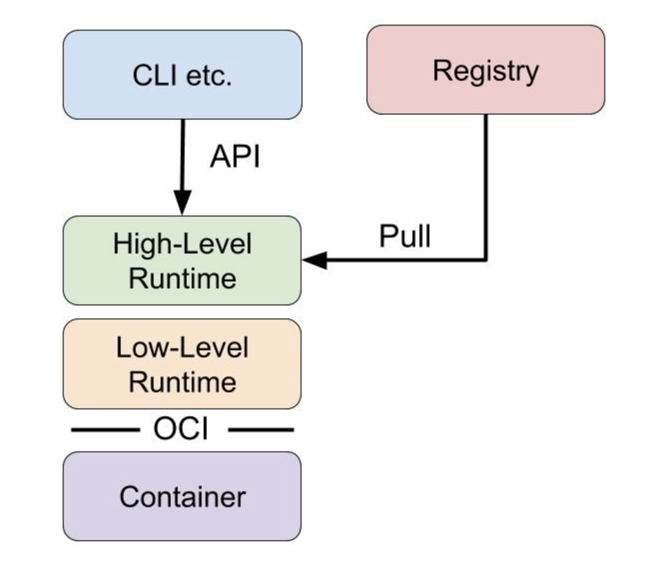

# 7.5 容器运行时

容器运行时（container runtime），对于 runtime 理解是：“为了运行特定语言而提供的特定实现和设计”。 具体到容器运行时的理解，通俗地讲就是：容器从拉取镜像创建、启动、运行管理、销毁的一个完整生命周期。

以 Docker 为例，作为一个整体容器运行时实现，主要提供的功能如下：

- 制定容器镜像格式
- 构建容器镜像
- 运行容器
- ...

## 1. 容器运行时分类

目前较为流行说法根据不同的功能实现将容器运行时分成了低层运行时（low-level）和高层运行时（high-level）两类。

通常只关注如 Namespace、Cgroups、镜像拆包等基础的容器运行时实现被称为**低层运行时**（low-level container  runtime）。而支持更多高级功能（如镜像管理和 CRI 实现）的运行时通常称为**高层运行时**（high-level container runtime）。

而特殊的 Docker 容器引擎，可以说是 high-high-level container runtime 。

两类运行时按照各自的分工，共同协作完成容器整个生命周期的管理工作。

	

