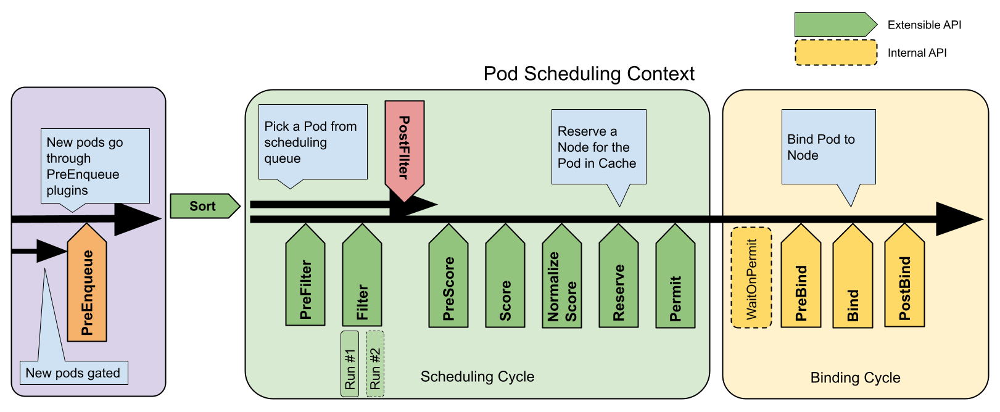

# 7.5.5 调度插件 

Kubernetes 默认调度器是以 Pod 为调度单元进行依次调度的，并不考虑 Pod 之间的关联关系。但是很多数据**计算类的离线作业具有组合调度的特点，要求所有的子任务都能够成功创建后，整个作业才能正常运行**，即所谓的 All_or_Nothing。

例如：JobA 需要 4 个 Pod 同时启动，才算正常运行。kube-scheduler 依次调度 3 个 Pod 并创建成功，到第 4 个 Pod 时，集群资源不足，则 JobA 的 3 个 Pod 处于空等的状态。但是它们已经占用了部分资源，如果第 4 个 Pod 不能及时启动的话，整个 JobA 无法成功运行，更糟糕的集群其他的资源刚好被 JobB 的 3 个 Pod 所占用，同时在等待 JobB 的第 4 个 Pod 创建，此时整个集群就出现了死锁。

**解决以上问题的思想是将调度单元从 Pod 修改为 PodGroup，以组的形式进行调度，实现「Gang Scheduling」**。为此，Kubernetes 提供的「调度插件」框架，核心思想是将 Pod 调度过程中的每个环节都尽可能插件化，开发者可以通过实现扩展点所定义的接口来实现插件，将插件注册到扩展点，使用户可以实现自己的容器调度逻辑。

:::center
   
  pod 的调度流程和调度框架公开的扩展点；Filter也就是谓词过滤器（predicate filter），Scoring等同于优先算法(Priority function)，注册的插件将会在对应的扩展点被调用。
:::

目前业内开源的一些调度器，譬如华为 Volcano、阿里巴巴 Koordinator 等，虽功能上有些差异，但总体而言是先实现基本的 Gang Scheduling 功能，提供主流架构的 CPU、GPU 在内的异构设备混合调度能力，再补些 MPI 等辅助功能。

:::center
   
 Koordinator 概述
:::