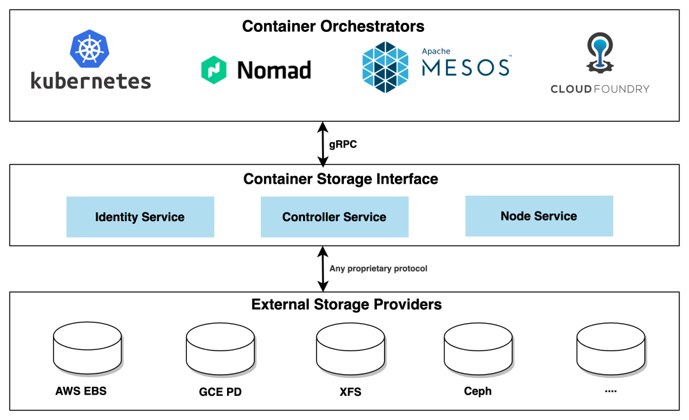

# 7.5 持久化存储设计的演进

:::tip 容器内部的存储

容器是镜像的运行实例，在 7.3 节，我们详细分析过镜像的原理，作为不可变的基础设施，要求同一份镜像能复制出完全一致的镜像实例，这就意味着在容器内写入的任何数据是无法真正写入镜像内。

容器启动时后的 rootfs，本质是利用 UnionFS（Union File System，联合文件系统） 实现的一个堆叠的文件系统。容器内部的进程在这个堆叠系统内写入数据的，是写在了利用 CoW（Copy-on-write，写时复制）技术创建一个可写层内。当容器被销毁，读写层也随之销毁，内部的数据也必然会随着容器的消逝而消失。

:::

那么容器如何实现持久化存储呢？我们先看看在计算机体系中是怎么设计的。在计算机体系中，硬盘被定义为外设，如果要使用，得先添加（Attach）一块磁盘（Volume），然后再挂载（Mount）到某个目录。设计容器目的是实现操作系统的虚拟化，自然地 Volume 和 Mount 的设计自然也被继承到容器系统中。 

不论是 Docker 或者 Kubernetes 都抽象出了数据卷（Volume）来解决持久化存储的问题。有了数据卷，容器的存储就变成了**只读层（容器镜像） + 读写层 + 外置存储（数据卷）**。

但存储本来就不是一件简单的事情：存储位置不限于宿主机（还有网络存储）、存储的介质不限于只是磁盘（还有 tmpfs）、存储的管理不限于简单的映射关系（还有各种访问模式）、存储的类型又有临时和持久之分等等。

反应到 Kubernetes 持久化存储设计中，仅 Volume 的类型就有十几种之多。

:::center
  <br/>
:::

乍一看，这么多的类型，这么多的操作，实在难以下手。然而，总结起来其实主要有两种类型：

- 非持久化的 Volume（Non-Persistent Volume or also called ephemeral storage）
- 持久化的 PersistentVolume

## 非持久化的 Volume

非持久化的 Volume 跟 Docker 比较类似。

使用 Docker 时，类似下面的命令，创建 Volume 数据卷，然后挂载到指定容器的指定路径下，以实现容器数据的持久化存储（持久化在宿主机节点，不能和 Kubernetes 的持久化等同而论）。 

```
docker run -v /usr/share/nginx/html:/data nginx:lastest
```

上面的操作实际上相当于在容器中执行下面类似的代码。

```
// 将宿主机中的 /usr/share/nginx/html 挂载到 rootfs 指定的挂载点 /data 上
mount("/usr/share/nginx/html","rootfs/data", "none", MS_BIND, nulll)
```

Volume 的设计目标并不是为了持久地保存数据，而是为同一个 Pod 中多个容器提供可共享的存储资源。

:::center
  <br/>
:::

从上面的架构图所示，Volume 是包在 Pod 内的，因此其生命周期与挂载它的 Pod 是一致的，当 Pod 因某种原因被销毁时，Volume 也会随之删除。

EmptyDir 就是一种典型的 Non-Persistent Volume。常见的应用方式是一个 sidecar 容器通过 EmtpyDir 来读取另外一个容器的日志文件。


另外一种 HostPath，它是将宿主机节点上的文件系统上的文件或目录，直接挂载到 Pod 中。我们使用 Loki 日志系统，第一步就是要 Pod 挂载相同的宿主机 hostPath Volume，这样才能读取到所有 Pod 写入的日志。


## 从临时卷到持久化存储

想要让数据能够持久化，首先就需要将 Pod 和卷的声明周期分离，这也就是引入持久卷 PersistentVolume(PV) 的原因。

PV 为 Kubernete 集群提供了一个如何提供并且使用存储的抽象，如下代码所示，声明了一个 PV 存储对象，并描述了存储能力、访问模式、存储类型、回收策略、后端存储类型等信息。

```
apiVersion: v1
kind: PersistentVolume
metadata:
  name: pv1
spec:
  capacity:  #容量
    storage: 5Gi
  accessModes:  #访问模式
  - ReadWriteOnce
  persistentVolumeReclaimPolicy: Recycle  #回收策略
  storageClassName: slow  
  nfs:
    path: /
    server: 172.17.0.2
```

PV 描述了详细的存储信息，但对应用层的开发者却不太友好，应用层开发者只想知道我有多大的空间、I/O 是否满足要求，并不关心存储底层的配置。这时就需要对存储服务再次进行抽象，把应用开发者关心的逻辑再抽象一层出来，这就是 PVC（Persistent Volume Claim）。


如下声明一个 PVC，与某个 PV 绑定后再被应用（Pod）消费。

```
apiVersion: v1
kind: PersistentVolumeClaim
metadata:
  name: pv-claim
spec:
  storageClassName: manual
  accessModes:
    - ReadWriteOnce
  resources:
    requests:
      storage: 3Gi
```

在 Pod 中使用存储：

```
apiVersion: v1
kind: Pod
metadata:
  name: test-nfs
spec:
  containers:
  - image: nginx:alpine
    imagePullPolicy: IfNotPresent
    name: nginx
    volumeMounts:
    - mountPath: /data
      name: nfs-volume
  volumes:
  - name: nfs-volume
    persistentVolumeClaim:
      claimName: pv-claim
```

此时 NFS 的远端存储就挂载了到 Pod 中 nginx 容器的 /data 目录下。

PVC 和 PV 的设计，其实跟“面向对象”的思想完全一致：
- PVC 可以理解为持久化存储的“接口”，它提供了对某种持久化存储的描述，声明需要的存储类型、大小、访问模式等需求；
- 而这个持久化存储的实现部分则由 PV 负责完成。

作为应用开发者，我们只需要跟 PVC 这个“接口”打交道，而不必关心底层存储实现是 NFS 还是 Ceph。


## 从静态到动态

前面通过人工管理 PV 的方式叫作 Static Provisioning，如果是小规模的集群，这种方式倒也不是什么问题。但在一个大规模的 Kubernetes 集群里很可能有成千上万个 Pod，这肯定没办法靠人工的方式提前创建出成千上万个 PVC。所以，Kubernetes 为我们提供了一套可以自动创建 PV 的机制，即：Dynamic Provisioning。

Dynamic Provisioning 机制工作的核心在于一个名叫 StorageClass 的 API 对象，这个对象的作用其实就是创建 PV 的模板，它的定义主要包名称、存储提供者（provisioner）以及存储的相关参数。

如下示例，定义了一个名为 standard 的 StorageClass，存储提供者为 为 aws-ebs，其存储参数设置了一个 type ，值为 gp2，回收策略为 Retain。

```
apiVersion: storage.k8s.io/v1
kind: StorageClass
metadata:
  name: standard
provisioner: kubernetes.io/aws-ebs
parameters:
  type: gp2
reclaimPolicy: Retain
allowVolumeExpansion: true
mountOptions:
  - debug
volumeBindingMode: Immediate
```

https://kubernetes-csi.github.io/docs/drivers.html

现在，基于 StorageClass 的动态资源提供模式已经逐步成为各类云平台的标准存储管理模式。


## 从 in-tree 到 out-tree 的转变

CSI 存储提供商有两种类型，一种是 in-tree（树内类型），一种是 out-tree（树外类型）。前者是运行在k8s核心组件内部的存储插件；后者是一个独立于 Kubernetes 组件运行的存储插件，代码实现与 Kubernetes 本身解耦。

Kubernetes 最开始内置了 20 多种存储插件，但内置的往往满足不了定制化的需求。所以，和 CNI 一样，Kubernetes 也对外暴露存储接口，只要实现对应的接口方法，那么就可以创建属于自己的存储插件。

~~FlexVolume~~ 这个功能特性在 Kubernetes v1.2 引入

从 1.9 开始又引入了 Container Storage Interface（CSI）机制，CSI 的设计思想是将存储管理和容器编排系统解耦，使得新的存储系统可以通过实现一组标准化的接口来与 Kubernetes 进行集成，而无需修改 Kubernetes 的核心代码。
CSI 驱动器的出现为 Kubernetes 用户带来了更多的存储选择，同时也为存储供应商和开发者提供了更方便的接入点，使得集群的存储管理更加灵活和可扩展。值得注意的是 CSI 是整个容器生态的标准存储接口，同样适用于 Mesos、Cloud Foundry 等其他的容器集群调度系统。


:::center
  <br/>

:::

由于 CSI 的机制复杂、涉及的组件众多，详细介绍 CSI 工作原理也偏离了本节内容的范畴，相关的内容就不再过多介绍。接下来，我们从原理分析转回到开发者应用视角。得益 Kubernetes 的开放性设计，通过下图感受支持 CSI 的存储生态，基本上包含了市面上所有的存储供应商。

:::center
  <br/>

  CNCF 下的 Kubernetes 存储生态
:::

上述众多的存储系统实在无法一一展开，但无论多少种系统/供应商，总结其提供的存储类型来说无外乎 3 种：文件存储、块存储和对象存储。

### 块存储

块存储是最接近物理介质的，这些存储的介质不关心也无法关心数据的组织方式以及结构，那就用最简单粗暴的组织方式把所有数据按照固定的大小分块，每一块赋予一个用于寻址的编号，然后再通过与块设备匹配的协议（SCSI、SATA、SAS、FCP、FCoE、iSCSI..）进行读写。

我们最熟悉的块设备就是硬盘，以大家比较熟悉的机械硬盘为例，一块就是一个扇区，老式硬盘是512字节大小，新硬盘是4K字节大小。为了方便管理，硬盘这样的块设备通常可以划分为多个逻辑块设备，也就是我们熟悉的硬盘分区（Partition）。反过来，单个介质的容量、性能有限，可以通过某些技术手段把多个物理块设备组合成一个逻辑块设备，例如各种级别的 RAID，JBOD，某些操作系统的卷管理系统（Volume Manager）如 Windows 的动态磁盘、Linux的 LVM 等。

块存储本身处于整个存储软件栈的底层，不经过 OS 缓存，因此**具有超低的时延和超高的吞吐**。但缺陷是每个块是独立的，如果是多个系统对其操作，缺乏一个集中的控制机制来解决数据冲突和同步的问题，导致**块存储设备通常是不能共享**，无法被多个客户端（节点）挂载，在 Kubernetes 中类型为块存储的 Volume 访问模式都要求必须是 RWO（ReadWriteOnce，可读可写，但只支持被单个节点挂载）。

不关心数据的组织方式/内容，接口朴素简单，所以块存储并不是提供给自然人，而是提供给专门的文件系统以及专业的备份管理软件、分区软件以及数据库使用。

### 文件存储

块设备存储的是最原始的 0 和 1的二进制数据，这对于人类用户来说实在是过于难以使用、难以管理。

因此我们用“文件”这个概念对这些数据进行组织，所有用于同一用途的数据，按照不同应用程序要求的结构方式组成不同类型的文件（通常用不同的后缀来指代不同的类型），然后我们给每一个文件起一个方便理解记忆的名字。而当文件很多的时候，我们按照某种划分方式给这些文件分组，每一组文件放在同一个目录，所有的文件、目录形成一个树状结构。

把存储介质上的数据组织成目录-子目录-文件这种形式的数据结构，再这个数据结构之中加入其他控制信息，就能很方便地扩展出更多的高级功能，比如除了文件占用的块地址信息外，在表中再加上文件的逻辑位置就形成了目录，加上文件的访问标志就形成了权限，我们还可以再加上文件的名称、创建时间、所有者、修改者等一系列的元数据信息。人们把定义文件分配表应该如何实现、储存哪些信息、提供什么功能的标准称为文件系统（File System），很常用的文件系统如 FAT32、NTFS、exFAT、ext2/3/4、XFS、BTRFS 等等。

绝大多数文件系统都是基于块存储之上去实现的，但文件存储的访问不像块存储因设备差异有五花八门的协议，其 POSIX 接口（Portable Operating System Interface，POSIX）已经成为事实标准，诸如 Open、Write、Read 等许多操作数据的接口都能在上述文件系统中被找到。

而在网络存储中，底层数据并非存储在本地的存储介质，而是另外一台服务器上，不同的客户端都可以用类似文件系统的方式访问这台服务器上的文件，这样的系统叫网络文件系统（Network File System），常见的网络文件系统有 Windows 网络的CIFS（也叫SMB）、类 Unix 系统网络的 NFS 等。而文件存储除了网络文件系统外，FTP、HTTP 其实也算是文件存储的某种特殊实现，都是可以通过某个 url 来访问一个文件。

### 对象存储

文件存储的树状结构以及路径访问方式虽然方便人类理解、记忆和访问，但计算机需要把路径进行分解，然后逐级向下查找，最后才能查找到需要的文件，对于应用程序来说既没必要，也很浪费性能。而块存储呢，虽然性能出色，但难以理解且无法共享。选择困难症发作的同时，我们思考是否能有一种兼具性能、还要实现共享、同时满足大规模扩展需求的新型存储系统呢？这就是对象存储。

对象存储中的“对象”可以理解为一个元数据及与其配对的一个逻辑数据块的组合，元数据提供了对象所包含的上下文信息，比如数据的类型、大小、权限、创建人、创建时间，等等，数据块则存储了对象的具体内容。所有的数据都在同一个层次中，通过数据的唯一地址标识来识别并查找数据。

当然，对于不同的软件系统来说，一次访问需要获取的不一定是单个我们传统意义上的文件，根据不同的需要可能只是一个/组值，某个文件的一部分，也可能是多个文件的组合，甚至是某个块设备，统称为对象。

从设计之初衷（一般的对象存储都是基于哈希环之类的技术来实现），对象存储就可以非常简单的扩展到超大规模，因此非常适合数据量大、增速又很快的非结构化的数据（视频、图像等）。

公有云的的对象存储服务如 AWS S3、腾讯云的 COS、阿里云的 OSS 等，开源的产品有 Ceph、Minio、Swift 等。

