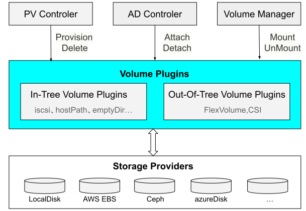
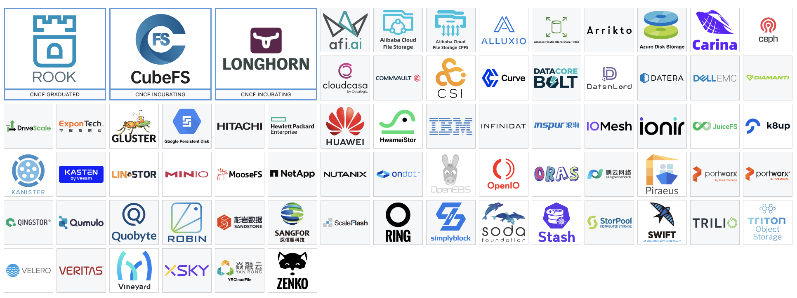

# 7.5 持久化存储设计的演进

:::tip 容器内部的存储

容器是镜像的运行实例，在 7.3 节，我们详细分析过镜像的原理，作为不可变的基础设施，要求同一份镜像能复制出完全一致的镜像实例，这就意味着在容器内写入的任何数据是无法真正写入镜像内。

容器启动时后的 rootfs，本质是利用 UnionFS（Union File System，联合文件系统） 实现的一个堆叠的文件系统。容器内部的进程在这个堆叠系统内写入数据的，是写在了利用 CoW（Copy-on-write，写时复制）技术创建一个可写层内。当容器被销毁，读写层也随之销毁，内部的数据也必然会随着容器的消逝而消失。

:::

那么容器系统怎么解决持久化存储呢？我们由浅入深，先从 Docker 看起。目前，Docker 支持 3 中挂载的方式：

:::center
  <br/>
:::

Bind mount 是 Docker 最早支持的挂载类型，只要用过 Docker，肯定熟悉下面挂载方式。

```
docker run -v /usr/share/nginx/html:/data nginx:lastest
```
上面的命令实际上就是下面的 MS_BIND 类型的 mount 系统调用。

```
// 将宿主机中的 /usr/share/nginx/html 挂载到 rootfs 指定的挂载点 /data 上
mount("/usr/share/nginx/html","rootfs/data", "none", MS_BIND, nulll)
```

这种挂载的方式显然有非常明显的缺陷：
- **通过映射的方式挂载宿主机中的一个绝对路径，这就跟操作系统强相关**。这意味着 Bind mount 无法写在 dockerfile 中，不然镜像有可能无法启动。其次，宿主机中的目录虽然被挂载，但其他非 Docker 的进程也可以进行读写，存在安全隐患。
- 容器被广泛使用后，**容器存储绝对不是简单的映射关系那么简单**，存储位置不限于宿主机（还有可能是网络存储）、存储的介质不限于磁盘（还可能是 tmpfs）、存储的类型也不仅仅是文件系统（还有可能是块设备或者对象存储），而且**存储也并不是都需要先挂载到操作系统，再挂载到容器某个目录，如果 Docker 想越过操作系统，就需要知道使用何种协议（譬如网络硬盘 iSCSI 协议、网络文件 NFS 协议）**。

为此 Docker 提供全新的挂载类型 Volume：
- 它首先在宿主机开辟了一块属于 Docker 空间（Linux 中该目录是 /var/lib/docker/volumes/），这样就解决了 Bind mount 映射宿主机绝对路径的问题；
- 考虑存储的类型众多，仅靠 Docker 自己实现并不现实，为此 Docker 提出了 Volume Driver 的概念，借助社区力量丰富 Docker 的存储驱动种类。这样用户只要通过 docker plugin install 安装额外的第三方卷驱动，就能使用网络存储或者各类云厂商提供的存储。

我们从 Docker 返回到 Kubernetes 中，同 Docker 类似，Kubernetes 也抽象出了数据卷（Volume）来解决持久化存储，也开辟了属于 Kubernetes 的空间（该目录是 /var/lib/kubelet/pods/[pod uid]/volumes）、也设计了存储驱动（Volume Plugin）的概念用以支持出众多的存储类型。

不过作为一个工业级的容器编排系统，Kubernetes 支持的 Volume 的类型要比 Docker 多一丢丢。

:::center
  <br/>
:::

乍一看，这么多的类型，难以下手。然而，总结起来其实主要有 3 种类型：

- 普通的 Volume
- 特殊的 Volume（譬如 Secret、Configmap，将 Kubernetes 集群的配置信息以 Volume 方式挂载到 Pod 中，并实现 POSIX 接口来访问这些对象中的数据）
- 持久化的 Volume

## 7.5.1 普通的 Volume

普通的 Volume 和 docker 的 Volume 非常相似，区别在于挂载在本地而非远端存储。

如下图所示，Volume 是包在 Pod 内，生命周期与挂载它的 Pod 是一致的当 Pod 因某种原因被销毁时，Volume 也会随之删除。

:::center
  <br/>
:::

**设计普通 Volume 的目标并不是为了持久地保存数据，而是为同一个 Pod 中多个容器提供可共享的存储资源**。这类 Volume 的典型是 EmptyDir，常见的应用方式是一个 sidecar 容器通过 EmtpyDir 来读取另外一个容器的日志文件。另外一种 HostPath，和 EmptyDir 的区别是 HostPath 的 Volume 可以被所有的 Pod 共享 。我们使用 Loki 日志系统，第一步就是要 Pod 挂载相同的宿主机 hostPath Volume，这样才能读取到所有 Pod 写入的日志。

## 7.5.2 持久化的 Volume

对于一个编排系统，Pod 随时可能被调度到另外一台 Node 节点，如果想要数据持久化，肯定不能存储在本地，网络存储是最合适的方式，这也就是引入持久卷 PersistentVolume(PV) 的原因。

PV 为 Kubernete 集群提供了一个使用使用远程存储的抽象，如下代码所示，声明了一个 PV 存储对象，并描述了存储能力、访问模式、存储类型、回收策略、网络存储类型等信息。

```
apiVersion: v1
kind: PersistentVolume
metadata:
  name: pv1
spec:
  capacity:  #容量
    storage: 5Gi
  accessModes:  #访问模式
  - ReadWriteOnce
  persistentVolumeReclaimPolicy: Recycle  #回收策略
  storageClassName: slow  
  nfs:
    path: /
    server: 172.17.0.2
```

PV 描述了详细的存储信息，但对应用层的开发者却不太友好，应用层开发者只想知道我有多大的空间、I/O 是否满足要求，并不关心存储底层的配置。那我们就把存储服务再次进行抽象，把应用开发者关心的逻辑再抽象一层出来，这就是 PVC（Persistent Volume Claim）。

PVC 和 PV 的设计，跟“面向对象”的思想一致：
- PVC 为持久化存储的“接口”，它提供了对某种持久化存储的描述，声明需要的存储类型、大小、访问模式等需求；
- 而这个持久化存储的实现部分则由 PV 负责完成。

作为应用开发者，我们只需要跟 PVC 这个“接口”打交道，而不必关心底层存储是怎么配置或者实现的。

如下声明一个 PVC，与某个 PV 绑定后再被应用（Pod）消费。

```
apiVersion: v1
kind: PersistentVolumeClaim
metadata:
  name: pv-claim
spec:
  storageClassName: manual
  accessModes:
    - ReadWriteOnce
  resources:
    requests:
      storage: 3Gi
```

细心的读者到这里可能会有一个疑问：**PV 和 PVC 两者之间并没有明确相关的绑定参数**。PV 和 PVC 的绑定实际是一个自动过程：

- 第一个条件：当然是 PV 和 PVC 的 spec 参数，譬如 存储的大小
- 第二个条件：则是 PV 和 PVC 的 storageClassName 必须一致（稍后介绍）。

当 PVC 匹配到 PV 之后，就可以在 Pod 中使用了。

```
apiVersion: v1
kind: Pod
metadata:
  name: test-nfs
spec:
  containers:
  - image: nginx:alpine
    imagePullPolicy: IfNotPresent
    name: nginx
    volumeMounts:
    - mountPath: /data
      name: nfs-volume
  volumes:
  - name: nfs-volume
    persistentVolumeClaim:
      claimName: pv-claim
```

此时 NFS 的远端存储就挂载了到 Pod 中 nginx 容器的 /data 目录下。

## 7.5.3 从静态到动态

Pod 使用存储有一个原则：**先规划 -> 后申请 -> 再使用**，如果在系统中没有满足 PVC 要求的 PV，PVC 则一直处于 Pending 状态，直到系统里产生了一个合适的 PV，在这期间 Pod 将无法正常启动。

如果是一个小规模的集群，我们可以预先创建多个各种各样的 PV 等待 PVC 申请即可。但在一个大规模的 Kubernetes 集群里很可能有成千上万个 Pod，这肯定没办法靠人工的方式提前创建出成千上万个 PV。为此，Kubernetes 为我们提供了一套可以自动创建 PV 的机制 —— Dynamic Provisioning（前面通过人工管理 PV 的方式叫作 Static Provisioning）。

Dynamic Provisioning 核心在于 StorageClass 对象，这个对象的作用其实就是创建 PV 的模板，它的定义中包含两类关键信息：
- **PV 的属性**：譬如存储空间的大小、读写模式、回收策略等
- **Provisioner 的信息**：即声明采用何种存储插件以及插件的参数信息。存储插件有两类：一种内置在 Kubernetes 源码中，这种类型的插件称为 In-Tree 类型，前缀一般为 "kubernetes.io"；另外一种根据 Kubernetes 提供的存储接口，由第三方的存储供应商实现，代码独立于 Kubernetes，这种类型的插件被称为 Out-of-Tree 类型。 

如下示例，定义了一个名为 standard 的 StorageClass，存储提供者为 aws-ebs，其存储参数设置了一个 type ，值为 gp2，回收策略为 Retain。

```
apiVersion: storage.k8s.io/v1
kind: StorageClass
metadata:
  name: standard
provisioner: kubernetes.io/aws-ebs
parameters:
  type: gp2
reclaimPolicy: Retain
allowVolumeExpansion: true
mountOptions:
  - debug
volumeBindingMode: Immediate
```

StorageClass 被创建之后，当 PVC 的需求来了，它就会自动的去创建 PV，这样 PV 的创建就从静态转向了动态。


## 7.5.4 Kuberneters 的存储系统设计

通过上面的介绍相信绝大部分读者对于如何使用 Volume 没什么疑问了。下面我们再了解真实的存储系统是如何接入到新创建的 Pod 中。在这之前，我们先预备一些前置知识。

Kubernetes 的 Volume 继承了Docker和操作系统的设计，并将新增或者卸载存储设备分解为以下三个操作：

- 首先，得 Provision（准备）哪种设备，Provision 类似给操作系统准备一块新的硬盘，这一步确定了接入存储设备的类型、容量等基本参数。它的逆向操作是 delete（移除）设备。
- 然后，将准备好的存储附加（Attach）到系统中，Attach 可类比为将存储设备接入操作系统，此时尽管设备还不能使用，但你已经可以用操作系统的fdisk -l 命令查看到设备，这一步确定存储设备的名称、驱动方式等面向系统侧的信息，它的逆向操作是 Detach（分离）设备。
- 最后，将附加好的存储挂载（Mount）到系统中，Mount 可类比为将设备挂载到系统的指定位置，也就是操作系统中mount命令的作用，它的逆向操作是 卸载（Unmount）存储设备。

:::tip <i/>
如果 Pod 中使用的是 EmptyDir、HostPath 这类非网络存储型的卷，这些卷并不会经历附着和分离的操作，它们只会被挂载和卸载到某一个 Pod 中。
:::

Volume 的创建和管理在 Kubernetes 中主要由卷管理器 VolumeManager 和 AttachDetachController 和 PVController 三个组件负责，前面提到的 Provision、Delete、Attach、Detach、Mount、Unmount 则由 Volume Plugins 实现。

理解基本的前置知识，我们再来看一个带有 PVC 的 Pod 挂载过程:

:::center
  <br/>
:::


1. 用户创建了一个包含 PVC 的 Pod，该 PVC 要求使用动态存储卷。
2. Scheduler 根据 Pod 配置、节点状态、PV 配置等信息，把 Pod 调度到一个合适的 Worker 节点上
3. PV Controller 会不断观察 ApiServer，如果它发现一个 PVC 已经创建完毕但仍然是未绑定的状态，它就会试图把一个 PV 和 PVC 绑定。PV Controller 首先会在集群内部找到一个适合的 PV 进行绑定，如果未找到相应的 PV，就调用 Volume Plugin 去做 Provision。Provision 就是从远端上一个具体的存储介质创建一个 Volume，并且在集群中创建一个 PV 对象，然后将此 PV 和 PVC 进行绑定；

4. 如果有一个 Pod 调度到某个节点之后，它所定义的 PV 还没有被挂载（Attach），此时 AD Controller 就会调用 VolumePlugin，把远端的 Volume 挂载到目标节点中的设备上（如：/dev/vdb）

5. 在 Worker 节点上，当 Volum Manager 发现一个 Pod 调度到自己的节点上并且 Volume 已经完成了挂载，它就会执行 mount 操作，将本地设备（也就是刚才得到的 /dev/vdb）挂载到 Pod 在节点上的一个子目录 `/var/lib/kubelet/pods/[pod uid]/volumes/kubernetes.io~iscsi/[PV name]（以 iscsi 为例）`；
6. Kubelet 通过容器运行时（如 containerd）启动 Pod 的 Containers，用 bind mount 方式将已挂载到本地全局目录的卷映射到容器中。


上面流程的每个步骤，其实就对应了 CSI 提供的标准接口，云存储厂商只需要按标准接口实现自己的云存储插件，即可与 K8s 底层编排系统无缝衔接起来，提供多样化的云存储、备份、快照(snapshot)等能力。


## 7.5.5 Kubernetes 的 CSI 存储生态

得益 Kubernetes 的开放性设计，通过下图感受支持 CSI 的存储生态，基本上包含了市面上所有的存储供应商。

:::center
  <br/>

  CNCF 下的 Kubernetes 存储生态
:::

上述众多的存储系统实在无法一一展开，但无论是内置的存储插件还是第三方存储插件，总结其提供的存储类型来说无外乎 3 种：文件存储、块存储和对象存储。

### 1. 块存储

块存储是最接近物理介质的，这些存储的介质不关心也无法关心数据的组织方式以及结构，那就用最简单粗暴的组织方式把所有数据按照固定的大小分块，每一块赋予一个用于寻址的编号，然后再通过与块设备匹配的协议（SCSI、SATA、SAS、FCP、FCoE、iSCSI..）进行读写。

我们最熟悉的块设备就是硬盘，以大家比较熟悉的机械硬盘为例，一块就是一个扇区，老式硬盘是512字节大小，新硬盘是4K字节大小。为了方便管理，硬盘这样的块设备通常可以划分为多个逻辑块设备，也就是我们熟悉的硬盘分区（Partition）。反过来，单个介质的容量、性能有限，可以通过某些技术手段把多个物理块设备组合成一个逻辑块设备，例如各种级别的 RAID，JBOD，某些操作系统的卷管理系统（Volume Manager）如 Windows 的动态磁盘、Linux的 LVM 等。

块存储本身处于整个存储软件栈的底层，不经过 OS 缓存，因此**具有超低的时延和超高的吞吐**。但缺陷是每个块是独立的，如果是多个系统对其操作，缺乏一个集中的控制机制来解决数据冲突和同步的问题，导致**块存储设备通常是不能共享**，无法被多个客户端（节点）挂载，在 Kubernetes 中类型为块存储的 Volume 访问模式都要求必须是 RWO（ReadWriteOnce，可读可写，但只支持被单个节点挂载）。

不关心数据的组织方式/内容，接口朴素简单，所以块存储并不是提供给自然人，而是提供给专门的文件系统以及专业的备份管理软件、分区软件以及数据库使用。

### 2. 文件存储

块设备存储的是最原始的 0 和 1的二进制数据，这对于人类用户来说实在是过于难以使用、难以管理。

因此我们用“文件”这个概念对这些数据进行组织，所有用于同一用途的数据，按照不同应用程序要求的结构方式组成不同类型的文件（通常用不同的后缀来指代不同的类型），然后我们给每一个文件起一个方便理解记忆的名字。而当文件很多的时候，我们按照某种划分方式给这些文件分组，每一组文件放在同一个目录，所有的文件、目录形成一个树状结构。

把存储介质上的数据组织成目录-子目录-文件这种形式的数据结构，再这个数据结构之中加入其他控制信息，就能很方便地扩展出更多的高级功能，比如除了文件占用的块地址信息外，在表中再加上文件的逻辑位置就形成了目录，加上文件的访问标志就形成了权限，我们还可以再加上文件的名称、创建时间、所有者、修改者等一系列的元数据信息。人们把定义文件分配表应该如何实现、储存哪些信息、提供什么功能的标准称为文件系统（File System），很常用的文件系统如 FAT32、NTFS、exFAT、ext2/3/4、XFS、BTRFS 等等。

绝大多数文件系统都是基于块存储之上去实现的，但文件存储的访问不像块存储因设备差异有五花八门的协议，其 POSIX 接口（Portable Operating System Interface，POSIX）已经成为事实标准，诸如 Open、Write、Read 等许多操作数据的接口都能在上述文件系统中被找到。

而在网络存储中，底层数据并非存储在本地的存储介质，而是另外一台服务器上，不同的客户端都可以用类似文件系统的方式访问这台服务器上的文件，这样的系统叫网络文件系统（Network File System），常见的网络文件系统有 Windows 网络的CIFS（也叫SMB）、类 Unix 系统网络的 NFS 等。而文件存储除了网络文件系统外，FTP、HTTP 其实也算是文件存储的某种特殊实现，都是可以通过某个 url 来访问一个文件。

### 3. 对象存储

文件存储的树状结构以及路径访问方式虽然方便人类理解、记忆和访问，但计算机需要把路径进行分解，然后逐级向下查找，最后才能查找到需要的文件，对于应用程序来说既没必要，也很浪费性能。而块存储呢，虽然性能出色，但难以理解且无法共享。选择困难症发作的同时，我们思考是否能有一种兼具性能、还要实现共享、同时满足大规模扩展需求的新型存储系统呢？这就是对象存储。

对象存储中的“对象”可以理解为一个元数据及与其配对的一个逻辑数据块的组合，元数据提供了对象所包含的上下文信息，比如数据的类型、大小、权限、创建人、创建时间，等等，数据块则存储了对象的具体内容。所有的数据都在同一个层次中，通过数据的唯一地址标识来识别并查找数据。

当然，对于不同的软件系统来说，一次访问需要获取的不一定是单个我们传统意义上的文件，根据不同的需要可能只是一个/组值，某个文件的一部分，也可能是多个文件的组合，甚至是某个块设备，统称为对象。

从设计之初衷（一般的对象存储都是基于哈希环之类的技术来实现），对象存储就可以非常简单的扩展到超大规模，因此非常适合数据量大、增速又很快的非结构化的数据（视频、图像等）。

公有云的的对象存储服务如 AWS S3、腾讯云的 COS、阿里云的 OSS 等，开源的产品有 Ceph、Minio、Swift 等。

