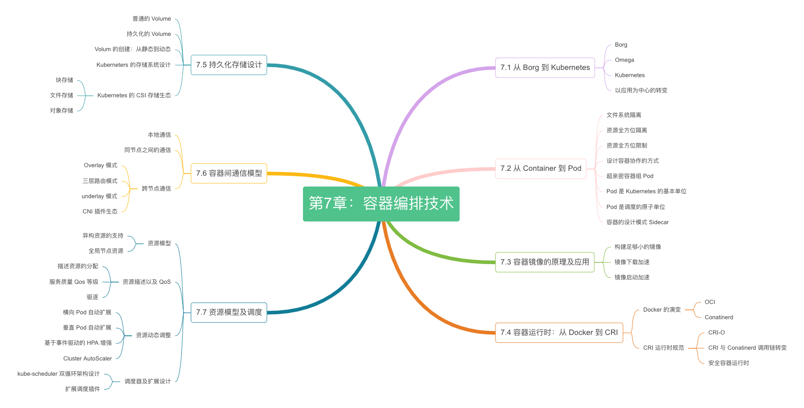

# 第七章：容器技术概论

容器技术典型的代表是 Docker，在 Docker 之外还有 CoreOS rkt、Mesos、LXC 等容器引擎，但直到 Docker 引擎的出现，创新性地提出容器镜像、仓库以及一次编译，随处运行的口号，这才真正意义上降低了容器技术复杂性，让容器技术在现代应用中大放异彩。

发展到云原生时代，OCI 容器技术标准规范逐步成为行业共识，各类工业级容器运行时如 runc、containerd、Kata Containers 也不断涌现。

“八卦”也能引起读者的好奇心，我们不妨从容器技术之争的故事开始。

  

