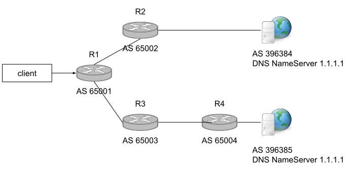
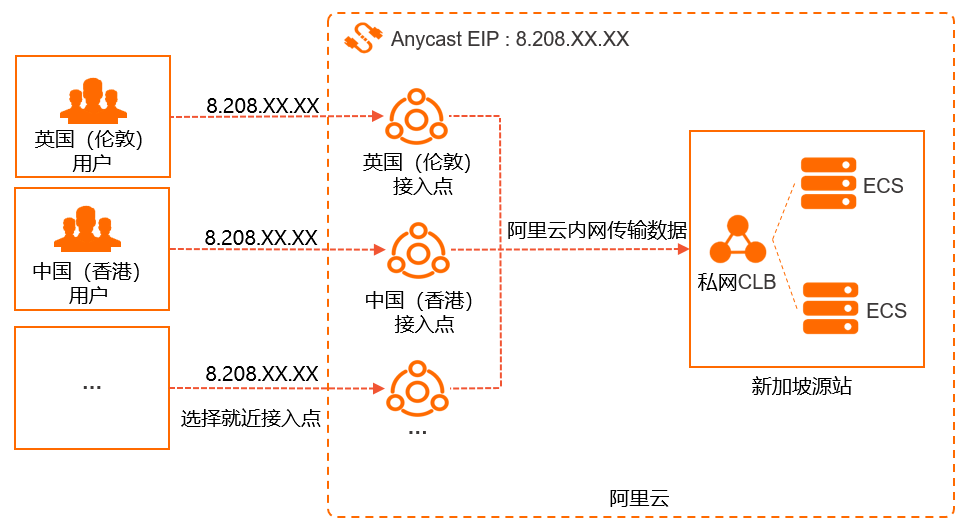

# 2.6.2 公网加速方案 Anycast

我们在国内 ping 8.8.8.8，延迟只有 30ms，通过 ip 工具查询这是一台美国的节点，那为什么延迟这么低呢？答案就是虽然 8.8.8.8 查询是美国的 IP，但是因为使用了 Anycast（任意播）技术，实际上我们 ping 的是一台国内的节点。

Anycast 是一种网络寻址和路由方法，允许多个节点共享一个 IP 地址。使用 Anycast 技术，可以将流量请求路由到就近节点中，多用在网络加速、多地同服场景。大型的互联网服务商通常使用 Anycast 构建异地多活的高可用架构。例如，用 Anycast 扩展 DNS 的 NameServer 服务。在 DNS 服务过程中，Anycast 会将传入的流量路由到距离最近并且能够有效处理请求的数据中心，这种方式可以有效改善延迟、高流量、网络拥塞和 DDoS 攻击等问题。

在 IPv4 网络内，Anycast 由 AS 自治系统以及 BGP 协议配合实现，在一个大型多个子网环境中，各个子网发布同样 IP 路由，然后不同来源的请求根据 BGP 路由就近规则路由到不同 AS 内的节点，从而实现 IPv4 网络下 AnyCast 架构，如图 示例。

	

## 1. Anycast 技术架构的优点

总结使用 Anycast 技术架构的一些明显优点。

- **更低的网络延迟** 进入 Anycast 的流量将被路由到最近的节点，从而减少节点之间的延迟，这确保了无论客户端从何处请求信息，速度都将得到优化。
- **更高的可用性** 使用 Anycast 可以全球范围内放置多个节点来提高服务冗余度，这允许某个节点故障情况下将流量重新路由到下一个最近的节点。
- **缓解 DDoS 攻击** DDoS 攻击下，单播机器由于负载上限而产生无法提供服务故障。在 Anycast 架构下，多台节点能够分散攻击，从而减轻服务整体的压力。
- **流量负载均衡** Anycast 可以将请求控制在特定的网络区域内，Anycast 和 ECMP （Equal-cost multi-path routing，等价路由）配合可以有效地均衡服务器之间的流量。

## 2. Anycast 技术应用场景说明

Anycast 技术适用于大范围的 DNS 部署、CDN 数据缓存、数据中心等。大部分公有云都提供 Anycast EIP（ Anycast Elastic IP Address，任播弹性公网IP） 服务，以阿里云 EIP 实现多地同服务架构为例说明。

	

后端集中维护一套集群，然后绑定 Anycast 类型的 EIP，该 EIP 借助云内网和 POP 点，多地发路由。客户不用感知网络路径的选择，无需手动指定 IP 的发布位置，流量就近完成了全局负载均衡，从最优的地域进出，就近接入后数据走的是专线传输，比公网传输更可靠、更低延时，服务质量也得到提高。
