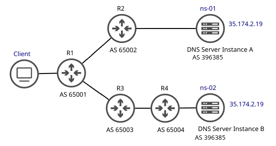
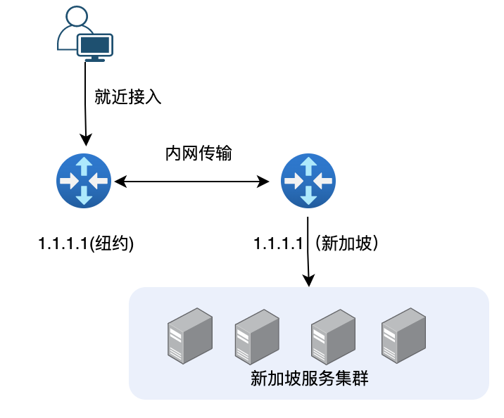

# 多地同服实现：Anycast 技术

Anycast的中文名为`任意播`，是一种网络寻址和路由方法，允许多个机器共享一个IP地址，可以将传入请求路由到各种不同的位置或“节点”。

作为一种为一组节点提供多个路由路径的技术，Anycast网络中每个节点都分配相同的IP地址，并使用等价多路径（ECMP）路由来引导这些节点之间的流量。很多大型的互联网服务商通常将 Anycast 作为他们的基础组件架构技术之一，用于构建异地多活的高可用架构。

如：用 Anycast 扩展 CDN 服务，在 CDN 的上下文中，Anycast 通常会将传入的流量路由到距离最近并且能够有效处理请求的数据中心，选择性路由使 Anycast 网络能够应对延迟、高流量、网络拥塞和 DDoS 攻击等问题。

## Anycast的原理

对于Anycast技术需要注意两点：

- IPv4协议本身不支持Anycast技术
- IPv6协议原生支持 Anycast 技术， 但IPv6 至今也未完善普及

到目前为止， AnyCast技术落地的最大问题是如何在IPv4是实现 Anycast。 

好在有BGP协议的帮忙， 在一个大型的网络内，多个不同的路由器都发布同样IP的路由，根据BGP协议，不同的客户端被路由到不同路由器的节点上，再由路由器选择对应的节点传输数据，就可实现IPv4网络下的 AnyCast。

	

## Anycast 几个明显优势

- **更低的网络延迟** 进入任播节点的流量将被路由到最近的节点，从而减少客户端和节点本身之间的延迟。这确保了无论客户端从何处请求信息，速度都将得到优化。
- **更高的可用性** Anycast 通过使用相同的 IP 在全球范围内放置多个服务器来提高冗余度。这允许在一台服务器出现故障或离线的情况下将流量重新路由到下一个最近的服务器。
- **DDoS 缓解** DDoS 攻击是由僵尸网络引起的，僵尸网络可以产生如此多的流量，以至于使典型的单播机器不堪重负。在这种情况下使用任播配置的好处是每台服务器都能够“吸收”一部分攻击，从而减轻服务器整体的压力。
- **负载均衡** Anycast技术可以将请求有效地控制在特定的网络区域内（一般是网络路径最短的节点优先被请求），Anycast往往和ECMP搭配使用，利用ECMP可以有效地负载均衡各个 DNS 服务器之间的查询；

## AnyCast应用场景说明

AnyCast主要应用于大范围的DNS部署，CDN数据缓存，数据中心等。以一个案例需求说明。

某视频公司，BACKEND 服务集群在新加坡。该公司不希望部署多套逻辑和数据层，从而降低成本，但又希望全球的客户能够接入，需要全局漂移 IP 作为访问的唯一入口，并可做全局的就近分配、动态流量分配、故障剔除。

**方案设计说明**

	

方案重点如下：

**使用 Anycast 的 EIP (Anycast Elastic IP Address)，该 IP 同时在多地 Anycast，实现多地同服。**

用户后端集中维护一套集群，然后绑定 Anycast 类型的 EIP。该 EIP 借助云内网和 POP 点，多地发路由。
客户不用感知网络路径的选择，无需手动指定 IP 的发布位置，流量就近完成了全局负载均衡，从最优的地域进出，后端得到简化。同时，客户的 IP 得到收敛，无需每个地域配一个 IP 和 DNS 规则, 管理上得到简化, 同时传输质量得到提高。

**多个 IP 发布地，实现了多路径，增加了网络的容错能力**

此外，就近接入后走的是专线传输，比公网传输更可靠、更低延时，提升了用户的播放体验。
