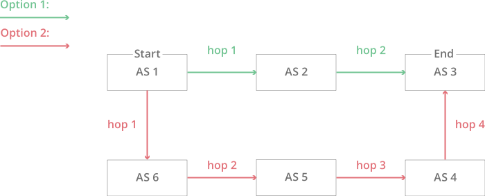

# 网络互联：AS与BGP

中小型局域网几百台、几千台可以用RIP、OSPF等路由协议组网，但互联网上亿台主机如何解决互联问题呢？

解决方式就是整个互联网按组织边界、管理边界等划分为多个自治系统（Autonomous System ，AS），每个自治系统由一组运行相同的路由协议、路由选择算法的路由器组成，由于AS的规模较小，路由算法不会产生性能问题。

	

上面的解释涉及了IP网络中数据包传递的两个重要的概念：`AS`、`BGP`。

## 什么是AS

更具体地说，自治系统（AS）是具有统一路由策略的巨型网络或网络群组。连接到 Internet 的每台计算机或设备都连接到一个 AS。

一个运营商或者IDC机房想要进入互联网，需要在CNNIC或APNIC申请IP地址段和AS号，然后通过EGP协议将此段IP地址广播到到其他网络运营商参与互联。

大多数 AS 会连接到其他几个 AS。如果一个 AS 仅连接到另一个 AS 并共享相同的路由策略，则可以将其视为第一个 AS 的子网。每个 AS 都控制一组特定的 IP 地址。

如下图展示了一个简化版的 BGP。在此版本中，互联网上有 6 个自治系统。

	

如果 AS1 需要向 AS3 路由一个数据包，它有两种不同的选择：`AS2 → AS3`或`AS6 → AS5 → AS4 → AS3`

但遗憾的是现实中的真实情况：路由往往不是最短路径选择，而是费用最便宜选择

## 什么是 BGP

BGP 是在 AS 之间路由数据包的边界网关协议。AS 通过 BGP 通知其到其他 AS 和路由器的路由策略。

> BGP互联网中最重要的协议，同时也是最危险的协议。2022年 Facebook 大规模服务中断，就是因为配错了 BGP 通告。

BGP 路由器从世界各地的 AS 中获取所有这些信息，并将其放入AS 内的路由表，以确定从 AS 到 AS 的最快路径。当数据包到达时，BGP 路由器会参考其路由表来确定数据包接下来应转到哪个 AS。

全世界有许多 AS，BGP 路由器不断更新其路由表。网络脱机时，新网络联机时，AS 扩展或收缩其 IP 地址空间，所有这些信息都必须通过 BGP 通知，以便 BGP 路由器可以调整其路由表。

### BGP工作原理

BGP基于（Path Vector Protocol）路径矢量来实现，每个BGP服务的实体叫做BGP Router，而与BGP Router连接的对端叫BGP Peer。

BGP Router在收到了Peer传来的路由信息，会存储在自己的数据库。

BGP Router会根据自己本地策略结合路由信息中内容判断处理，如果路由信息符合本地策略，BGP Router会修改自己的主路由表。本地策略会有很多，如果BGP Router收到两条路由信息，目的网络一样，但是路径不一样， 如：

1. 一个是AS1->AS3->AS5
2. 一个是AS1->AS5

如果没有其他的特殊策略 BGP Router 会选用AS1->AS5这条路由信息。由此 BGP 可以实现复杂的控制，以及更有保障性的网络。

BGP 基于 TCP 连接可靠性处理互联网大量的路由信息（TCP连接的窗口是65K字节，也就是说TCP连接允许在没有确认包的情况下，连续发送65K的数据），BGP 非常适合于大规模网络环境。

## BGP 的应用

BGP 常应用于大型和复杂的网络，比如容器网络方案中的Calico， 就是一个基于BGP的纯三层数据中心网络方案，较与 Overlay 网络的 Flannel等，通信时不需要解包和封包，网络性能损耗小，易于排查，且易于水平扩展。

除了数据中心的组网实现，BGP也可以实现数据中心更好的互联性。数据中心与ISP 运营商通过BGP协议建立多个对等网络的，该数据中心在网络互联上就自动有了 `冗余备份`、`路由环路消除`特点。

在使用多线、或者单线的机房网络时候，我们常常会申请多个VIP（Virtual IP），当时某个线路出现问题时，再手动从DNS中摘除，相当麻烦。而使用上面的这种数据中心（BGP机房），只要一个VIP，当某个运营商至数据中心连通出现问题，其用户自动切换至其他线路。

