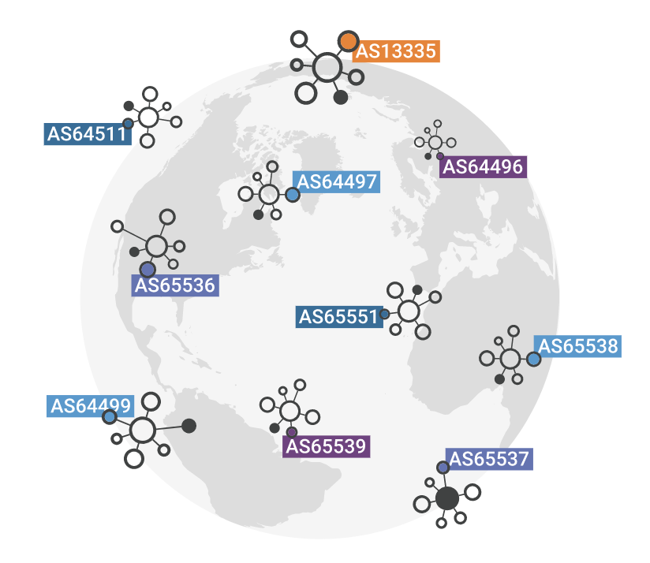

# BGP与AS自治系统

只有两个点，画一条直线两个点就连接起来了。但如果这两个点一个是 上海的计算机，另外一个是地球另一端的纽约计算机呢？计算机到另外一台计算机路径的选择就是 `路由`。

	

一个上海的数据包发送到美国，靠的是`BGP协议`，根据可达性和路由信息，权衡最新的网络状况，从而找到这两个点之间的最佳路径。

## 什么是AS

互联网上亿台主机如何解决互联问题呢？

解决方式就是整个互联网按组织边界、管理边界等划分为多个自治系统（Autonomous System ，AS）。每个 AS 都会被分配一个称为 ASN（自治系统编号）的唯一编号 （我们使用 mtr 测试网络可以获知 IP包 途径的 AS）。

	

上图展示了一个简化版的 BGP。在此版本中，互联网上有 6 个自治系统。

如果 AS1 需要向 AS3 路由一个数据包，它有两种不同的选择：`AS2 → AS3`或`AS6 → AS5 → AS4 → AS3`。**但现实中的真实情况，路由往往不是最短路径选择，而是费用最便宜选择。**

## IGP与BGP

自治系统使用的路由协议大概可以分为两种：

- IGP 内部网关协议，在一个AS内部所使用的一种路由协议， RIP、OSPF 是IGP的代表协议
- EGP 外部网关协议，在多个AS之间使用的一种路由协议，BGP是EGP的代表协议。

IGP需要执行大量的计算，才能让每台设备在同一时刻都能得到对应所处网络拓扑的相同认知。这也就限制了IGP使用的规模。

而BGP是唯一使用TCP作为传输层的路由协议，基于TCP连接可靠性和互联网大量的路由信息（TCP连接的窗口是65K字节，也就是说TCP连接允许在没有确认包的情况下，连续发送65K的数据） BGP非常适合于大规模网络环境。

BGP可以在网络中扩容到几百台路由器的规模，如果再使用 BGP Route Reflection, 更能扩容到数万台。在大规模的组网中，通常都利用BGP提高路由规则可扩展性。比如云原生中的 Calico 用的也是 BGP。

## BGP机房

一个机房拥有了AS号，意味着拥有了与网络运营商同等级别的网络调度能力，建立的对等数越多，网络的互联性就越好。

运维常说的 BGP九线、BGP六线机房，机房申请了AS号，使用了BGP协议和其他众多ISP运营商做了对等互联。

除此BGP机房还存在`冗余备份`、`路由环路消除`特点。在使用多线、或者单线机房时候，我们常常会申请多个VIP（Virtual IP），当时某个线路出现问题时，再手动从DNS中摘除，相当麻烦。

而使用BGP机房，只要一个VIP（Virtual IP），当某个运营商至机房连通出现问题，其用户自动切换至其他线路。

机房或者ISP的AS号 可以用过 mtr 等路由工具获取，获取AS号之后可以在网络中心获取该AS的一些基本信息，如建立的对等网络、所含CIDR、物理位置信息等等。。

如爱奇艺网络的AS为AS133865，通过该网址获取AS信息 [https://bgpview.io/asn/133865](https://bgpview.io/asn/133865)

