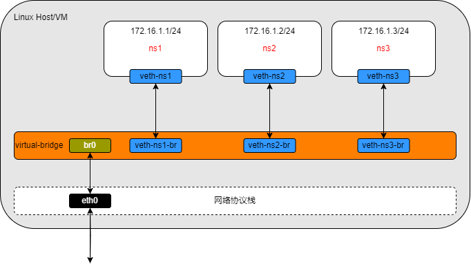

# Linux Bridge

Veth实现了点对点的虚拟连接，可以通过Veth连接两个network namespace，如果我们需要将三个或者多个network namespace接入同一个二层网络时，就不能只使用veth了。

在物理网络中，如果需要连接多个主机，我们会使用网桥，或者又称为交换机。Linux也提供了网桥的虚拟实现：Linux Bridge。

Linux Bridge与其他网络设备的区别在于：普通的网络设备只有两端，从一端进来的数据会从另一端出去。

比如，物理网卡接收的网络数据会转发给内核协议栈，内核协议栈收到的数据会转发给物理网卡，而 Linux Bridge 则有多个端口，数据可以从任何端口进入，哪个出口出去取决于目的地 Mac 地址，bridge就相当于软件模拟硬件中的交换机。


Docker中支持bridge网络模式，就是Docker利用Bridge 再依靠 Veth-pair 连接到 docker0 网桥上与宿主机乃至外界的其他机器通信。


<div  align="center">
    
</div>

## Linux Bridge 操作实践

笔者在这里通过实践操作，创建不同的ns （network namespace），以及实现多个 ns之间的通信，以便读者贯彻理解 Linux Bridge 。

该实践的网络拓扑图如下：

<div  align="center">
    
</div>

创建三个ns：

```
ip netns add ns1
ip netns add ns2
ip netns add ns3
```

创建一个Linux bridge。

```
brctl addbr virtual-bridge
```

创建veth pair，然后将veth pair一端的虚拟网卡加入到namespace，再将另一端通过brctl addif命令加入到网桥上。

这样就相当于用一条网线将三个namespace连接到了网桥上。

```
ip link add veth-ns1 type veth peer name veth-ns1-br
ip link set veth-ns1 netns ns1
brctl addif virtual-bridge veth-ns1-br

ip link add veth-ns2 type veth peer name veth-ns2-br
ip link set veth-ns2 netns ns2
brctl addif virtual-bridge veth-ns2-br

ip link add veth-ns3 type veth peer name veth-ns3-br
ip link set veth-ns3 netns ns3
brctl addif virtual-bridge veth-ns3-br
```

为三个namespace中的虚拟网卡设置IP地址，这些IP地址位于同一个子网172.16.1.0/24中。

```
ip -n ns1 addr add local 172.16.1.1/24 dev veth-ns1
ip -n ns2 addr add local 172.16.1.2/24 dev veth-ns2
ip -n ns3 addr add local 172.16.1.3/24 dev veth-ns3
```

设置网桥和虚拟网卡状态为up。

```
ip link set virtual-bridge up
ip link set veth-ns1-br up
ip link set veth-ns2-br up
ip link set veth-ns3-br up
ip -n ns1 link set veth-ns1 up
ip -n ns2 link set veth-ns2 up
ip -n ns3 link set veth-ns3 up
```

检查几个namespace之间是否可达。

```
ip netns exec ns1 ping 172.16.1.2
PING 172.16.1.2 (172.16.1.2) 56(84) bytes of data.
64 bytes from 172.16.1.2: icmp_seq=1 ttl=64 time=0.153 ms
64 bytes from 172.16.1.2: icmp_seq=2 ttl=64 time=0.148 ms
```

## 小结

通过上面的试验，我们验证了可以使用Linux bridge来将多个namespace连接到同一个二层网络中。

你可能注意到，在分配IP地址的时候，我们只为veth在namespace中那一端的虚拟网卡分配了地址，而没有为加入bridge那一端分配地址。这是因为bridge是工作在二层上的，只会处理以太包，包括ARP解析，以太数据包的转发和泛洪；并不会进行三层(IP)的处理，因此不需要三层的IP地址。
