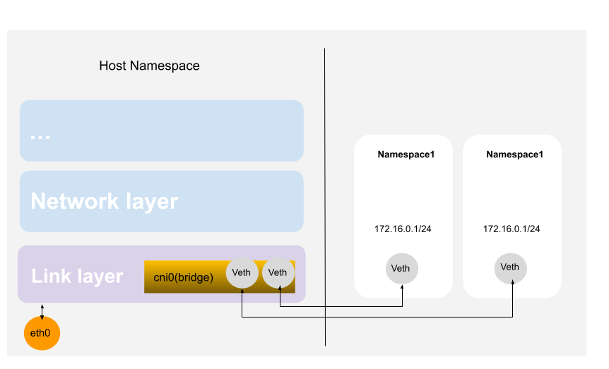

# 2.2.3 虚拟网桥设备 Linux Bridge

我们使用 Veth 实现了两个 Network Namespace 之间的点对点通信，但如果是多个 Network Namespace 呢？在物理网络中，如果需要连接多个主机，我们会使用网桥（也可以理解为交换机）设备组成一个小型局域网。在 Linux 网络虚拟化系统中，也提供了网桥虚拟实现 Linux Bridge。

Linux Bridge 与 物理交换机机制一致，能够接入任何二层的网络设备，无论是真实的物理设备（例如 eth0）亦或者虚拟设备（例如 Veth、Tap）。我们在部署 Docker 或者 Kubernetes 时，宿主机内的 cni0、docker0，就是它们创建的虚拟 bridge 设备。


<div  align="center">
    
</div>

## 1. Linux Bridge 操作实践

笔者在这里通过实践操作，创建多个 Network Namespace 并通过 Bridge 实现通信。该实践的网络拓扑如图 2-2 所示。

创建连个 Network Namespace：

```
ip netns add ns1
ip netns add ns2
```

创建一个 Linux bridge。

```
brctl addbr bridge0
ip link set bridge0 up
```

创建 Veth，并将 Veth 一端加入到 Network Namespace，再将另一端通过brctl addif命令加入到网桥上。

```
$ ip link add veth1 type veth peer name veth1-peer

$ ip link set veth1 netns ns1
$ brctl addif bridge0 veth1-peer
$ ip -n ns1 link veth1 up
$ ip link set veth1-peer up


$ ip link add veth2 type veth peer name veth2-peer

$ ip link set veth2 netns ns2
$ brctl addif bridge0 veth2-peer
$ ip -n ns2 link veth2 up
$ ip link set veth1-peer up
```

为 Network Namespace 虚拟网卡设置 IP 地址，位于同一个子网 172.16.1.0/24 中。

```
ip -n ns1 addr add local 172.16.0.1/24 dev veth1-peer
ip -n ns2 addr add local 172.16.0.2/24 dev veth2-peer
```

检查这两个 Network Namespace 之间是否可达。

```
$ ip netns exec ns1 ping 172.16.0.2
PING 172.16.1.2 (172.16.0.2) 56(84) bytes of data.
64 bytes from 172.16.0.2: icmp_seq=1 ttl=64 time=0.153 ms
64 bytes from 172.16.0.2: icmp_seq=2 ttl=64 time=0.148 ms
...
```

通过以上实践，我们使用 Linux bridge 来将多个 Network Namespace 连接到同一个二层网络中，并实现了它们之间的通信。
