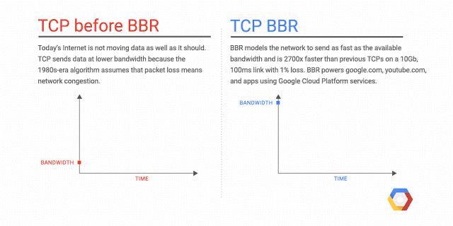

# 理解TCP拥塞控制

TCP拥塞控制是传输层做的事情，对于常规的应用影响微乎其微，我们只要大致理解拥塞控制原理以及现流行的控制算法就可以。

现在Linux系统常规使用的拥塞控制算法一般是 cubic。版本更高一点的内核会有 bbr 和 bbr2的选择。查询系统所支持的拥塞控制算法。

```
sysctl net.ipv4.tcp_available_congestion_control
```

## 理解拥塞控制

当TCP传输数据时候，中间网络链路复杂且是动态的，中间网关节点瓶颈带宽、路由路径变化、send fuffer 和 receive buffer 、ISP中的QOS 策略 等等都影响传输效率，这是一个非常复杂的过程。

Google发布过一篇BBR的论文，文章内有个图片比较清晰的解释了拥塞控制中的各个关系，我们围绕这个图片去理解，就能很好搞懂TCP的拥塞控制。

<div  align="center">
	
</div>

我们根据这张图梳理TCP的传输链路，他有几个物理属性：

- **RTprop** (round-trip propagation time). 两端之间最小时延，取决于物理距离.
- **BtlBw**  （bottleneck bandwidth）瓶颈带宽. 把链路想象成物理管道，RTprop 就是管道的长度，BtlBw 则是管道最窄处的直径）
- **BtlBufSize**  链路之间各个路由节点的缓存
- **BDP 带宽时延积** 整条物理链路（不含路由器缓存）所能储藏的比特数据之和 BDP = BtlBw * RTprop

除了上面的物理属性，TCP的传输效率还关注两个现实属性：

- **T（时延）** 数据从发送端到接收端实际时延， 也就是RTT，对应于图中的round-trip time
- **R（带宽）** 数据的实际传输带宽，对应于图中的delivery rate
- **D（数据量）** 已发送但还未被确认的数据量, 对应于inflight data

### 拥塞控制的分区

横轴表示 inflight 数据量，有三个关键的区间:

- **(0, BDP)**: 这个区间内，客户端发送的数据并未占满瓶颈带宽。 称为： 应用受限（app limited）区
- **(BDP, BtlneckBuffSize):** 这个区间内，已经达到链路瓶颈容量，但还未超过 瓶颈容量+缓冲区容量，此时应用能发送的数据量主要受带宽限制， 称为带宽受限（bandwidth limited）区
- **(BDP+BtlneckBuffSize, infinity)** ：这个区间内，实际发送速率已经超过瓶颈容量+缓冲区容量 ，多出来的数据会被丢弃，缓冲区大小决定了丢包多少。称为缓冲区受限（buffer limited）区


通过分析图片的关系：**拥塞（congestion）就是 inflight 数据量持续向右侧偏离 BDP 线的行为， 而拥塞控制（congestion control）就是各种在平均程度上控制这种偏离程度的方案或算法**

## BBR 算法

TCP的BBR（Bottleneck Bandwidth and Round-trip propagation time，BBR）是谷歌在2016年开发的一种新型的TCP 拥塞控制算法。

在此以前互联网主要使用基于丢包的拥塞控制策略，只依靠丢失数据包的迹象作为减缓发送速率的信号。但随着全球化互联网的迅速普及，网卡由最初的Mbps 到 Gbps，内存从KB 到 GB，跨洋长链路的出现，4G/5G/WiFi无线网络的应用，带宽时延积越来越大，链路层和物理层误码导致的随机丢包会时常出现，这就导致丢包和拥塞之间的关系也变得愈发微弱，基于延迟或丢包来判断拥塞这种由事件驱动调整拥塞窗户非常被动，也很难现代互联网发挥作用。

BBR尝试通过使用全新的拥塞控制来解决这个问题，它使用基于延迟而不是丢包作为决定发送速率的主要因素。

<div  align="center">
	<p>BBR 原理示例</p>
	
</div>

### BBR的改善

使用BBR，可以获得显著的网络吞吐量的提升和延迟的降低。

吞吐量的改善在远距离路径上尤为明显，比如跨太平洋的文件或者大数据的传输，尤其是在有轻微丢包的网络条件下。延迟的改善主要体现在最后一公里的路径上，而这一路径经常受到缓冲膨胀（BtlBufSize）的影响。

当网络链路拥塞时，就会发生缓冲膨胀，从而导致数据包在这些超大缓冲区中长时间排队。在先进先出队列系统中，过大的缓冲区会导致更长的队列和更高的延迟，并且不会提高网络吞吐量。

由于BBR并不会试图填满缓冲区，所以在避免缓冲区膨胀方面往往会有更好的表现。
