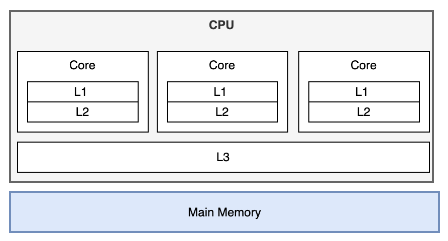

# 内核旁路技术介绍

很多年前以前我们讲C10k，通过前面介绍的一些优化方式以及使用io多路复用epoll、Coroutine、libevent库等技术可以轻松实现单节点突破1万+的并发性能指标。

而随着移动互联网的发展、云架构中复杂的服务治理已经将C10K的问题发展到C10M（单机并发 1000 万）。一个大规模集群内，面对东西向规模性的Gbp/s数据流量，关键节点的挑战是用户态协议栈和多核并发问题。

这个时候，Linux 网络协议栈进行的各种优化策略，基本都没有太大效果。网络协议栈的冗长流程才是最主要的性能负担。

## 内核瓶颈限制

基于系统内核的数据传输会面临如 中断处理、内存拷贝、上下文切换、局部性失效、CPU亲和性、内存管理等等影响，在高并发的场景下这些机制是非常大的瓶颈所在。

以CPU多核的性能问题来讨论：

	

大多数的程序在高于4核的CPU上不能发挥更好的性能，有时甚至会降低性能。其中主要的影响因素是CPU的缓存流水线。

L1 Cache 4个Cycles（CPU时钟），L2 Cache 12个Cycles，L3 30 Cycles，内存 300 Cycles。如果命中L1、L2缓存，性能则很高，若缓存Miss则性能则会降低。在高并发的情况下因为上下文的切换过于频繁，缓存Miss的情况将大大增加。

在上下文切换时，如果同一个连接的处理线程不是绑定在同一个CPU上的，那么将进一步加剧缓存Miss的情况。

## 内核旁路技术思想

既然内核是瓶颈所在，明显解决方案就是想办法绕过内核（Kernel-Bypass技术）

Kernel-Bypass或者说是内核旁路，主要的思想是：

- 控制层和数据层分离：将数据包处理、内存管理、处理器调度等任务转移到用户空间去完成，而内核仅仅负责部分控制指令的处理。这样就不存在上述所说的系统中断、上下文切换、系统调用、系统调度等等问题。
- 使用多核编程技术代替多线程技术： 并设置 CPU 的亲和性，将线程和 CPU 核进行一比一绑定，减少彼此之间调度切换
- 针对 NUMA 系统：尽量使 CPU 核使用所在 NUMA 节点的内存，避免跨内存访问
- 使用大页内存：代替普通的内存，减少 Cache-Miss

## 内核旁路技术代表

内核旁路有两类的技术代表：

- 使用 DPDK 技术，跳过内核协议栈，直接由用户态进程用轮询的方式，来处理网络请求。同时，再结合大页、CPU 绑定、内存对齐、流水线并发等多种机制，优化网络包
的处理效率。

- 使用内核自带的 XDP 技术，在网络包进入内核协议栈前，就对其进行处理，这样也可以实现很好的性能

很多企业如Facebook的Katran、美团的MGW、爱奇艺的DPVS等都使用Intel 提供的DPDK套件进行kernel bypass，直接全部在用户态进行流量的处理。

正是基于内核旁路的技术得以实现单机千万并发的性能指标。