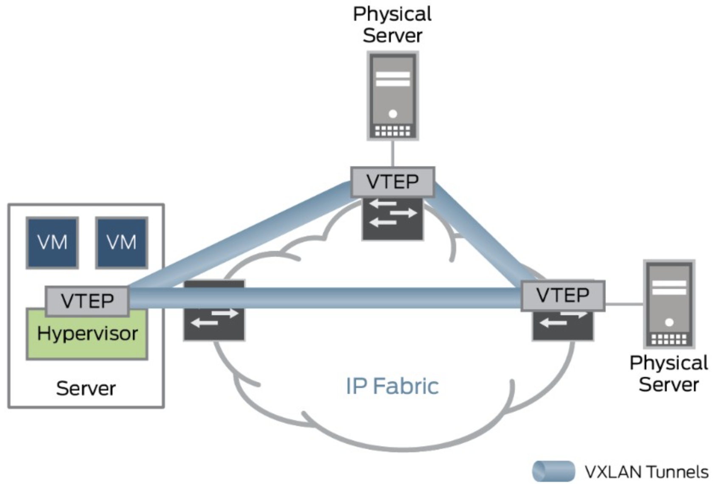
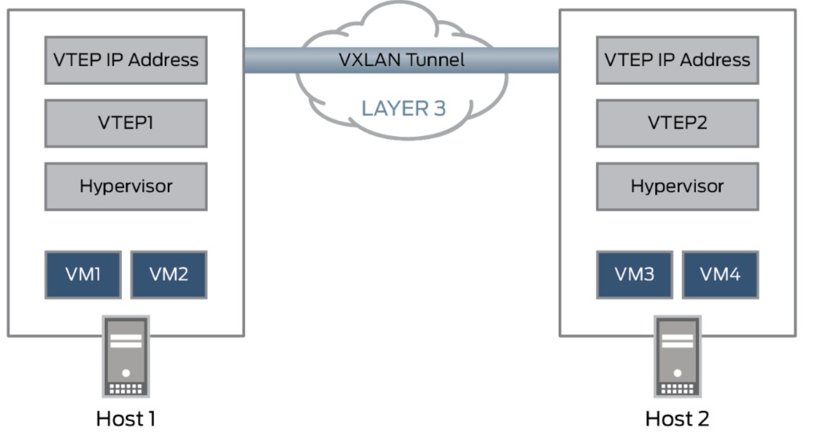

# 2.5.5 数据中心网络方案 VxLAN

介绍完各类虚拟设备，我们了解了虚拟机和宿主机之间的交互流程之后，我们继续思考在数据中心层面如何实现虚拟机的交互。设计数据中心的网络通信要考虑以下几点：

- 允许应用在任意服务器上灵活部署而不受物理网络现实，实现支持灾难恢复、业务迁移等敏捷需求。
- 跨集群甚至跨多个计算中心的可迁移性
- 按需进行虚拟网络部署，而无需重新配置物理网络
- 支持多租户环境下的大规模网络部署

以上的解决方案就是 VxLan（Virtual eXtensible Local Area Network ，虚拟可扩展的局域网）。VxLAN 本质上是一种隧道封装技术。它使用 TCP/IP 协议栈的惯用手法——封装/解封装技术，将 L2 的以太网帧（Ethernet frames）封装成 L4 的 UDP 数据报（datagrams），然后在 L3 的网络中传输，效果就像 L2 的以太网帧在一个广播域中传输一样，实际上是跨越了 L3 网络，但却感知不到 L3 网络的存在。


## VxLAN 的工作原理是什么？

VXLAN 隧道协议将第 2 层以太网帧封装到第 3 层 UDP 数据包中，以便创建虚拟化第 2 层子网或横跨物理第 3 层网络的分段。每个第 2 层子网都由可对流量进行分段的 VXLAN 网络标识符 (VNI) 进行唯一标识。

执行数据包封装和解封装的实体被称为 VXLAN 隧道端点 (VTEP)。

为了支持自身无法当作 VTEP 的设备，如裸机服务器，瞻博网络设备可以封装并解封装数据包。

这种类型的 VTEP 被称为硬件 VTEP。

VTEP 也可驻留在虚拟机管理程序主机中，例如基于内核的虚拟机 (KVM) 主机中，以直接支持虚拟化工作负载。这种类型的 VTEP 被称为软件 VTEP。

硬件和软件 VTEP 如下所示。

<div  align="center">
	
</div>

在下图所示，当 VTEP1 接收来自对虚拟机 3 (VM3) 寻址的虚拟机 1 (VM1) 的以太网帧时，其使用 VNI 和目标 MAC 在其转发表中查找将数据包发送到的 VTEP。

VTEP1 将包含 VNI 的 VXLAN 表头添加到以太网帧中，将此帧封装在第 3 层 UDP 数据包中，然后通过第 3 层网络将数据包发送至 VTEP2。

VTEP2 解封装原始以太网帧并将其转发至 VM3。

VM1 和 VM3 完全不知道其间存在 VXLAN 隧道及第 3 层网络。

<div  align="center">
	
</div>

## VxLan 组网实践

在了解 VxLan 的必要背景知识后，我们将通过几个例子说明如何搭建基于 VxLan 的 overlay 网络。

### 点对点网络组建

```
ip link add vxlan0 type vxlan \
	id 1024 \
	dstport 4789 \
	remote 192.168.1.3 \
	local 192.168.1.2 \
	dev eth0
```

通过上面的命令，我们创建了一个名为 `vxlan0` 类型为 `vxlan`的网络接口。

该命令中的参数说明如下：

- id 1024：指定的VNI值，有效范围在 1~2^24之间；
- dstport: VTEP 通信端口, IANA分配的端口为 4789，如不指定，Linux 默认使用8472；
- remote: 对端的VTEP地址
- local: 当前节点的VTEP地址
- dev: 当前节点用于VTEP通信的网卡设备，用来获取本节点 VTEP ip地址。local 和 dev 参数功能一致，实际中只写一个即可。

执行之后，系统会创建一个名为 vxlan0 的网卡，我们查询它的详细信息

```
ip -d link show dev vxlan0
...
```

接下来为 vxlan0 网卡分配IP地址，并启用

```
ip addr add 172.17.1.2/24 dev vxlan0
ip link set vxlan0 up
```

