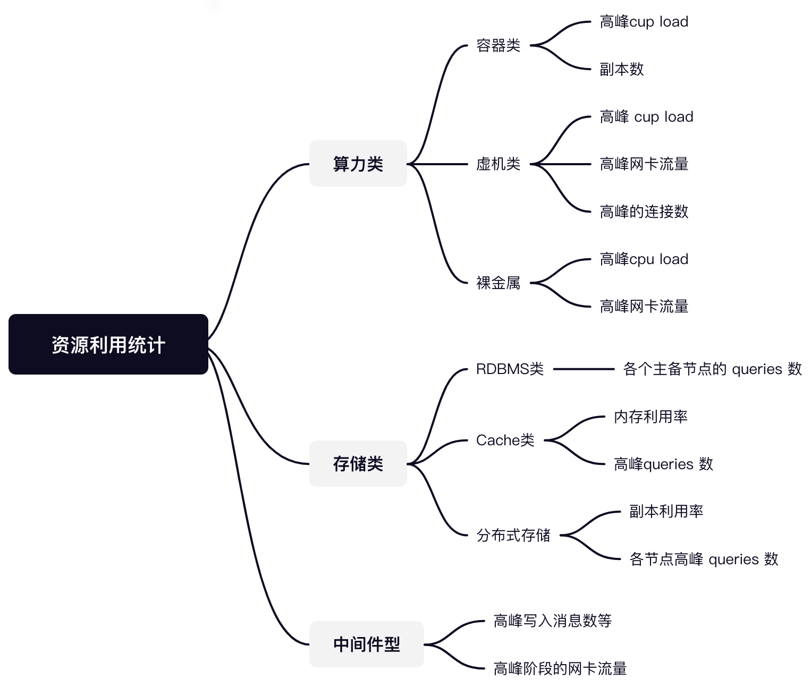

# 爱奇艺海外业务在FinOps方面的实践

从项目发展周期中核心需求来看，它有这么几个阶段：可用、稳定和效率、成本管理。

成本管理包含 `技术成本`、`财务视角下的云成本控制` 。在解决系统 0 到 1 后，将一部分工作目标聚焦在 `成本管理`方面，不论是改善技术产品交付能力或者 “财务控制” 都有非常大的意义，也符合当前企业 “降本增效” 的方向。 

笔者在2022年对海外的技术架构、云资源等做过一些复盘以及降本方面的实践，从践行的过程来看，有点 FinOps 的方法论的味道。

为了更好地理解 FindOps 以及下一步的工作，我们将去年的工作总结成文，将实践过程分享给在此方面践行的同行，以期待交流及团队内部实现更进一步的目标。

由于笔者的主要工作是技术方面的执行，所以内容也主要集中在 “技术成本” 方面的思考和实践，所以存在一定的局限性，也敬请理解。

结合FinOps，当时工作的过程中大致分为三个阶段：**资源洞察**、**成本优化执行**、**云成本管理持续运营**


## 资源洞察

工作开始的第一步：首先要摸清资源大盘、技术架构、财务支出的情况。这一阶段主要目标是查清楚财务支出、项目分布及资源使用的情况。建立评价基准，并在内部讨论建立共识，为降本做好前期准备。

作为一个流媒体服务，IT建设的财务支出上包含两个大头成本：

- CDN流量成本 （CDN包含动态内容以及静态内容）
- 计算类成本 （由于海外业务使用的是公有云，统一按 Core和内存数计算， 这部分资源包含大量的ECS云服务器以及小量的裸金属服务器）

另外还有一个隐形的技术成本，因为在支出上无法量化，所以常被忽略。隐形的技术成本包含：因架构的复杂度等原因产生的不必要投入。

### 分析资源大盘

依托爱奇艺基础架构的能力，我们拿到了涉及海外所有项目使用的资源，一个JSON的原始数据文件。

有了所有资源的信息之后，我们就开始这这批资源进行成本度量的计算。继续借助爱奇艺基础架构的监控平台，按每类资源查询该资源下的metrics指标列表，本根据资源类型找到合适的metrics指标。

伪代码大概如下的逻辑:
```
for resource in resources:
	resposne = getHostBaseInfo(resource.host, metrics)
	print resposne.metrics // 人工挑选一个合适的metrics
```

有了资源以及metrics之后，对所有的资源进行分析，对于资源使用的情况分析，我们使用如下方式

<div  align="center">
	
</div>

伪代码大概如下的逻辑:

```
 for resource in resources:
 	switch(resource):
 		case .Redis:
 			resp = getMetrics(resource.host,  "qps/port=8081", start_at, end_at)
 			usage = max(resp.values) // 获取最大的
 		case .QAE
 			...
```
### 建立报表

整个资源大概有90% 来源于爱奇艺内部 中台、垂线服务、其他业务部门。所以有必要建立报表，能更好地跨部分沟通，更快地看到问题。我们制定了三种类型的报表：

- 按数据总览报表，按资源和项目分类，可以一目了然知道成本大头的项目和资源类型。
- 按项目报表：按项目下资源分类整理，并给出降本的修改建议。【这部分执行很有效果，给到降本的原因，以及具体的降本建议后，多数项目按照建议修改了】
- 按资源报表：


### 建立基准

首先要有一个可量化的数据标准，用来行业内对比以及阶段工作之后的复盘。这个基准建议使用云商的结算支出来量化，支出上最能说明工作是否有效。

云商结算的周期是按月，同时业务上有个MAU（月活）的概念。

