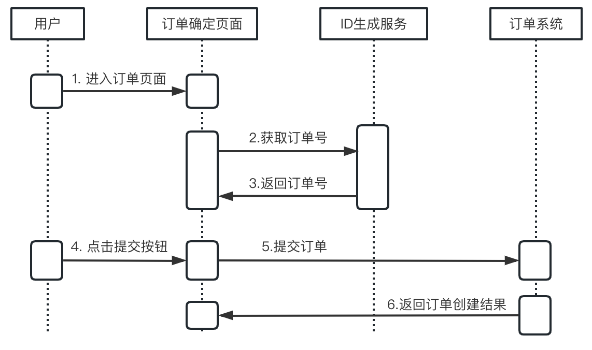
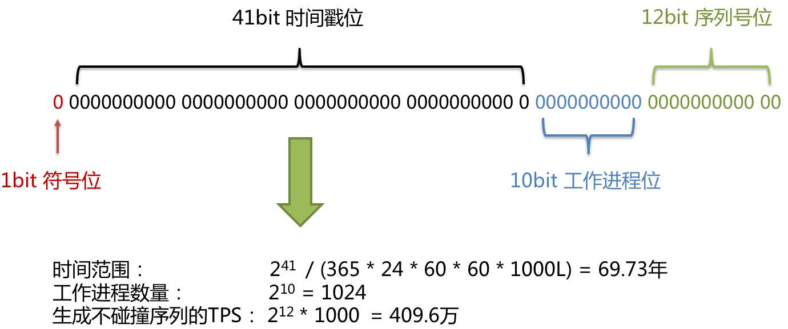

# 幂等性设计

幂等性是数学和计算机学中的一个概念。

在计算机中，幂等性是指：用户对于同一个操作发起一次请求或者多次请求，获得的结果都是一致的。不会因为请求多次出现异常情况。

在一些特殊业务中，会对幂等性有严格的设计要求。比如在退款、支付的流程中，如果没有严格设计，肯定会造成重大的经济损失。

对于非幂等性产生的原因，举一个例子： 

- 因网络延迟的问题，用户多次点击下单按钮，如果没有做幂等性限制，就会产生多条订单记录

## 非幂等性产生的场景

以下几种情况会导致非幂等性的结果出现

- 前端设计不合理，用户主动多次请求
- 网络库超时重试机制
- 弱一致性分布式系统中，不合理的查询判断

## 解决数据重复提交的问题

类似`订单`，`退款`，`票务`等系统要求具备幂等性，那么如何解决上面的场景问题呢？

- 利用 `全局唯一ID` 防止重复提交
- 利用 `Token` 机制防止重复提交

### 全局唯一ID

利用数据库主键的唯一特性，可以解决重复提交的问题。系统流程图如下：

	

对于相同的ID，再进行插入时，会产生 `result in duplicate entry for key primary` 错误。

系统中一般会搭建一个独立的全局ID生成服务，生成的ID建议具备以下特性：

- 全局唯一
- 趋势自增 ，多数RDBMS使用BTree索引，有序的主键可保证写入性能
- 单调自增 ，支持排序需求
- 信息安全 ， 防止被扒
- 含有时间戳

一般情况下，用 UUID、数据库自增 基本就可以保证需求。如果要满足以上更严格的特性，可以使用 `snowflake` 自增ID生成算法

### snowflake 算法

snowflake 是Twitter开源的分布式自增ID算法, 特点是：按实践有序、生成的结果小 64bit的 Long型，转化为字符串最多19位, 在分布式系统内不会产生碰撞。生成效率高。

	
snowflake ID 结构

	

- 第1位占用1bit，其值始终是0，可看做是符号位不使用。
- 第2位开始的41位是时间戳，41-bit位可表示2^41个数，每个数代表毫秒，那么雪花算法可用的时间年限是(1L<<41)/(1000L360024*365)=69 年的时间。
- 中间的10-bit位可表示机器数，即2^10 = 1024台机器，但是一般情况下我们不会部署这么台机器。如果我们对IDC（互联网数据中心）有需求，还可以将 10-bit 分 5-bit 给 IDC，分5-bit给工作机器。这样就可以表示32个IDC，每个IDC下可以有32台机器，具体的划分可以根据自身需求定义。
- 最后12-bit位是自增序列，可表示2^12 = 4096个数。

这样的划分之后相当于在一毫秒一个数据中心的一台机器上可产生4096个有序的不重复的ID。但是我们 IDC 和机器数肯定不止一个，所以毫秒内能生成的有序ID能力是翻倍的。

### Token 机制。

Token的机制和  `全局唯一ID`有点类似，不过增加了一个 校验 `Token` 是否有效的逻辑。

- 订单系统提供一个发放 Token的令牌。 Token的生成可以使用上面提到的  snowflake 算法生成。
- 在订单页面，调用获取 token接口，并对该token设定一个失效期
- 提交订单时，将该token作为参数提交给后端订单系统
	- 后端判断该 token 是否存在，如存在，则为第一次提交，放行并删除token
	- 如无token，第二次提交，阻拦该请求

在高并发的环境中，注意 token 的获取和删除要使用原子操作。
