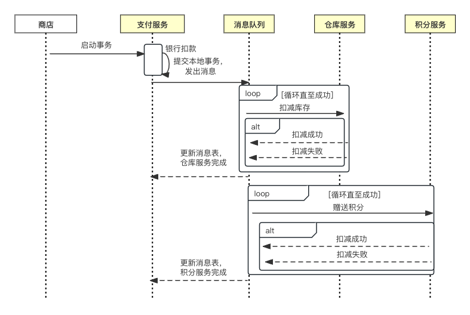

# 5.1 BASE 理论及应用

BASE 是 Basically Available(基本可用)、Soft State（软状态）和 Eventually Consistent（最终一致性）三个短语的缩写。

BASE 理论是分布式系统中一致性和可用性权衡的结果，其核心思想是在某些场景中，无需做到强一致性，以保证系统的可用性，同时业务系统可采用适当的方式使数据达到最终一致性。

BASE 理论的三个方面：

- 基本可用: 是指分布式系统出现不可预知的故障时，允许损失系统部分特性来换取系统可用性。损失系统部分特性通常包括两个方面：响应时间的损失和功能降级。
	- 响应时间的损失：当部分节点宕机时，在请求增加响应时间的基础上返回客户端正常的结果，而不是停止服务。
	- 功能降级：当处于流量高峰时，一部分用户请求会返回降级的数据，而不会真正请求后端的核心数据，以保证后端系统大部分用户访问的可用性。

- 软状态：是指允许系统中的数据存在中间状态，并认为该中间状态的存在不影响整体系统的可用性。即允许系统在不同节点的数据副本之间进行数据同步时存在延时。对比 ACID 中的原子性，事务结束之后不会存在残留的中间状态，而 BASE 理论的软状态则允许事务出现中间状态。譬如，节点之间的投票协商和多副本之间的数据同步都需要进行网络交互，交互过程中的状态及即是软状态的一种体现。

- 最终一致性：强调系统中所有的数据副本，在经过一段时间同步后，最终能够达到一个一致的状态。BASE 理论允许事务出现中间状态，但经过一定的时间后，要求事务结束，所有的操作要么全部成功、要么全部失败。

## BASE 理论应用

BASE 理论应用与多个微服务之间的调用。微服务的架构中，一个用户的请求往往需要多个服务配合才能完成，对于一个强一致性系统的可用性，都是所依赖服务可用性的乘积，例如，在一个事物中，涉及三个服务的操作，假设每个服务的可用性为 99.9%，则整个事务的可用性为 `99.9% * 99.9% * 99.9% ≈ 99.7%`。

现代的应用架构中，通常由几十甚至几百个微服务组成，对于如何提高整体系统的可用性，可用 BASE 理论进行指导，在允许存在软状态的基础上，我们只需要保证整个事务的基本可用性和最终一致性即可，并不需要保证实时一致性，保障性的设计，通常采用异步补偿机制。

例如，在一个电商系统中，下单需要三个服务支持。

- 访问支付服务，通知银行扣款
- 访问库存服务，扣除购买商品的库存
- 访问积分服务，为用户增加积分。

	

如果采用异步补偿机制，则需要明确哪些操作属于非关键操作，如果非关键操作失败，允许业务流程继续执行，然后再异步补偿非关键操作，以此降低非关键操作失败对整个事务的影响。

在上述电商案例中，我们可以将积分服务定义为非关键操作，非关键操作失败后，可以通过定时任务或者消息队列在下单完成后再给用户增加积分。而支付以及库存操作为关键操作，当其中任意一个发生故障时，我们都需要回滚本次事务。

采用异步补偿机制需要注意以下几点：
- 每个补偿操作都应该设置重试机制，且需要实现幂等。
- 整个事务应由工作流驱动，记录每个分支操作的处理结果。
- 对于所有分支事务，都需要提供回滚事务的接口。

