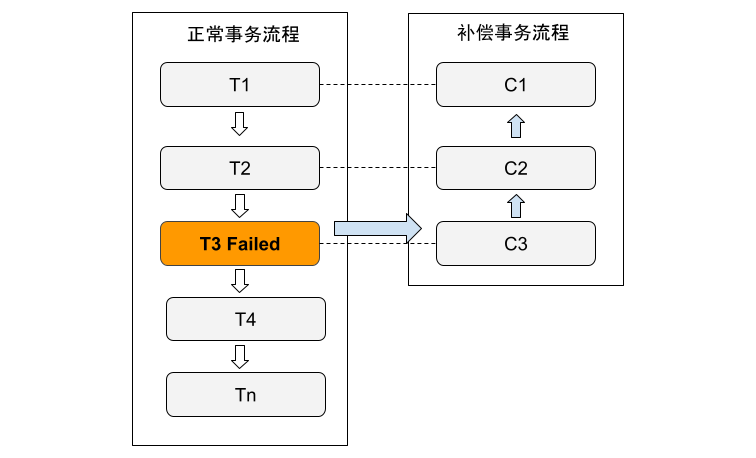

# 长事务解决方案：Saga

Saga 是一种长事务解决方案，也是一种分布式事务协议。

Saga 核心思想是将长事务拆分为多个本地短事务，由 Saga 事务协调器协调，如果正常结束那就正常完成，如果某个步骤失败，则根据相反顺序一次调用补偿操作。Saga 把一个业务流程，分解为多个步骤，每个步骤对应一个本地事务，每个步骤都有一个补偿操作，Saga 首先按流程顺序，执行流程中的每一个步骤（本地事务），如果出现异常，就会按流程顺序反向，执行补偿操作，用于回滚或撤销之前的操作。

Saga 这种特性非常适用于流程长、流程多且需要保证事务最终一致性的业务操作。

	

在 Saga 模式下，分布式事务内有多个参与者，每个参与者都是正向补偿服务。上图中的 T1~Tn 就是「正向调用」，C1~Cn 是「补偿调用」，正向调用和补偿调用是一一对应的关系。假设有 n 个被调用方服务，T1 就是对服务一的调用，接着 T2 是对服务方二的调用，T3 是对服务方三的调用。如果这个时候返回了失败，那么就需要进行回滚，此时就会调用 T2 的对应补偿 C2，调用 T1 的对应补偿 C1，使得分布式事务回到初始状态。

## 小结

相较于 TCC 对于业务改造较大，如果遗漏系统或者流程较复杂的系统，可以尝试使用 Saga 模式进行改造，另外 Saga 模式一阶段就会提交本地事务，无锁、长流程情况下可以保证性能。

总结 Saga 模式的优势：

- 一阶段提交本地数据库事务，无锁，高性能。
- 参与者可以采用事务驱动异步执行，高吞吐。
- 补偿服务即正向服务的“反向”，易于理解，易于实现。