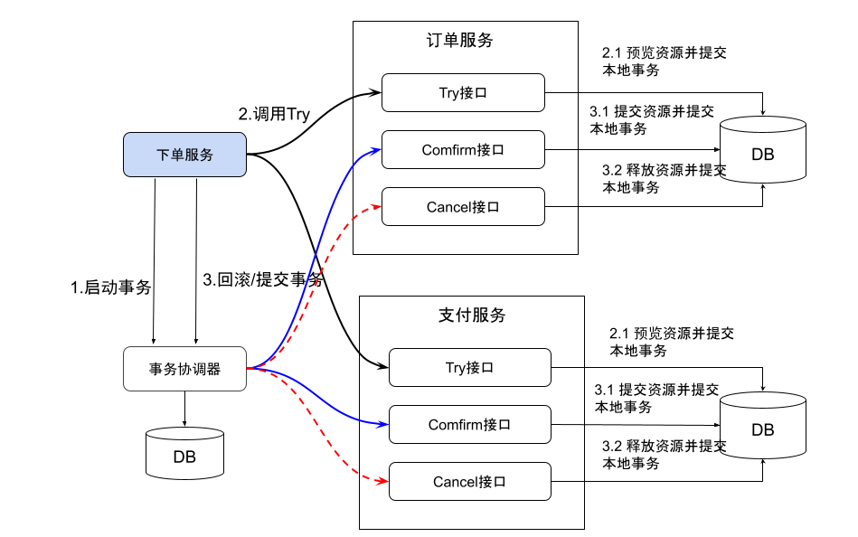

# 5.5.4 应用层面的分布式事务协议： TCC

TCC（Try、Confirm、Cancel）是一种基于补偿事务的分布式事务协议，TCC 和 2PC 有很大的相似性，不过两者面向的场景不同，2PC 是在数据库层面实现的分布式事务协议，TCC 则是应用层面实现的分布式事务协议。

TCC 核心思想是："针对每个操作都要注册一个与其对应的确认（Try）和补偿（Cancel）"， 整个事务流程通常由三个阶段组成：

- Try 阶段：在这个阶段中，参与者会尝试执行事务，并将所有要修改的数据保存在一个本地事务中。如果所有的参与者都执行成功，那么它们就会向协调者报告这一事实。
- Confirm 阶段：如果所有的参与者都成功执行了 Try 阶段，那么协调者会向所有参与者发出确认提交的指令。在这个阶段中，参与者将提交事务，释放资源，并向协调者报告操作成功。
- Cancel 阶段：如果在 Try 阶段中有任何参与者执行失败，那么协调者会向所有参与者发出取消事务的指令。在这个阶段中，参与者将回滚事务，释放资源，并向协调者报告操作失败。

通过这些步骤，TCC 协议可以保证在分布式系统中的事务操作要么全部提交，要么全部回滚，从而确保了数据的一致性。

## TCC 示例

以一个下单服务为例，说明 TCC 事务处理流。该下单服务由两个系统操作完成：订单系统 X、资金账户系统 Y。

<div  align="center">
	
</div>

- **Try 操作** : try X 下单系统创建待支付订单。try Y 自己账户系统冻结订单金额 100 元。 
- **Confirm 操作**  confirm X 订单更新为支付成功。confirm Y 扣减账户系统 100 元。
- **Cancel 操作** Cancel X 订单异常，资金退回，Cancel Y 扣款异常，订单支付失败

订单逻辑代码示例：

```plain
/**
 TCC 业务三个阶段实现
*/
public class PayService {
	// Try 事务准备阶段
	int prepareOrder() {
		// 检测账户余额
		Account account = accountService.get(uid = 10000);
		if (account.getAmount() < 100) throw new Exception("账户余额不足")
		// 冻结支付金额
		account.setFreezedAmount(200);

	}
	// 如果一阶段的工作都顺利进行完了，则进行二阶段的事务提交
	Boolean confirm() {
		Account account = accountService.get(uid = 10000);
		// 释放冻结的金额
		account.setFreezedAmount(100);
		// 进行扣款操作
		account.setAmount(100);
		
		return True;
	}
	// 如果一阶段的方法执行出问题了，二阶段就要回滚，进行各类反向补偿操作
	Boolen cancel() {
		Account account = accountService.get(uid = 10000);
		// 取消冻结金额
		account.setFreezedAmount(account.getFreezedAmount()  - 100);
	}
}

public class OrderService {
	// 下单
	func order() {
		try {
			// 第一阶段 Try 操作
			PayService.prepareOrder()
		} catch {
			// 回滚补偿操作
			PayService.cancel()
			throw new Exception("error")
		}
		// 第一阶段正常，进行 confirm 操作
		PayService.confirm()
	}
}
```

通过上面的逻辑代码可以看出，感知各个阶段的执行情况以及推进执行下一个阶段的这些事情，需要编写大量的代码。通常的情况，实际环境中，一般引入一款 TCC 分布式事务框架（Seata、ByteTCC、TCC-transaction）提升开发效率。


## 小结

TCC 事务相当于 2PC 的一种升级，相对于 2PC， TCC 不再依赖于本地数据库事物能力，并把 2PC 的提交跟回滚操作明确的抽象成 Confirm 跟 Cancel ，TCC 可以专注解决应用层面的事务。TCC 事务在逻辑上是比较清晰，但是代码开发量很大（每个子系统都要实现三个接口），对业务有很强的侵入性，另外因为 TCC 有重试机制，所有的接口都需要实现幂等。