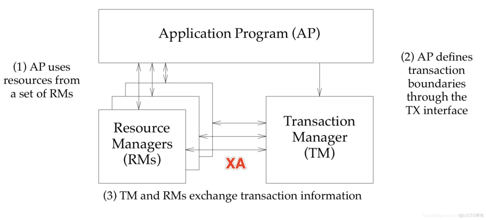

# 5.5.3 分布式事务标准规范： XA 规范

XA 规范 （eXtended Architecture） 是 X/Open 组织定义的分布式事务处理（DTP，Distributed Transaction Processing）标准。XA 规范使用 2PC 协议来保证所有资源同时提交或回滚任何特定的事务。

## 1. XA 规范概述

XA 规范是由 X/Open 组织定义的一套分布式事务处理的接口规范，旨在为应用程序和数据库管理系统（DBMS）提供一致的接口，以支持分布式事务处理。XA 规范定义了一组API，应用程序可以使用这些 API 来管理分布式事务。

XA规范主要涉及到以下三个角色：

- 应用程序（Application Program，AP）：执行业务逻辑，并发起或参与分布式事务。
- 事务管理器（Transaction Manager， TM）：负责管理分布式事务的整个生命周期，包括事务的提交、回滚和恢复等。
- 资源管理器（Resource Manager，RM）：管理事务处理过程中涉及到的各种资源，如数据库、消息队列等。

	

在 XA 规范中，应用程序使用 XA API 与事务管理器进行交互，而事务管理器使用 XA API 与各个资源管理器进行交互。XA 规范定义了一组标准的接口函数，包括开始全局事务、结束全局事务、提交全局事务、回滚全局事务等。通过这些接口函数，应用程序可以实现分布式事务的提交和回滚，从而保证事务的一致性和可靠性。

总的来说，XA 规范为应用程序和数据库提供了一套通用的接口，使得分布式事务处理变得更加容易和可靠。各大数据库厂商都实现了 XA 规范，因此应用程序可以在不同的数据库系统之间进行无缝的移植。

## 2. 支持 XA 规范的数据库

很多关系型数据库都支持XA协议。以下是一些主流数据库的支持情况：

- MySQL: 支持 XA 事务，并实现了XA接口。
- PostgreSQL: 从版本8.0开始支持XA事务，通过插件接口实现。
- Oracle: 支持 XA 事务，使用 OracleXADataSource 提供XA接口。
- SQL Server: 支持 XA 事务，使用 MSDTC 提供 XA 接口。
- DB2: 支持 XA 事务，使用 DB2 Universal JDBC 驱动器提供XA接口。
- Sybase ASE: 支持 XA 事务，使用 JConnect 提供 XA 接口。