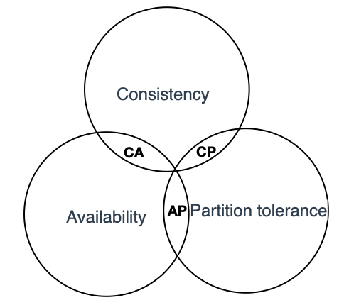

# 5.1 CAP 定理

CAP 这个词最早出现在 Eric A.Brewer 1999 年发表的论文 “Harvest, Yield, and Scalable Tolerant Systems”，在这篇论文中 CAP 被称为 CAP 原则（CAP principle）。一年之后，在 2000 年的 PODC 大会上，Eric A.Brewer 演讲了名为“Towards robust distributed systems”的主题[^2]，在这个演进中 CAP 理论开始广泛流传。

虽然 Eric A.Brewer 提出了 CAP，但仅是提出了一种假设，并没有证明 CAP 就是正确的。在 2002 年，Seth Gilbert 和 Nancy Lynch 联合发表了一篇论文，在这篇论文中证明了 CAP 的正确性，此后 CAP 真正成为一个定理，并开始深远地影响着分布式系统领域。

CAP 是在 ACID 的一致性（Consistency，简写 C），BASE 的可用性（Availability，简写 A）两者基础上扩展出了一个新的维度：即分区容错性（Partition tolerance，简写 P），以此组成 CAP 定理。

CAP 定理的核心思想是：一个分布式系统其一致性（C）、可用性（A）和分区容错性（P），最多只能同时满足其中两项。

	

## 1. CAP 定理描述

- 一致性：被形容为原子性和串行化，每个读写操作都像是一个原子操作，并且像全局排好序一样，后面的读操作一定能读到前面的写操作。这意味着在分布式系统中执行一个操作就像在单节点执行一样。

- 可用性：是指系统提供的服务必须还一直处于可用的状态，对于用户的每一个操作请求总是能够在有限的时间内返回结果。这里需要注意“有限时间内”和“返回结果”。如果时间处理的延时以及结果匹配性存在异常，那么我们认为系统是不可用的。

- 分区容错性：分布式的存储系统会有很多的节点，这些节点都是通过网络进行通信。而网络是不可靠的，当节点和节点之间的通信出现了问题，此时，就称当前的分布式存储系统出现了分区。分区容错性约束了一个分布式系统需要具有如下特征：分布式系统在遇到任何网络分区故障时，仍然需要能够保证对外提供满足一致性和可用性的服务，除非整个网络环境发生故障。

## 2. CAP 定理的应用

CAP 的指导作用是在架构设计中，不要浪费精力去设计一个满足一致性、可用性、分区容错性三者完美的系统，而是根据自己业务的特点就行取舍。值得注意的是，CAP 中的一致性和可用性表现为强一致性和完全(100%)可用性。

对于一个分布式系统而言，因为网络必然会出现异常情况，一旦发生分区错误，整个分布式系统就完全无法使用，分区容错性也就成了必然要面对和解决的问题，因此系统架构师往往需要把精力花在如何根据业务特点在 C(一致性)和 A（可用性）之间寻求平衡。

而根据一致性和可用性的选择不同，开源的分布式系统往往又被分为 CP 系统和 AP 系统。例如 CP 系统 Zookeeper，任何时刻对 ZooKeeper 的访问请求保证能得到一致的数据结果，而另外的 AP 系统 Eureka，则保证 A，当分区发生故障时，保证可用性但无法保证数据一致性。

[^2]: 参见 https://dl.acm.org/doi/10.1145/343477.343502