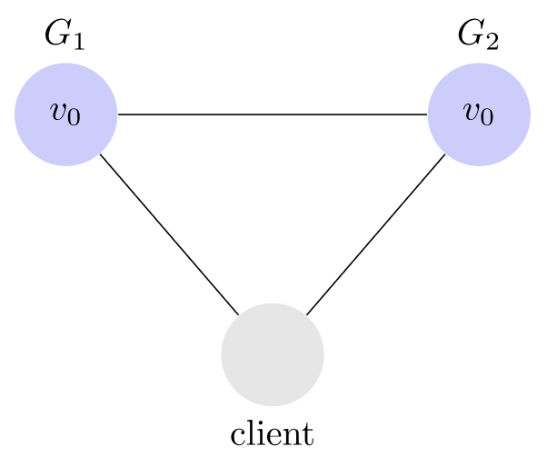
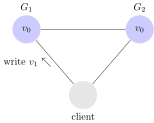
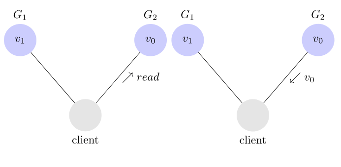
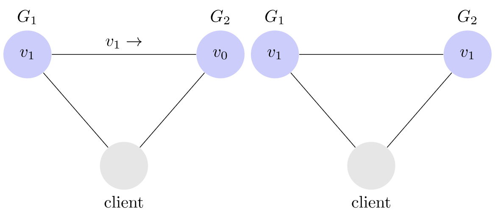
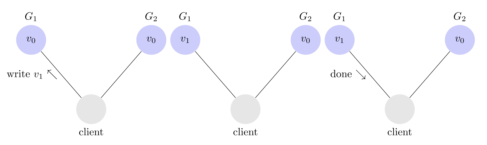
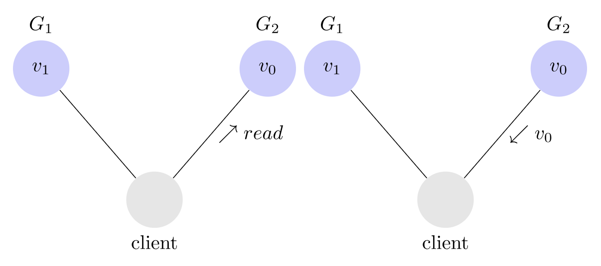

# 5.2 CAP 定理

CAP 是分布式系统中进行平衡的理论，1999 年，Eric A.Brewer 发表的论文 “Harvest, Yield, and Scalable Tolerant Systems”[^1] 中，首次提出了 CAP 原理（CAP principle）。一年之后，Eric A.Brewer 又在 PODC 大会上演讲了名为“Towards robust distributed systems”的主题[^2]，会上又详细介绍了 CAP 原理，之后 CAP 的概念开始流传。

虽然 Eric A.Brewer 提出了 CAP，但此时的 CAP 仅是一种猜想，并没有被从理论上证明。2002 年，Seth Gilbert 和 Nancy Lynch 联合发表了一篇论文[^3]从理论上证明了 CAP 的正确性，此后 CAP 从原理转变成定理，并开始深远地影响着分布式系统领域。

CAP 定理其实也非常简单，也是理解分布式系统的起点，CAP 定理对分布式系统的特征做了高度抽象，形成了 3 个 指标：

- 一致性（Consistency）
- 可用性（Availability）
- 分区容错性（Partition tolerance）

**Eric Brewer 的结论是一个分布式系统中 3 个指标不可能同时做到，只能从中选择 2 个，这个结论就叫做 CAP 定理**。

:::tip 额外知识

笔者在这里提前补充一点：对一个分布式系统，因为必须要实现分区容错性，CAP 其实是二选一而不是三选二而的权衡。
:::

下面笔者引入一个简单的分布式系统来解释清楚何为可用性、一致性、和分区容错性。假设这样的分布式系统包含两个服务 G~1~ 和 G~2~，这俩服务都保存着同一变量 V，其初始值是 V~0~。G~1~ 和 G~2~ 之间可以互相通信，同时它们也可以分别同第三方客户端通信，如下图所示：

	

现在我们已经建立了一个简单的分布式系统，接下来我们分别看下一致性、可用性和分区容错性。

## 1. 分区容错

先看 Partition tolerance（分区容错）。大多数分布式系统都分布在多个子网络，每个子网络就叫做一个区（partition）。只要有网络交互就一定会有延迟和数据丢失，这种情况我们只能接受，还必须要保证系统不能挂掉。如上面所提，节点之间的分区故障是必然发生的，也就是说 分区容错性（P）是前提，必须要保证。

	

上图中，G~1~ 和 G~2~ 是两台跨区的服务器。G~1~ 向 G~2~ 发送一条消息，G~2~ 可能无法收到。系统设计的时候，必须考虑到这种情况。

一般来说，分区容错无法避免，因此可以认为 CAP 的 P 总是成立。CAP 定理告诉我们，剩下的 C 和 A 无法同时做到。

## 2. 一致性

Consistency 中文叫做"一致性"。意思是写操作之后的读操作，必须返回该值。举例来说，某条记录是 v0，用户向 G1 发起一个写操作，将其改为 v1，接下来，用户的读操作就会得到 v1，这就叫一致性。

	
	

问题是，用户有可能向 G2 发起读操作，由于 G2 的值没有发生变化，因此返回的是 v0。G1 和 G2 读操作的结果不一致，这就不满足一致性了。

	

为了让 G2 也能变为 v1，就要在 G1 写操作的时候，让 G1 向 G2 发送一条消息，要求 G2 也改成 v1，这样的话，用户向 G2 发起读操作，也能得到 v1。

	

## 3. 可用性

保证可用性的系统中，如果客户端向某个没有宕机的服务端发送了请求，服务端必须响应客户端的请求，不能选择忽略掉客户端的请求。用户可以选择向 G~1~ 或 G~2~ 发起读操作。不管是哪台服务器，只要收到请求，就必须告诉用户，到底是 V~0~ 还是 V~1~，否则就不满足可用性。

## 证明

现在我们已经了解了什么是一致性、可用性和分区容错性，接下来我们证明下为什么一个分布式系统不能同时满足这三者。 

客户端将G1中的v从v0改成v1，因为要满足可用性的要求，G1必须响应客户端的写入请求，但是因为网络的问题，G1没法将数据同步到G2。Gilbert和Lynch将这个阶段称为alpha1阶段，如下图：

	

再然后，假设有个客户端从G2读了v的值，因为满足可用性要求，G2也必须正常响应，因为网络的问题，G2没有更新到G1的数据，所以G2只能返回v0，Gilbert和Lynch将这个阶段称为alpha2阶段，如下图：

	

在这里G1返回v1，G2只能返回v1，产生了不一致，和我们的假设相悖，所以证明同时满足一致性、可用性和分区容错性的分布式系统不存在。  

## 2. CAP 定理的应用

CAP 的指导作用是在架构设计中，不要浪费精力去设计一个满足一致性、可用性、分区容错性三者完美的系统，而是根据自己业务的特点就行取舍。

**对于一个分布式系统而言，因为网络必然会出现异常情况，一旦发生分区错误，整个分布式系统就完全无法使用，分区容错性也就成了必然要面对和解决的问题，因此系统架构师往往需要把精力花在如何根据业务特点在 C(一致性)和 A（可用性）之间寻求平衡**。

**根据一致性和可用性的选择不同，分布式系统往往又被分为 CP 系统和 AP 系统**。对 CP 系统而言，如果消息丢失、延迟过高发生网络分区时，为了不破坏一致性，会暂时牺牲可用性，例如基于 Raft 的强一致性系统，出现网络问题时，会无法执行读写操作的错误。对 AP 系统而言，会优先考虑水平扩展、性能、服务可用性等指标，所以即使出现网络分区导致数据失效，也仍然会返失效或者过时的数据，典型 AP 应用就是各大内容网站的点赞和评论功能，用户不太在意点赞和评论的实时性，更在意的时查看感兴趣内容的可访问性。

最后，笔者要额外提及，Seth Gilbert 和 Nancy Lynch 的论文中基于证明严谨性的考虑，将 CAP 中的一致性和可用性的含义定义为强一致性（原子一致性）和完全(100%)可用性。论文之外，很多系统既不是 CP 类型，也不是 AP 类型。而是处于两者之外的状态，这种状态用弱 CAP 原则描述更为普适一些。

## 3. 弱 CAP 原则

同时，Eric A.Brewer 在论文中还提出了弱 CAP 原则（weak CAP principle）：

:::tip 弱 CAP 原则

The stronger the guarantees made about any two of strong
consistency, high availability, or resilience to partitions, the
weaker the guarantees that can be made about the third.

在强一致性、高可用性、分区容错性三个属性中，任意两个属性越强，第三个属性就越弱。
:::

对于弱 CAP 的原则理解是比如一致性，可以是稍弱的最终一致性模型，再比如可用性， Zookeeper 的可用性就是比完全可用性更弱的一种可用性。在大多数系统内，一般都同时存在属于 A 和属性 C，只是相对弱一些而已。

最后，不管是 CAP 定理还是弱 CAP 原则，都说明可用性和一致性之间是矛盾的，需要在它们之间做均衡。但 CAP 定理对 C 和 A 的定义非常严苛，只能衡量很少一部分系统，而弱 CAP 原则则给出了一种更普适的均衡。

[^1]: 参见 https://ieeexplore.ieee.org/document/798396
[^2]: 参见 https://dl.acm.org/doi/10.1145/343477.343502
[^3]: 参见 https://groups.csail.mit.edu/tds/papers/Gilbert/Brewer2.pdf