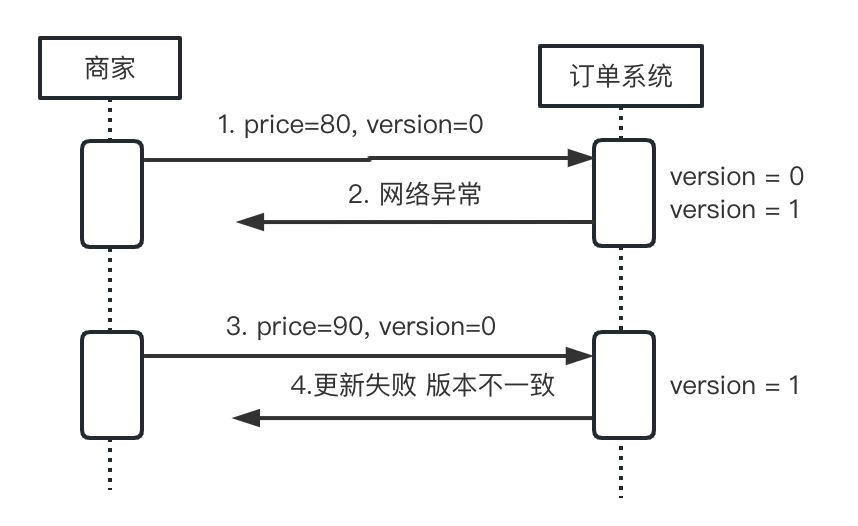

# 5.4 幂等性设计

幂等性是指一个操作多次执行的结果与其执行一次的结果相同。设计具有幂等性的分布式系统可以有效避免数据不一致和重复处理的问题。在一些特殊业务中，会对幂等性有严格的设计要求。比如在退款、支付的流程中，如果没有严格设计，会造成重大的经济损失。对于非幂等性产生的原因，举例说明： 

- 前端设计不合理，用户主动多次请求
- 网络库超时重试机制
- 弱一致性分布式系统中，不合理的查询判断

## 1. 实现幂等性系统方案选型

类似`订单`，`退款`，`票务`等系统要求具备幂等性，可以采用如下的方案进行实现：

- 利用 `全局唯一ID` 防止重复提交
- 利用 `Token` 机制防止重复提交

### 使用全局唯一 ID

利用全局唯一 ID 及数据库主键唯一特性，可以解决重复提交的问题，对于相同的 ID 重复插入时，会产生 `result in duplicate entry for key primary` 错误。系统流程图如下：

<div  align="center">
	
</div>

系统中一般会搭建一个独立的全局 ID 生成服务，生成的 ID 建议具备以下特性：

- 全局唯一
- 趋势自增 ，多数关系型数据库使用 BTree 索引，有序的主键可保证写入性能
- 单调自增，可以支持排序需求
- 信息安全，可以防止被外界猜到生成规律
- 含有时间戳

一般情况下，用 UUID 或数据库自增 ID 基本就可以保证需求。如果要满足更严格的特性，可以使用 `snowflake` 自增 ID 生成算法。

### 使用 snowflake 算法

snowflake 是 Twitter 开源的分布式自增 ID 算法。特点是：按时间有序、生成的结果小、生成效率高。

<div  align="center">
	<p>snowflake ID 结构</p>
	
</div>

- 第 1 位占用 1bit，其值始终是 0，可看做是符号位不使用。
- 第 2 位开始的 41 位是时间戳，41-bit 位可表示 2^41 个数，每个数代表毫秒，那么雪花算法可用的时间年限是(1L<<41)/(1000L360024*365)=69 年的时间。
- 中间的 10-bit 位可表示机器数，即 2^10 = 1024 台机器，但是一般情况下我们不会部署这么台机器。如果我们对 IDC（互联网数据中心）有需求，还可以将 10-bit 分 5-bit 给 IDC，分 5-bit 给工作机器。这样就可以表示 32 个 IDC，每个 IDC 下可以有 32 台机器，具体的划分可以根据自身需求定义。
- 最后 12-bit 位是自增序列，可表示 2^12 = 4096 个数。

这样的划分之后相当于在一毫秒一个数据中心的一台机器上可产生 4096 个有序的不重复的 ID。但是我们 IDC 和机器数肯定不止一个，所以毫秒内能生成的有序 ID 能力是翻倍的。

### 1.3 Token 机制

Token 机制和  `全局唯一ID`有点类似，不过增加了一个校验 `Token` 是否有效的逻辑。

- 订单系统提供一个发放 Token 令牌。Token 生成可以使用上面提到的  snowflake 算法生成。
- 在订单页面，调用获取 token 接口，并对该 token 设定一个失效期
- 提交订单时，将该 token 作为参数提交给后端订单系统
	- 后端判断该 token 是否存在，如存在，则为第一次提交，放行并删除 token
	- 如无 token，第二次提交，阻拦该请求

在高并发的环境中，需要注意 token 的获取和删除要使用原子操作。

## 2. 幂等下 ABA 的问题

先看一下数据库中幂等和非幂等性的操作：

幂等操作
```plain
update order set price = 100 where id = 1;
```
非幂等
```plain
update order set price = price+1 where id = 1;
```
在高并发的场景中，计算型更新会产生非幂等性问题。以支付环节为例，说明幂等性问题：

1. 用户下单一个 100 块钱的商品，在支付前与商家沟通这打个 9 折。
2. 商家操作出错，将价格改成了 8 折，改完后发现改错了，再修改成 9 折，对于订单系统这两次都修改成功了。
3. 但是由于网络出错，第一次修改通知产生了重试或者其他逻辑，覆盖了后面 90 元的推送。
4. 最终用户支付的价格，是错误的 80 元。

对于这种典型的 ABA 问题，通常可以使用`乐观锁`来解决, 即在数据中加一个版本号的概念，版本号不一致则产生异常处理，我们看一下使用乐观锁的处理逻辑。

<div  align="center">
	<p>乐观锁逻辑</p>
	
</div>

数据库原句 **注意保证原子性操作**
```plain
update order set price=80,version=version+1 where order=1 and version=1
```
从上面的流程图中， 当商家更新失败时，产生一个错误的逻辑，或者刷新页面，或者其他方式，重新获取最新的版本号就行修改，即可解决 高并发中 ABA 问题。
