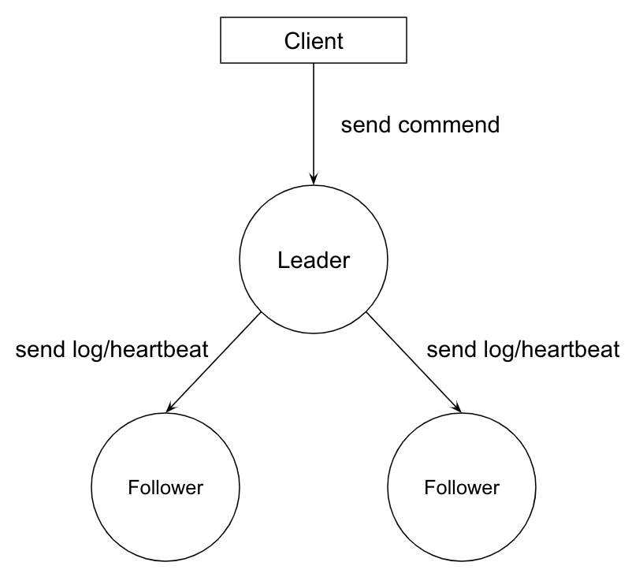
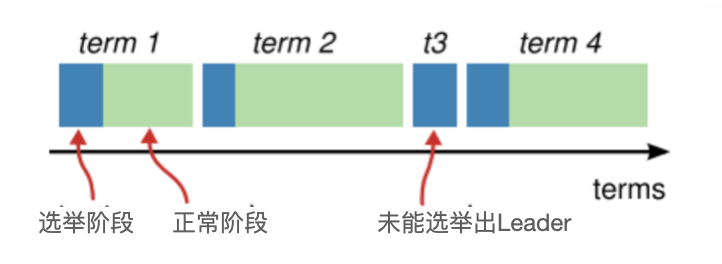
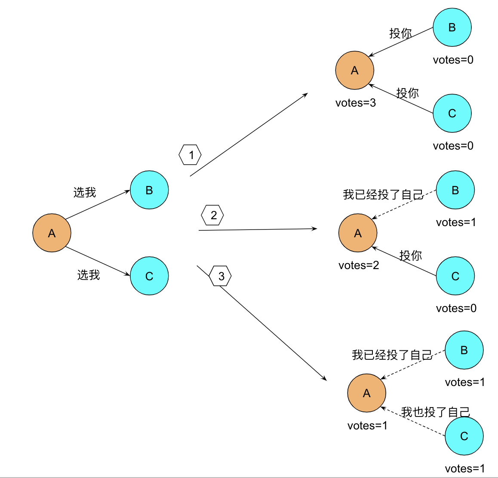
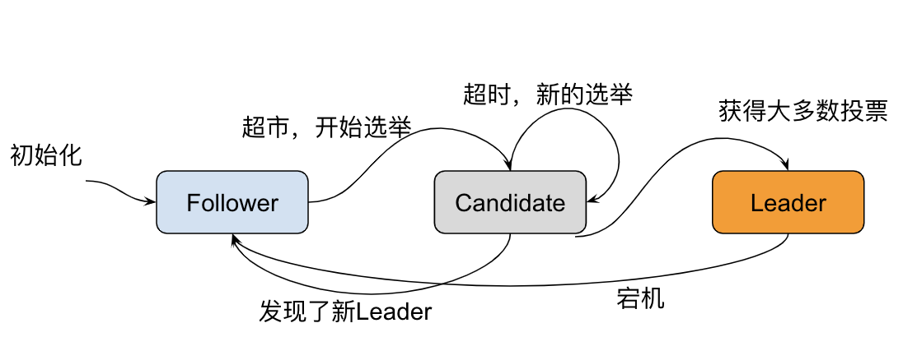
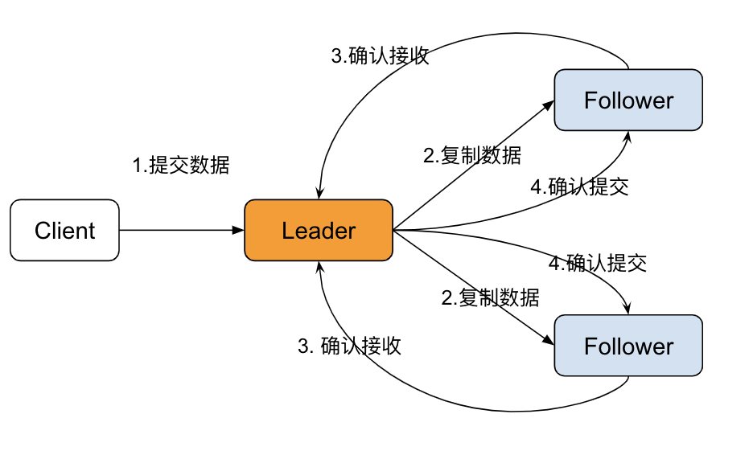

# 5.6.2 共识算法 Raft

Raft 是工程上使用较为广泛的强一致性、去中心化、高可用的分布式共识算法。Raft 从问世就开始备受关注，被认为是所有共识算法中的最优解，无论是协商效率还是工程实现，效果都非常出色。

## 1. Raft 的基本概念

Raft 将系统中的角色分为领导者（Leader）、跟从者（Follower）和候选者（Candidate）

- **Leader**：接受客户端请求，并向 Follower 同步请求日志，当日志同步到大多数节点上后高速 Follower 提交日志。
- **Follower**：接受并持久化 Leader 同步的日志，在 Leader 告知日志可以提交后，提交日志。当 Leader 出现故障时，主动推荐自己为候选人。
- **Candidate**：Leader 选举过程中的临时角色。向其他节点发送请求投票信息，如果获得大多数选票，则晋升为 Leader

Raft 算法将分布式一致性分解为多个子问题，包括 Leader 选举（Leader election）、日志复制（Log replication）、安全性（Safety）、日志压缩（Log compaction）等。

	

Raft 算法将时间划分为不定长度的任期 Terms，Terms 为连续的数字。每个 Term 以选举开始，如果选举成功，则由当前 leader 负责出块，如果选举失败，并没有选举出新的单一 Leader，则会开启新的 Term，重新开始选举。

	

### Leader 选举

Raft 使用心跳机制来触发领导者选举，当服务器启动时，初始化都是 Follower 身份，由于没有 Leader，Followers 无法与 Leader 保持心跳，因此 Followers 会认为 Leader 已经下线，进而转为 Candidate 状态，然后 Candidate 向集群其他节点请求投票，同意自己成为 Leader，如果 Candidate 收到超过半数节点的投票(N/2 +1)，它将获胜成为 Leader。

	

Leader 向所有 Follower 周期性发送 heartbeat，如果 Follower 在选举超时时间内没有收到 Leader 的 heartbeat，就会等待一段随机的时间后发起一次 Leader 选举。

	

### 日志同步

Raft 算法实现日志同步的具体过程如下：

- Leader 收到来自客户端的请求，将之封装成 log entry 并追加到自己的日志中；
- Leader 并行地向系统中所有节点发送日志复制消息；
- 接收到消息的节点确认消息没有问题，则将 log entry 追加到自己的日志中，并向 Leader 返回 ACK 表示接收成功；
- Leader 若在随机超时时间内收到大多数节点的 ACK,则将该 log entry 应用到状态机并向客户端返回成功。

	

## 2. Raft 工程实现

Raft 拥有不同的开发语言多种实现，如下表展示了部分 Raft 工程实现

| 项目 | 开发语言 | Leader 选举+日志复制 | 持久化 |成员变更| 日志复制 |
|--:|:--|:--|:--|:--|:--|
| etcd/raft | Go | 支持| 支持| 支持| 支持|
| RethinkDB |  C++ | 支持| 支持| 支持|支持|
| TiKV| Rust | 支持| 支持| 支持|支持|
|SOFAJRaft | java | 支持| 支持| 支持|支持|
| braft | C++ | 支持| 支持| 支持|支持|

如果是 Java 开发者，可以尝试使用 SOFAJRaft。 SOFAJRaft 是一个蚂蚁金服开源的高性能生产级类库，SOFAJRaft 除了提供单元测试之外，还可以使用 Jepsen 分布式一致性和线性化的安全性，以及模拟各种分布式场景。

感兴趣的读者可以在 https://raft.github.io 获取更多信息