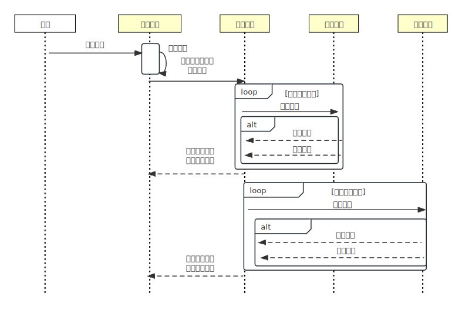

# 5.3.1 可靠事件队列

2008 年，eBay 系统架构师 Dan Pritchett 在 ACM 发表了论文《Base: An Acid Alternative》[^1]。这篇论文中，作者基于实践总结出一种独立于 ACID 之外，通过消息队列和幂等机制来达成数据一致性的技术手段，并提出了“最终一致性”的概念。

从论文标题可以看出，最终一致性的概念与 ACID 强一致性对立。因为 ACID 在英文中有的“酸”的含义，这一事务模型的名字刻意拼凑成 BASE（BASE 在英文中有碱的含义）。有酸 vs 碱这个计算机浑然天成的梗加成，《Base: An Acid Alternative》论文广泛传播，BASE 理论和最终一致性的概念也被大家熟悉。

BASE 是“Basically Available”、“Soft State”和“Eventually Consistent”的缩写，其核心理念为：

- **基本可用（Basically Available）**：系统保证在大多数情况下能够提供服务，即使某些节点出现故障时，仍尽可能保持可用性。这意味着系统优先保障可用性，而非一致性。
- **柔性状态（Soft state）**：系统状态允许在一段时间内处于不一致状态。与 ACID 强一致性的要求不同，BASE 允许系统在更新过程中状态“柔性”，即数据在某些节点上可以暂时不一致，直到系统最终达到一致性。
- **最终一致性（Eventually consistent）**：最终一致性强调，即使在网络分区或系统故障的情况下，在经过足够的时间和多次数据同步操作后，所有节点的数据一定会一致。

BASE 理论是对 CAP 定理中 AP（可用性和分区容错性）方案的延伸，强调在分布式系统中，即使无法实现强一致性，也可以通过适当的方式使系统最终达到一致性。

**Dan Pritchett 在论文中提到的“实现数据一致性的手段”，可以总结为基于可靠事件队列的事件驱动模式**。该模式的关键在于确保事件的可靠投递和避免重复消费。幸运的是，当前流行的消息中间件已经普遍实现了事件持久化和至少一次投递机制。此外，幂等性的实现也有成熟的解决方案，因此这些问题已不再是难点。

接下来，笔者将通过一个具体的例子帮助你理解“可靠事件队列”的具体做法。

假设有一个电商系统，下单操作依赖于三个服务：支付服务（进行银行扣款）、库存服务（扣减商品库存）和积分服务（为用户增加积分）。下单过程中，我们优先处理最核心、风险最高的服务，按照支付扣款、仓库出库以及为用户增加积分的顺序执行。下单的整个流程如图 5-2 所示。

:::center
  <br/>
  图 5-2 可靠事件队列模型
:::

首先，用户向商店发送了一个交易请求，如购买一件价值 ￥100 的商品。接着，支付服务创建一个本地扣款事务。如果扣款事务执行成功，系统将在消息队列中新增一条待处理消息。消息的大致结构如下：

```go
struct Message {
	事务 ID;
	扣款 ￥100（状态：已完成）;
	仓库出库（状态：待处理）;
	赠送积分（状态：待处理）
}
```

系统中有一个持续运行的服务，定期轮询消息队列，以检查是否存在待处理的消息。如果发现待处理消息，它将通知库存服务和积分服务进行相应的处理。

此时，会出现以下几种情况：

- **仓库服务和积分服务顺利完成任务**：这两个服务成功执行了出库和积分操作，并将结果反馈给支付服务。随后，支付服务将消息状态更新为“已完成”，整个事务顺利完成，实现最终一致性。
- **网络问题导致消息未送达**：如果仓库服务或积分服务因网络问题未收到支付服务的消息，此时，支付服务中的消息状态将保持为“待处理”。消息服务会在每次轮询时继续向未响应的服务节点重复发送消息，直到通信恢复正常。为了确保出库和积分操作仅被执行一次，所有接收消息的服务必须具备幂等性（有关幂等性的设计，详见5.4节）。
- **服务无法完成操作**：如果仓库服务或积分服务由于某种原因无法完成操作（例如，仓库库存不足），消息服务将持续发送消息，直到操作成功（如库存补充）或通过人工干预终止。

由此可见，在可靠消息队列方案中，一旦第一步扣款成功，就不再考虑失败回滚的情况，后面只有成功一条路可选。

这种依赖持续重试来确保可靠性的解决方案在计算机领域被广泛应用，它还有专有的名称 —— “最大努力交付”（Best-Effort Delivery）。因此，可靠事件队列也称为“最大努力一次提交”（Best-Effort 1PC）机制，也就是将最容易出错的业务通过本地事务完成后，借助不断重试的机制促使同一个事务中其他操作也顺利完成。

[^1]: 参见 https://queue.acm.org/detail.cfm?id=1394128
