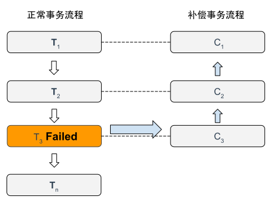

# 5.3.3 Saga

Saga 源于1987年普林斯顿大学的 Hector Garcia-Molina 和 Kenneth Salem 在 ACM 发表的论文《SAGAS》[^1]。该论文提出了一种改善“长时间事务”（Long Lived Transaction）效率的方法，核心思路是将大事务拆分为多个可并行执行的子事务，并在每个子事务中引入补偿操作。补偿（也称为逆向恢复）是在分布式事务发生异常时，通过一系列操作将事务状态回滚到之前的状态，从而避免不一致的情况发生。

Saga 事务模型由两部分组成：

1. 一部分是**将大事务 T 拆分成若干小事务**，命名为 T~1~，T~2~，T~n~。每个子事务被应被视为原子行为，如果分布式事务 T 能够正常提交，那么它对数据的影响应该与连续按顺序成功提交子事务 T~i~ 等价。
2. 另一部分是**为每个子事务设计对应的补偿动作**，命名为 C~1~，C~2~，C~n~。T~i~ 与 C~i~ 满足以下条件：
	- T~i~ 与 C~i~ 具备幂等性。
	- T~i~ 与 C~i~ 满足交换律，即无论先执行 T~i~ 还是先执行 C~i~，其结果都是一样的。
	- C~i~ 必须保证成功提交，即不考虑 C~i~ 的失败回滚情况。如果出现失败，则持续重试直至成功或者被人工介入为止。

如果 T~1~ 到 T~n~ 均执行成功，那么整个事务顺利完成，否则根据下面两种机制之一进行事务恢复：

- **正向操作**（Forward Recovery）：如果 T~i~ 提交失败，则一直对 T~i~ 进行重试，直至成功为止（使用最大努力交付机制）。这种恢复方式不需要进行补偿，适用于事务最终都要执行成功的情况。如订单服务中银行已经扣款，那么就一定要发货。
- **逆向恢复**（Backward Recovery）：如果 T~i~ 提交失败，则执行对应的补偿 C~i~，直至恢复到 T~i~ 之前的状态，这里要求 C~i~ 必须成功（使用最大努力交付机制）。

:::center
  
  图 5-4 Saga 事务模型
:::

Saga 非常适合处理流程较长、且需要保证事务最终一致性的业务场景。例如，在一个旅游预订平台中，用户可能同时预订机票、酒店和租车服务，这些服务可能由不同的微服务或第三方供应商提供。在这种场景下，Saga 事务模型允许系统逐步执行每个操作，并在任一步骤失败时有序地执行补偿操作，从而确保系统的一致性并提升用户体验。

与 TCC 相比，Saga 通常采用事件驱动设计，即每个服务都是异步执行的，无需设计资源的冻结状态或处理撤销冻结的操作。但缺点是不具备隔离性，多个 Saga 小事务操作同一数据源时，无法保证操作的原子性，可能出现数据被覆盖的情况。

最后，尽管补偿操作较易实现，但确保正向操作与补偿操作的严格执行仍需要大量精力。因此，Saga 事务通常不通过裸编码实现，而是在事务中间件的支持下完成。前面提到的 Seata 中间件也支持 Saga 事务模型。

[^1]: 参见 https://www.cs.cornell.edu/andru/cs711/2002fa/reading/sagas.pdf
