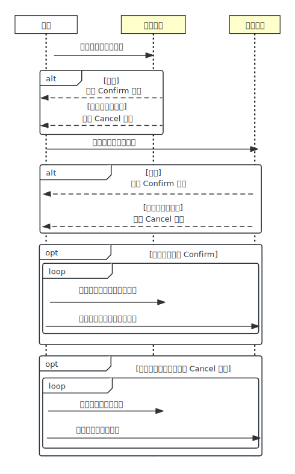

# 5.3.2 TCC

可靠消息队列虽然能保证最终结果的相对可靠性，过程也足够简单，但整个过程完全没有隔离性可言，如果你的业务需要隔离，那你就应该考虑笔者下面介绍的适合强隔离性的分布式事务 -- TCC。

TCC 是“Try-Confirm-Cancel”三个单词的缩写，最早出现在 2007 年数据库专家 Pat Helland 发表了一篇名为 “Life beyond Distributed Transactions:an Apostate’s Opinion” 的论文中[^1]，不过该论文中 TCC 还是以 Tentative-Confirmation-Cancellation 作为名称，在国内经历阿里程立博士的传道之后，TCC 逐渐被大家广为了解并接受。

TCC 是一种对业务侵入性较强的事务方案，要求业务处理过程中必须拆分为”预留业务资源“、”确认/释放消费资源“两个子过程。如同名字，TCC 整个事务流程由三个阶段组成：

- **Try 阶段**：尝试执行阶段，完成所有业务可执行检查（保障一致性，预留必须业务资源（保障隔离性）。
- **Confirm 阶段**：如果所有分支的 Try 都成功了，则走到 Confirm 阶段。Confirm 真正执行业务，不作任何业务检查，直接使用 Try 阶段预留的业务资源来完成处理。
- **Cancel 阶段**：如果所有分支的 Try 有一个失败了，则走到 Cancel 阶段。Cancel 释放 Try 阶段预留的业务资源。

按照 TCC 的协议，Confirm 和 Cancel 是只返回成功，不会返回失败。如果由于网络问题或者服务器临时故障，那么事务管理器会进行重试直至最终成功，所以这两个阶段的操作要求具备幂等性。

以一个下单服务为例，说明 TCC 事务处理流。该下单服务由两个系统操作完成：订单系统 X、资金账户系统 Y。

	

- **Try 操作** : try X 下单系统创建待支付订单。try Y 自己账户系统冻结订单金额 100 元。 
- **Confirm 操作**  confirm X 订单更新为支付成功。confirm Y 扣减账户系统 100 元。
- **Cancel 操作** Cancel X 订单异常，资金退回，Cancel Y 扣款异常，订单支付失败

由上述操作过程可见，TCC 其实有点类似 2PC 的准备阶段和提交阶段，但 TCC 是位于用户代码层面，而不是在基础设施层面，这为它的实现带来了较高的灵活性，可以根据需要设计资源锁定的粒度。

TCC 事务模型虽然说起来简单，然而要基于 TCC 实现一个通用的分布式事务框架，却比它看上去要复杂的多，感知各个阶段的执行情况以及推进执行下一个阶段需要编写大量的逻辑代码，不只是调用一下 Confirm/Cancel 那么简单。通常的情况，我们不需要靠裸编码来实现 TCC，而是引入某些分布式事务中间件（譬如 Seata、ByteTCC）来降低编码工作，提升开发效率。

[^1]: 参见 http://adrianmarriott.net/logosroot/papers/LifeBeyondTxns.pdf