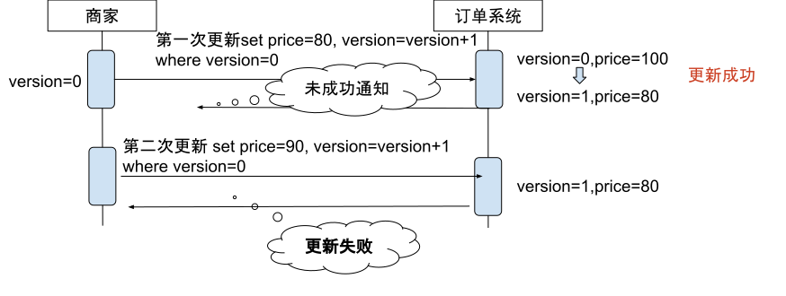

# 5.4 系统幂等性设计

由于分布式系统中可能会存在超时重试的情况，柔性事务大都采用最大努力交付机制解决超时问题，因此柔性事务中的操作必须是幂等的。

:::tip 什么是幂等

幂等是来源于数学中的一个概念，用数学语言表达就是 `f(x)=f(f(x))`，计算机中指的是一个操作多次执行的结果与其执行一次的结果相同。业务具有幂等性可以规避数据不一致和重复处理的问题，譬如一个退款的接口，如果不加以控制，多次请求产生多次退款会造成无法承受的损失。

:::
## 5.4.1 使用全局唯一 ID
实现系统的幂等性有多种方式，最常用的是：**使用全局唯一 ID 方案**。

这种方案利用全局唯一 ID 及数据库主键唯一特性解决重复提交的问题，对于相同的 ID 重复插入时，产生 `result in duplicate entry for key primary` 错误，这种方式的流程如下。

:::center
  
  图 5-5 使用全局唯一 ID 解决重复提交
:::

生成全局唯一 ID 最合适的是使用 snowflake（雪花算法，取自世界上没有两片相同的雪花之意），这是 Twitter 开源的分布式自增 ID 算法，使用分布式部署的情况下每秒可生成百万个不重复、递增 id。

另外一种方式是Token 机制，这种方式和`全局唯一ID`有点类似，不过增加了一个校验 `Token` 是否有效的逻辑，笔者以一个订单系统举例说明。

1. 订单系统提供一个发放 Token 令牌。Token 生成可以使用上面提到的 snowflake 算法生成。
2. 在订单页面，调用获取 token 接口，并对该 token 设定一个失效期。
3. 提交订单时，将该 token 作为参数提交给后端订单系统，后端判断该 token 是否存在：
	- 如存在，则为第一次提交，放行并删除 token
	- 如不存在，第二次提交，阻拦该请求

并发编程环境中，需要注意 token 的获取和删除要使用原子操作。

## 5.4.2 解决数据 ABA 的问题

:::tip 什么是 ABA 问题
所谓的 ABA 问题是指在并发编程中，如果一个变量初次读取的时候是 A 值，它的值被改成了 B，然后又其他线程把 B 值改成了 A，而另一个早期线程在对比值时会误以为此值没有发生改变，但其实已经发生变化了，这就是 ABA 问题。
:::

先看一下数据库中幂等和非幂等性的操作。

幂等操作。
```plain
update order set price = 100 where id = 1;
```
非幂等。
```plain
update order set price = price+1 where id = 1;
```
并发操作数据库场景中，计算型更新会产生非幂等性问题。以支付环节为例，说明幂等性问题：

1. 用户下单一个 100 块钱的商品，在支付前与商家沟通这打个 9 折。
2. 但商家操作出错了，将价格改成了 8 折，改完后发现改错了，又重新修改成 9 折（数据库中最终价格是 ￥90）。
3. 但是由于网络出错或者别的原因，第一次修改通知产生了重试或者其他逻辑，覆盖了后面 ￥90 元的推送。
4. 最终，用户看到的待支付的价格，是错误的 ￥80 元。

对于这种典型的 ABA 问题，可以使用`乐观锁`来解决, 即在数据中加一个 version 或者 timestamp 之类的字段，以 version 举例的话就是每次修改的时候都先查出来要改的这个字段的版本号，然后再执行 SQL 语句进行修改，不过 SQL 中需要带一个 WHERE 子句，条件为 version = {查出来的版本}，如果是 UPDATE 语句的话则同时将版本号+1 。

我们看一下使用乐观锁的处理逻辑，如图 5-6 所示。

:::center
  
  图 5-6 使用乐观锁解决数据 ABA 问题
:::

从上面的流程图中，当商家第一次更新价格时，数据库更新成功，但因某些特殊原因，未能成功通知商家（也就是说没有拿到最新的 version），第二次更改价格时，由于本地的 version 已经失效，数据库会执行失败。这时候，只有产品逻辑上或刷新页面、或其用他方式，获取到最新的版本号才能继续修改。

上面的乐观锁，其实就是一种典型的 CAS（Compare And Swap | Compare And Set，比较并交换）操作。如果系统中冲突没那么频繁，倒是可以考虑这种简单的校验和后续处理来确保共享资源的一致性的方式。