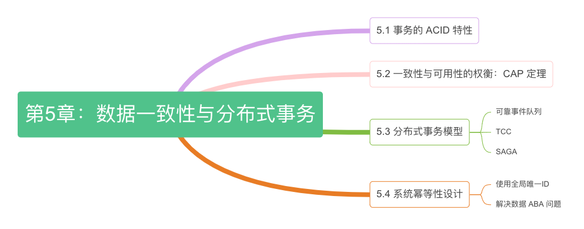

# 第五章：数据一致性与分布式事务

:::tip <a/>

网络是不稳定的，延迟是不可预测的，带宽是有限的，拓扑是动态的，一切都会失败。

:::right
—— 改自于分布式计算八大谬误[^1]
:::

事务（transaction）最早指本地事务，即将对数据库的多个读写操作捆绑为一个操作单元，作为一个执行整体要么成功，要么失败，从而保证某些极端情况下（进程崩溃、网络中断、节点宕机）数据一致性。不过，随着分布式系统的广泛应用，事务处理的范畴不再局限于数据库内，所有需要保证数据一致性的应用场景，包括但不限于缓存、消息队列、存储、微服务架构之下的数据一致性处理等等，都需要用到事务的机制进行处理。

当事务中的操作局限在本地时，如何实现事务仅仅是个编码问题。但若事务操作跨越了多个网络节点，如何保证分布式系统下数据一致性便成了架构设计问题。2000 年以前，人们曾经希望基于两阶段提交（2PC）的事务机制，也能在现代分布式系统中良好运行，但这个愿望被 CAP 定理粉碎。本章，我们深入理解分布式环境下数据一致性和可用性的矛盾，彻底掌握各个分布式事务模型。

:::center
  
  图 5-0 本章内容导图
:::

[^1]: 分布式计算八大谬误出现背景是，人们在设计和开发分布式系统时，常常将中心化系统的经验和假设直接应用到分布式环境中，忽视了分布式环境的复杂性和特殊需求。这些谬误可以视为分布式系统设计时需要考虑的架构需求。