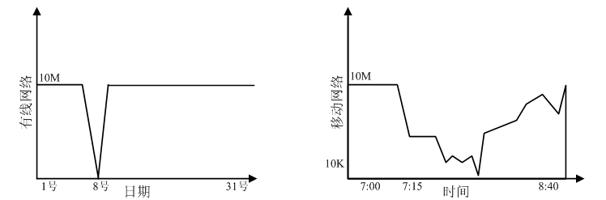
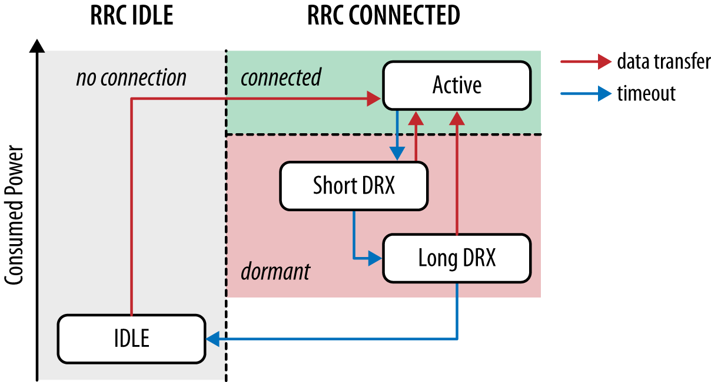

# 理解移动网络

很多时候我们讲C端网络优化，会突出一下移动网络的弱网特性。例如信号不稳定，高时延、易抖动丢包、通道狭窄问题...。这些特点，要求我们对移动端产品网络层的设计要更加敏感。

相较于有线网，移动的这种无线网络，因为物理特性具有更复杂的设计，这主要是由于：

- **通信链路复杂**： 相较有线网要经过基站、核心网等，网络传输中间环节越多，越容易出现问题。
- **资源受限** 移动设备接入基站空中信道数量非常有限，信道调度更是相当复杂
- **无线链路抖动** ：无线各种制式网络带宽上限都比较低而传输时延比较大，最重要的是，距离基站的远近、墙体、金属设备等隔离也影响无线信号的质量

	
图: 无线网络抖动不确定性更强

	

## 移动网络技术标准

无线通讯使用电磁波作为数据传输的载体，但受物理电气特性影响，如频段、传输损耗等，不如有线那么稳定可靠，所以围绕无线传输，产生了大量的可靠性提升技术。

比如提高频率（5G），应用MIMO技术等等。为了解决路径损耗、穿透损耗等信道的不利影响，信道编码技术也一直在不断升级，从Turbo 到 LDCP、Polar，信息传输效率不断接近香农极限。

3GPP组织从2004年始对无线通讯，开长期演进(Long Term Evilution, LTE)的标准化项目。通过对频段、信道编码等技术标准的推进，目前移动网络普遍已经演进为`LTE`、`LTE-Advanced（4G`）、`NR（5G）`

如果您是一位iOS的开发者，您可以从 `iOS CoreTelephony`框架中，得到各类网络状态信息的支持，其中在`<CoreTelephony/CTTelephonyNetworkInfo.h>`头文件中定义了各类的网络类型。

笔者将 `CTTelephonyNetworkInfo.h` 中的定义信息，抽出目前主流的制式汇总成以下表格，以供读者参考，更多信息可从该网址获取[^注1]，（在东南亚地区还存在一定的 3.5G 网络）

| 格式 | 名称 | 备注 |
|:----- |:-------- |:----- |
|HSDPA| 3.5G| 理论 8-10 Mbit/s，实际 150 ~ 00kBps|
|HSUPA| 3.7G| 时延 50ms， 理论峰值 1.4 - 5.8Mbps|
|LTE| 4G | 时延约 50ms， 理论峰值 100Mbps~150Mbps，实际约10 Mbps |
|NR| 5G New Radio | 时延约 1ms， 理论峰值 10Gbps ~ 20Gbps， 实际约 100 Mbps|

###  海外网络制式统计

根据iOS中网络制式的划分，在爱奇艺海外业务在运营初期，笔者的工作中就统计了一部分海外用户的网络状态，根据统计的数据，在后续的海报生产、视频码流起播选择、接口缓存策略等进行了相应的调整。

现将部分数据汇成表格，以供读者参考，但需了解网络状态无法代表网络质量的好坏，评估网络质量用时延（1RTT）、吞吐率等更为合适。

（注：数据统计于 2019年末，单行统计数大于10,000）

| 国家/地区 | wifi | 4G | 3G | 3.5G | 其他 |
| :---| :---| :---| :---| :---| :---|
|印尼 |57%|29%|4.9%|0.8%|4.5%|
|菲律宾|74%|14%|4%|0.8%|2%|
|越南 |85%|6%|2%|1.2%|2%|
|泰国 |65%|23%|3.4%|3%|2%|
|马来|49%|33%|7%|2%|3%|
|美国|74%|14%|1%|4%|2%|
|新加坡|79%|12%|1.5%|1.6%|~|
|中国|69%|17%|1%|4%|1%|
|中国香港|65%|27%|1%|0.7%|~|
|柬埔寨|58%|28%|4%|5%|1%|
|缅甸|70%|18%|3.6%|2%|1.7%|
|加拿大|87%|4.2%|0.05%|0.06%|1.7%|

## 移动网络优化指导

### 无线电资源控制模块 RRC

在讲移动网络优化之前，不得不提一下3G、4G移动设备中的无线电资源控制模块 `RRC`。

由于移动设备的电量是影响设备使用的一个关键因素，并且设备也不是所有的时刻都在传输数据，这就需要一个机制来调控设备的状态来节省电量。在传输数据时处在高功率状态，没有数据传输时处在空闲状态，这样就可以很好的节省设备电量。这个机制就是RRC状态机。

3GPP标准定义了一个完备的RRC状态机，它描述了连接到网络的每个设备的功率状态。

	

- **RRC空闲**：设备的无线电模块处于低功率状态（<15mW），只监听来自网络的控制信号。运营商网络中的客户端没有无线电资源。
- **RRC连接**：设备的无线电模块处于高分辨率状态（1000-3500mW），要么传输数据，要么等待数据。运营商网络中指定了数据承载方式，也分配了专用的无线电资源

当设备或网络处于空闲状态时需要传输数据，设备需要先监听网络以求与网络同步，然后再和RRC交换控制信息，协商相关信息，切换到连接状态，网络环境准备就绪，等待数据传输，这也有一个延时。

|延时|LTE|LTE-A|
|:--|:--|:--|
|空闲到连接|<100ms|<50ms|
|DRX到连接|<50ms|<10ms|
|用户面单向|<5ms|<5ms|

### 移动网络优化建议

在前面通过几个篇幅介绍移动网络的原理，相信读者已经能初步了解到无线网络的特征，我们要提升移动应用体验除了常规的优化手段之外，还要考虑无线信号性能特征、以及设备电量的有效性问题。性能移动应用体验的因素很多，但传输延迟、网络抖动、以及非合理性的联网操作导致电量消耗过大是其中最基础，也是最重要的。

下面将介绍针对移动网络的无线性及电源限制给出的性能优化建议。

### 1.节约用电的网络优化

移动网络的性能与电池的使用时间联系十分紧密，如果是全功率打开无线电模块，可能几个小时就会耗尽电量，在开发应用时，需要尽量合理利用无线电接口。

**消除周期性及无效的数据传输**

只要进行数据传输，无论传输数据量大小，无线电模块总会处于高功率状态，并不存在耗电少的请求。有以下优化规则：

- 轮询在移动网络中代价极高，尽量少用
- 尽可能使用推送和通知
- 出站和入站请求应该合并和汇总
- 非关键性请求应该推迟到无线模块活动时进行

**重连机制优化**

虽然移动网络中TCP/UDP连接的状态及生命周期与设备的无线状态是相互独立的，但不必要的长连接也有可能带来极大的电量消耗。

一般重连机制都有几个重要参数：`心跳时间间隔`、`重连超时时间`及`重连次数`。

其中心跳包每天会将手机从空闲模式唤醒近300次，一般的Android手机每天有超过15-20%的电量被消耗在发送过度频繁的心跳上。

另外如果手机连不上服务器而不断的重试，在几小时内就会耗光电池。所以心跳时间不宜过短，据测试微信心跳时间为300s，可以作为一个参考。

同样也不能永无休止的重连，重连几次还连不上，可以直接把问题抛给用户，由用户决定是否继续重连。

### 2.预测网络延迟上限

在移动网络中，一个HTTPS请求（DNS、TCP、TLS等）可能导致长达几百甚至是几千毫秒的延迟，里面有很多环节都是不可确切预估的，有不小的变化。

针对延迟的不确定性，移动应用需要做最坏的考虑，预测延迟的最大值，给用户以友好的反馈和用户体验。一个HTTPS的延迟预估如下

||3G|4G|
|:--|:--|:--|
|Control Plane| 200 ~ 2,500ms | 50~100ms|
|DNS lookup| 200ms | 100ms|
|TCP handshake| 200ms | 100ms|
|TLS handshake| 200~400ms | 100~200ms|
|HTTP Request| 200ms | 100ms|
|Total latency overhead| 200~3,500ms | 100~600ms|

如果移动设备处在空闲状态，第一个分组将会导致几百甚至几千毫秒的额外RRC延时。经验表明4G网络或增加100ms，3.5G+网络会增加150ms-500ms，而3G网络会增加500-2500ms的控制面延时。

虽然移动网络会给人一种应用永远在线的感觉，但其物理层是不断的连接和断开的。要考虑这种延时，否则会影响用户体验。

### 3. 面对多网络接口并存的现实

在移动应用的开发中我们要对各种网络问题做好足够的准备，如：无法访问服务、4G与WIFI切换、连接断开等。

有线网络一般在建立连接后，后续的连接一般是比较稳定的，但在移动网络中是有变化的，用户可能会移动，也可能进入高冲突、多用户或信号差的区域，这些都会对网络状况造成影响。

在应用设计和开发过程中，不能仅仅只考虑最新的移动网络，还应考虑3G、4G、WIFI等不同的网络环境，要对这些网络迁移做出相应的调整和准备。

[^注1]: https://developer.apple.com/documentation/coretelephony/cttelephonynetworkinfo/radio_access_technology_constants