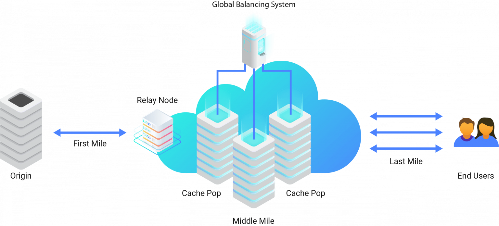

# 2.7 使用加速动态服务

如 2.2 节所言，如果仅是传输层、应用层的优化，无论何种手段都无法突破物理瓶颈限制。例如一个国际化的网络服务，受跨国、跨海等国际链路影响，降低网络延迟的难度也大幅增加。除此，还有个问题无法忽视，那就是“互联网中两个节点之间往往并不是路径最短，而是各个 AS (Autonomous System，网络自治系统)连接费用最低的策略”。解决长链路中的网络服务质量，我们不妨换个思路，使用商业性质的技术服务绕过物理瓶颈。

目前主流的 CDN 服务商，例如 Akamai、Fastly、Cloudfront、Azure 等都提供全球性的动态加速网络（Dynamic Site Accelerator，DSA）服务。这些服务商在全球各区域部署了近几十万台边缘设备，能有效改善因跨运营商和跨国引发的网络延迟、丢包和服务不稳定等问题。

使用动态加速网络流程大致如下：

- 源站提供一个 20KB 用于探测的资源。
- 服务商会在源站周边选择一批候选边缘节点。
- 候选边缘节点对测试资源进行下载测试，多个候选边缘节点多路探索后，根据丢包率、RTT、hops 数等选择最佳的路由线路。

	
	
图 2-11 动态加速网络服务

笔者使用过 Akamai 的加速服务，如表 2-4 所示，从抽样的数据看，整体连接速度提升了 30% 右。

表 2-4 动态加速网络效果对比

区域|直连|Akamai 加速|提升
:---|:--:|:--:|:--
Bangkok|0.58s|0.44|31%
jakarta|0.57s|0.44|31%
Kuala Lumpur|0.52s|0.38|36%
Taibei|0.51s|0.40|37%
Hanoi Bac Mai|0.54s|0.41|30%
Singapore|0.58s|0.39|48%
Hong Kong|0.38s|0.24|58%
Tokyo|0.60s|0.45s|32%
Surabaya|0.67s|0.52s|29%
Manila|0.46s|0.34s|36%

