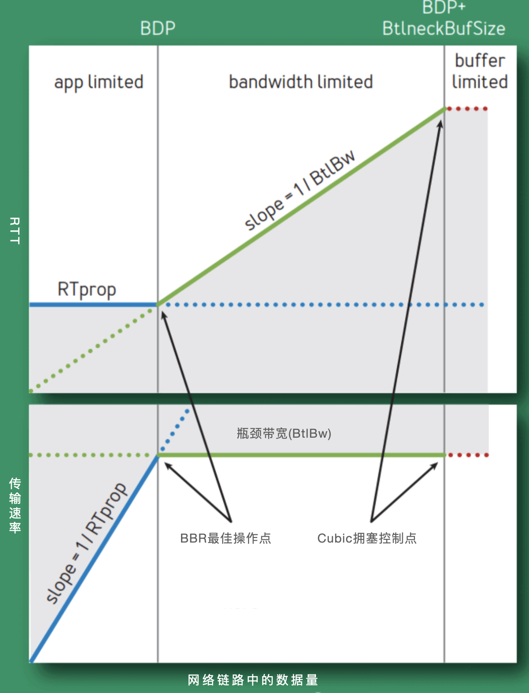
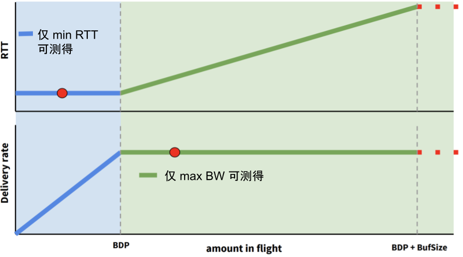
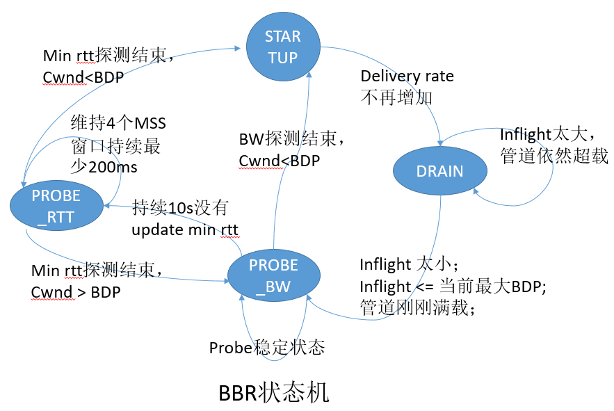
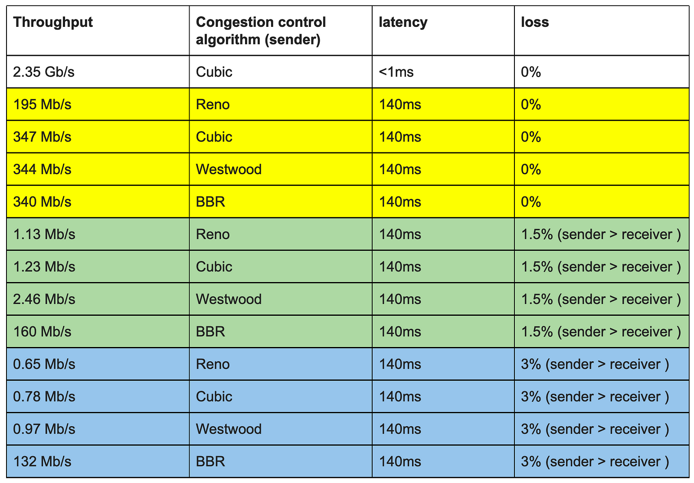

# 2.6 网络拥塞控制概论与实践

笔者曾做过在弱网环境下提升视频播放流畅度的工作，其中一项措施是尝试切换了 TCP 拥塞控制算法，实践由 Linux 默认的 Cubic 算法替换为 BBR 算法。调整之后大约提升了 45%的网络吞吐量，用户播放体验改善明显。

不过网络拥塞控制是一个十分发散的话题。既然实践是我们的最终目的，那就先暂时抛开理论，将实践操作和效果作为开篇。

## 2.6.1 使用 BBR 

BBR (Bottleneck Bandwidth and Round-trip propagation time)是 Google 在 2016 年发布的一套拥塞控制算法。它尤其适合在存在一定丢包率的弱网环境下使用，在这类环境下，BBR 的性能远超 Cubic 等传统的拥塞控制算法。

1. 查询系统所支持的拥塞控制算法。
```plain
$ sysctl net.ipv4.tcp_available_congestion_control
net.ipv4.tcp_congestion_control = bbr cubic reno
```
2. 查询正在使用中的拥塞控制算法。
```plain
$ sysctl net.ipv4.tcp_congestion_control
net.ipv4.tcp_congestion_control = cubic
```
3. 指定拥塞控制算法为 bbr。
```plain
$ echo net.ipv4.tcp_congestion_control=bbr >> /etc/sysctl.conf && sysctl -p
```

拥塞控制是单向生效，也就是说只要服务端调整了，下载速度即可提升。

4. 效果测试

先使用 tc 工具设置两台服务器的收发每个方向增加 25ms 的延迟以及 1%的丢包率。
```plain
$ tc qdisc add dev eth0 root netem loss 1% latency 25ms
```
使用 iperf 来测试两个主机之间的 TCP 传输性能。
```plain
$ iperf3 -c 10.0.1.188 -p 8080
```
如表 2-3 测试结果所示，存在丢包的场景下，BBR 的性能远远强于 Cubic。

表 2-3 不同拥塞控制算法下的网络吞吐量测试
| 吞吐量 |拥塞控制算法 | 延迟 | 丢包率|
|:--|:--|:--|:--|
| 2.35 Gb/s| cubic | 0ms | 0%|
| 347 Mb/s| cubic | 140ms | 0%|
| 340 Mb/s| bbr | 140ms | 0%|
| 1.23 Mb/s| cubic | 140ms | 1.5%|
| 160 Mb/s| bbr | 140ms | 1.5%|
| 0.78 Mb/s| cubic | 140ms | 3%|
| 132 Mb/s| bbr | 140ms | 3%|

实践结束了，下面我们聊聊拥塞控制理论。

## 2.6.2 网络拥塞控制概论

Google 在 ACM 杂志上发布过一篇文章 《BBR: Congestion-Based Congestion Control》[^1]，内容有不少值得深入研究的地方。本节，我们借鉴该文章内容聊聊网络拥塞控制技术。


首先，互联网协议体系是基于 IP 协议实现无连接的端到端的包交换服务，无连接设计的优势灵活和健壮已经被充分证实，然而这些优势并非没有代价，不重视动态包交换会导致严重的服务降级或“Internet 熔化“，这个现象首先被观察到是在 1980 年中叶网络的早期发展阶段，在技术上称之为”拥塞崩溃“。

针对 1980 年代的拥塞崩溃，导致了 1980 年代的拥塞控制机制的出炉，某种意义上这属于见招拆招的策略。1980 年代的拥塞控制算法分为四个部分：慢启动、拥塞避免、快速重传、快速恢复。

<div  align="center">
	
	<p>图2-21 早期拥塞控制</p>
</div>

这些机制完美适应了 1980 年代的网络特征：低带宽、浅缓存队列，美好持续到了 2000 年代。随后互联网大爆发，多媒体应用特别是图片，音视频类的应用促使带宽必须猛增，而摩尔定律促使存储设施趋于廉价而路由器队列缓存猛增，这便是 BBR 诞生的背景。换句话说，1980 年代的拥塞控已经不适用了，2010 年代需要另外的一次见招拆招。

如果说上一次 1980 年代的拥塞控制旨在收敛，那么这一次 BBR 则旨在效能最大化。

### 1. 网络效能最大化

拥塞控制的目的就是寻找网络工作中的最优点，如图 2-22 所示，圆圈所示即为网络工作的最优点（上面圆圈为延迟极小值，下面圆圈为带宽极大值）。此时数据包的投递率=BtlBW(瓶颈链路带宽)，保证了瓶颈链路被 100%利用；在途数据包总数=BDP(时延带宽积)，保证未占用 buffer。

<div  align="center">
	
	<p>图2-22 网络中的最优点</p>
</div>

然而带宽极大值和延迟极小值无法同时测得，如图 2-24 所示。要测量最大带宽，就要把瓶颈链路填满，此时 buffer 中有一定量的数据包，影响延迟指标。要测量最低延迟，就要保证 buffer 为空，此时就无法测量最大带宽值。

<div  align="center">
	
	<p>图2-24</p>
</div>

### 3. BBR 设计思路

BBR 的设计思路是不再考虑丢包作为拥塞的判断条件，而是交替测量带宽和延迟，用一段时间内的带宽极大值和延迟极小值作为估计值。**BBR 将控制时机提前，不再等到丢包时再进行暴力限制，而是控制稳定的发包速度，尽量榨干带宽，却又不让报文在中间设备的缓存队列上累积**。为了榨干带宽，BBR 会周期性地去探测是否链路条件变好了，如果是，则加大发送速率。为了不让报文在中间设备的缓存队列上累积，BBR 会周期性地探测链路的最小 RTT，并使用该最小 RTT 计算发包速率。

### 4. BBR 状态机

BBR 状态机是实现以上思路的基础，使用 BBR 进行拥塞控制时，任一时刻都是处于以下四个状态之一：启动（Startup）、排空（Drain）、带宽探测（Probe Bandwidth）和时延探测（Probe RTT），其中带宽探测属于稳态，其他三个状态都是暂态，如图 2-23 所示，四个状态之间的关系。

<div  align="center">
	
	<p>图2-23 BBR 状态转移关系</p>
</div>

- 启动阶段（Startup）：当连接建立时，BBR 采用类似标准 TCP 的慢启动方式，指数增加发送速率，目的是尽可能快的探测到带宽极大值。当判断连续时间内发送速率不再增长，说明已到达瓶颈带宽，此时状态切换至排空阶段。
- 排空阶段（Drain）：该阶段指数降低发送速率（相当于启动阶段的逆过程），目的是将多占的 buffer 慢慢排空。
- 完成以上两个阶段后，BBR 进入带宽探测阶段，BBR 大部分时间都在该状态运行。当 BBR 测量到带宽极大值和延迟极小值，并且 inflight 等于 BDP 时，便开始以一个稳定的匀速维护着网络状态，偶尔小幅提速探测是否有更大带宽，偶尔小幅降速公平的让出部分带宽。
- 时延探测阶段（PROBE_RTT）：如果估计延迟不变(未测量到比上周期最小 RTT 更小或等于的 RTT 值)，就进入延迟探测阶段。该状态下，cwnd 被设置为 4 个 MSS，并对 RTT 重新测量，持续 200ms，超时后，根据网络带宽是否满载决定状态切换为启动阶段或带宽探测阶段。

### 5. BBR 实践结论

如图 2-29 所示，BBR 算法在大带宽长链路（例如跨海网络），尤其是在有轻微丢包的网络环境下，较传统的 cubic 算法有很大的提升，Cisco 的工程师 Andree Toonk 在他的博客中验证了使用不同拥塞控制算法、延迟和丢包参数所做的各种 TCP 吞吐量测试的全套测试，证明了在一定的丢包率（1.5%、3%）的情况下 BBR 的出色表现[^3]。

<div  align="center">
	
	<p>图2-29 BBR 性能测试</p>
</div>

笔者实践结论中，通过对 Cubic 和 BBR 进行吞吐量测试，使用 BBR 后网络约提升了 30% ~ 45% 的吞吐率。

[^1]: 参见 https://datatracker.ietf.org/doc/html/rfc896
[^2]: 参见 https://research.google/pubs/pub45646/
[^3]: 参见 https://toonk.io/tcp-bbr-exploring-tcp-congestion-control/index.html

