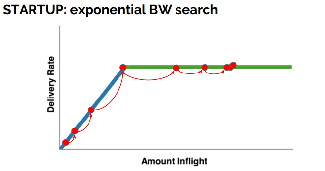
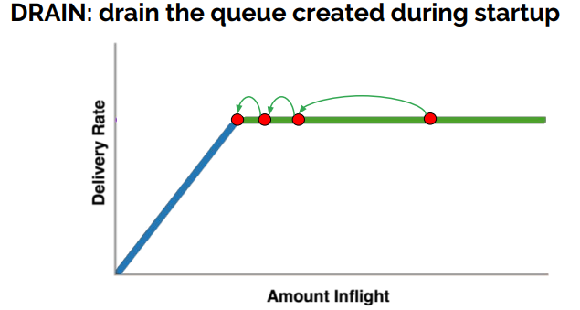
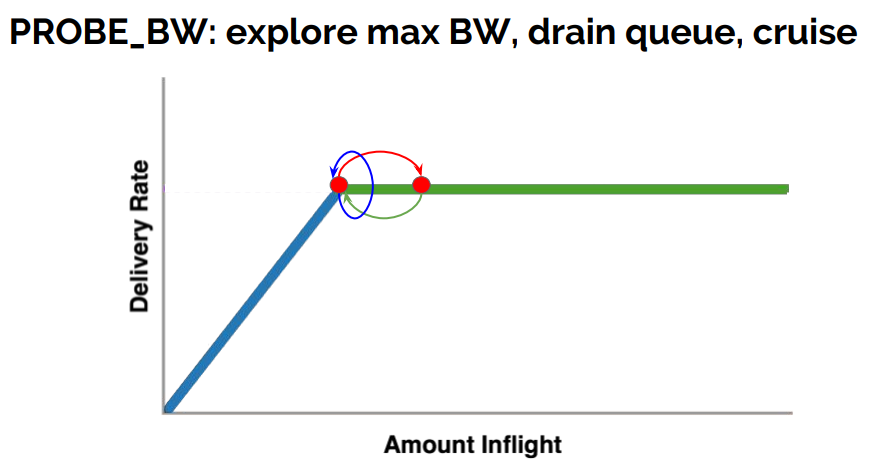
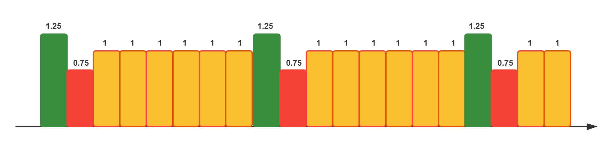
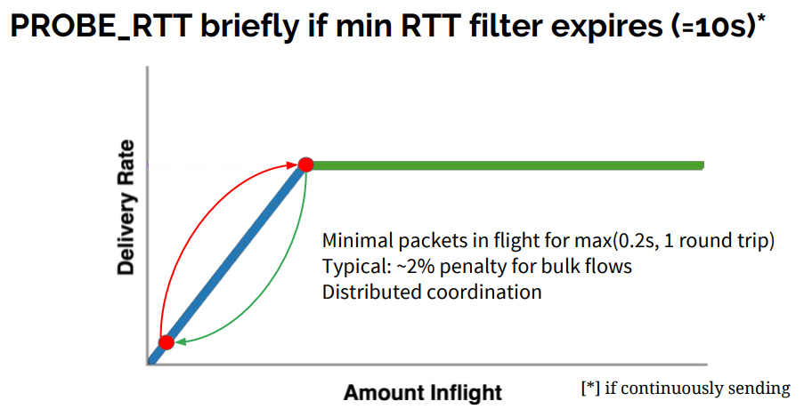

# 2.7 传输层优化之升级拥塞控制算法

笔者曾做过在弱网环境下提升视频播放流畅度的工作，其中一项实践细节是尝试切换了拥塞控制算法，实践中由 Linux 默认的 Cubic 算法替换为 BBR 算法。测试时，在丢包率 5%，从日本到上海的网络环境中，大约提升了45%的网络吞吐量。调整上线后，用户播放体验改善明显。

在本节，笔者对拥塞控进行简单地讲解，以供读者在后续实践中参考。

## 2.7.1 使用 BBR 

BBR (Bottleneck Bandwidth and Round-trip propagation time)是 Google 在 2016 年发布的一套拥塞控制算法。它尤其适合在存在一定丢包率的弱网环境下使用，在这类环境下，BBR 的性能远超 Cubic 等传统的拥塞控制算法。

1. 查询系统所支持的拥塞控制算法。
```
$ sysctl net.ipv4.tcp_available_congestion_control
net.ipv4.tcp_congestion_control = bbr cubic reno
```
2. 查询正在使用中的拥塞控制算法。
```
$ sysctl net.ipv4.tcp_congestion_control
net.ipv4.tcp_congestion_control = cubic
```
3. 指定拥塞控制算法为 bbr。
```
$ echo net.ipv4.tcp_congestion_control=bbr >> /etc/sysctl.conf && sysctl -p
```

拥塞控制是单向生效，也就是说只要服务端调整了，下载速度即可提升。

4. 效果测试

先使用 tc 工具设置两台服务器的收发每个方向增加25ms的延迟以及1%的丢包率。
```
$ tc qdisc add dev eth0 root netem loss 1% latency 25ms
```
使用 iperf 来测试两个主机之间的 TCP 传输性能。
```
$ iperf3 -c 10.0.1.188 -p 8080
```
表2-3 为测试结果[^1]，可以看到，在存在丢包的场景下，BBR 的性能远远强于 Cubic。

表2-3 不同拥塞控制算法下的网络吞吐量测试
| 吞吐量 |拥塞控制算法 | 延迟 | 丢包率|
|:--|:--|:--|:--|
| 2.35 Gb/s| cubic | 0ms | 0%|
| 347 Mb/s| cubic | 140ms | 0%|
| 340 Mb/s| bbr | 140ms | 0%|
| 1.23 Mb/s| cubic | 140ms | 1.5%|
| 160 Mb/s| bbr | 140ms | 1.5%|
| 0.78 Mb/s| cubic | 140ms | 3%|
| 132 Mb/s| bbr | 140ms | 3%|

## 2.7.2 网络拥塞与控制

网络中的中间设备(交换机、路由器等)在入方向通常都会有缓存入报文的队列，其目的是为了应付短时间内涌入的大量报文。如果入方向的报文持续超负荷，缓存队列会被填满，此后的报文就只能被丢弃，之后发送端便能感知到报文丢了。

如图2-21所示，可以把网络链路想象为一根水管，路径上的数通设备会自带一个蓄水池，一般不会使用。而当水流变大时，蓄水池开始蓄水，如果超过蓄水极限，则水流会溢出(报文丢包)。当发送端感知到丢包时，传统的 TCP 拥塞控制算法会减小发送端的拥塞窗口 Cwnd，限制报文的发送。这类拥塞控制算法也被称为基于丢包(Loss-based)的拥塞控制算法。

<div  align="center">
	
	<p>图2-21 网络链路概念</p>
</div>

缓存队列只应作为应急区域，平时不应该被使用，因为使用缓存队列并不能提升整个链路的带宽，反而还会增大报文的 RTT (每个报文的排队时间变长了)。

## 2.7.3 BBR 设计思路

### 1. 理论基础

为了得到稳定的发包速度，BBR 使用 TCP Pacing[^2] 进行发包控制，因此 BBR 的实现也需要底层支持 TCP Pacing。为了榨干带宽，BBR 会周期性地去探测是否链路条件变好了，如果是，则加大发送速率。为了不让报文在中间设备的缓存队列上累积，BBR 会周期性地探测链路的最小 RTT，并使用该最小 RTT 计算发包速率。

BBR 的设计思路就是**控制时机提前，不再等到丢包时再进行暴力限制，而是控制稳定的发包速度，尽量榨干带宽，却又不让报文在中间设备的缓存队列上累积**。

不少值得深入研究的地方。

如图2-22所示，是来自 BBR paper 里的一张经典设计图。

<div  align="center">
	
	<p>图2-22 BBR 论文中拥塞控制概览</p>
</div>

分析设计图时之前，我们先了解以下部分网络链路中的概念：

- **RTprop** (round-trip propagation time)，两端之间最小时延，取决于物理距离。
- **BtlBw**（bottleneck bandwidth）瓶颈带宽，把链路想象成物理管道，RTprop 就是管道的长度，BtlBw 则是管道最窄处的直径。
- **BtlBufSize** 链路之间各个路由节点的缓存。
- **BDP** 带宽时延积 整条物理链路（不含路由器缓存）所能储藏的比特数据之和 BDP = BtlBw * RTprop。

除了上面的概念外，传输效率还依赖以下几个因素：

- **round-trip time** 数据从发送端到接收端实际时延，也就是RTT。
- **delivery rate** 数据的实际传输带宽。
- **inflight data** 已发送但还未被确认的数据量。

图2-22分为上下两部分：上半部分的 Y 轴是 RTT，下半部分的 Y 轴则表示 delivery rate。特别注意的是 X 轴不是时间，而是 amount inflight，也就是在途报文的数量。

整个图从左到右可分为 3 个区域：

- **(0, BDP)** 该区间客户端发送的数据并未占满瓶颈带宽，称为：应用受限（app limited）区。
- **(BDP, BtlneckBuffSize)** 该区间已经达到链路瓶颈容量，但还未超过瓶颈容量+缓冲区容量，此时应用能发送的数据量受带宽限制，称为带宽受限（bandwidth limited）区。
- **(BDP + BtlneckBuffSize, infinity)** 该区间实际发送速率已经超过瓶颈容量+缓冲区容量 ，多出来的数据会被丢弃，缓冲区大小决定了丢包多少，称为缓冲区受限（buffer limited）区。

通过分析图片的关系：**拥塞就是 inflight 数据量持续向右侧偏离 BDP（Bandwidth-Delay Produc，时延带宽积） 线的行为（在接近第三区间时，传输效率最高），而拥塞控制就是各种在平均程度上控制这种偏离程度解决 Bufferbloat 方案或算法**。BBR 追求的目标是保持 inflight 报文数量就为 BDP，这样既充分利用了 bandwidth，每个报文又能享受到 RTprop 影响。

虽然 bandwith 和 RTT 都是可测量的，但很遗憾的是它们不能被同时探测，BBR 采用的方案是分时探测，即在不同的状态下探测 bandwidth 和 RTT。

### 2. BBR 状态机

采用 BBR 进行拥塞控制的流在任一时刻都是处于以下四个状态之一：Startup、Drain、Probe Bandwidth 和 Probe RTT。其中 Probe Bandwidth 属于稳态，其他三个状态都是暂态，如图2-23所示，四个状态的转移图。

<div  align="center">
	
	<p>图2-23 BBR 状态机</p>
</div>

#### 2.1 Startup & Drain

如图2-24所示，Startup 是 BBR 控制的流启动时的状态，为了能尽快找到链路的瓶颈带宽 BtlBw，处于 Startup 状态的流每一个 RTT 会将报文发送速率会提高一倍。指数增长的发送速率使得 inflight 报文快速增加，也使得 delivery rate 快速增加，从而 BBR 计算的 bandwith 也快速增加。

<div  align="center">
	
	<p>图2-24 Startup</p>
</div>

随着 inflight 越过 BDP 这条线，delivery rate 不再变化，此时 BBR 测量到的 bandwidth 也会达到峰值。当 BBR 看到 测量到的 bandwidth 连续 3 个 RTT 不再显著增长时(增长幅度小于 25%)，便会退出 Startup 状态，进入 Drain 状态，如图2-25所示。

<div  align="center">
	
	<p>图2-25 Drain状态</p>
</div>

Drain 状态的目标是让 inflight 报文数量回到 BDP 的水平，其存在的意义是为了抵消掉在 Startup 状态后期向网络灌入的超量报文。随后，该流会进入 Probe Bandwidth 状态

#### 2.2 Probe Bandwidth 状态

Probe Bandwidth 是四个状态中唯一的稳态，也是持续时间最长的状态 (大概 98% 的时间)。在此状态下，BBR 会不断的去探测(或者说是压榨)带宽。BBR 定义了一个增益循环(gain cycling)的概念，将增益系数作用到 pacing rate 上，以此控制报文发送速度。

<div  align="center">
	
	<p>图2-26 Probe Bandwidth 状态</p>
</div>

具体的定义是，一个 cycle 包含 8 个 phase，每个 phase 的持续时间为 1 个 min RTT。8 个 phase 的 gain 分别为：1.25、0.75、1、1、1、1、1、1。当处于 gain 为 1.25 的 phase 时，意味着 pacing rate 是当前计算的合理值的 1.25 倍，此时 BBR 发送速率也会变成正常情况下的 1.25 倍(踩油门)。而当处于 gain 为 0.75 的 phase 时，相应的发送速率是正常情况的 0.75 倍(踩刹车)。而 gain 为 1 时，发送速率就是正常值(巡航).

<div  align="center">
	
	<p>图2-27 Probe Bandwidth 状态</p>
</div>

BBR 一脚油门一脚刹车的组合保证了当链路带宽不变时，这条流不会向链路灌入超量的报文。而 6/8 时间段里的 gain 为 1 又使得大部分时候，采用 BBR 控制的 流发送报文的 pacing rate 是稳定的。

#### 2.3 Probe RTT 状态

Probe RTT 状态的目的是为了探测链路的固有往返时延(RTprop)，如果 min-RTT 在 10s 内没有刷新，则无论之前在哪个状态，BBR 都会强制将流的状态切换到 Probe RTT。

<div  align="center">
	
	<p>图2-28 Probe RTT</p>
</div>

进入 Probe RTT 状态后，BBR 会将 cwnd 限制到一个非常小的值(4)，并持续至少 200ms, 目的是保证这条流不会引起中间设备上的报文堆积。

## 2.7.4 BBR 实践结论

BBR 算法对于大带宽长链路也就是高 BDP 网络环境中，例如跨海网络、尤其是在有轻微丢包的网络条件下，较传统的 cubic 算法，有一定的提升。

<div  align="center">
	
	<p>图2-29 BBR 性能测试</p>
</div>

笔者实践结论中，通过对 cubic 和 BBR 进行吞吐量测试，使用 BBR 提升了 30% ~ 45% 的吞吐率。表 2-2 综合使用不同拥塞控制算法、延迟和丢包参数所做的各种 TCP 吞吐量测试的全套测试，证明了在一定的丢包率（1.5%、3%）的情况下 BBR 的出色表现。

在书写本节内容时，BBR 迭代到了 v3 版本，相信再经过一段时间，BBRv3 也会被提交到 Linux 内核主线中。

[^1]: 参见 https://queue.acm.org/detail.cfm?id=3022184
[^2]: 参见 https://en.wikipedia.org/wiki/TCP_pacing
[^2]: 参见 https://toonk.io/tcp-bbr-exploring-tcp-congestion-control/index.html

