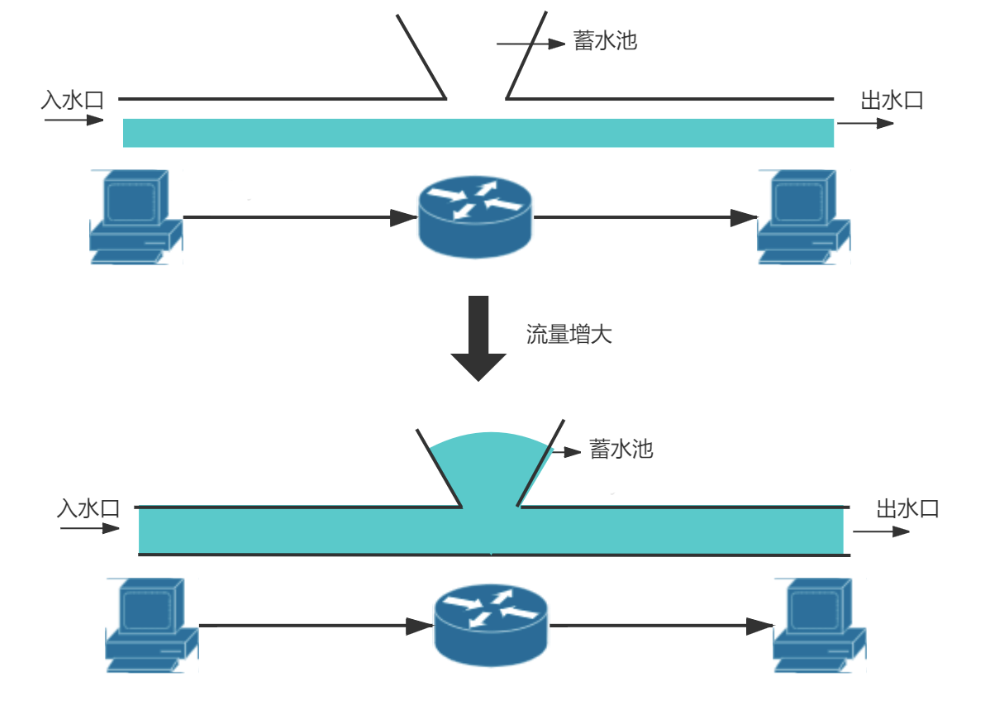
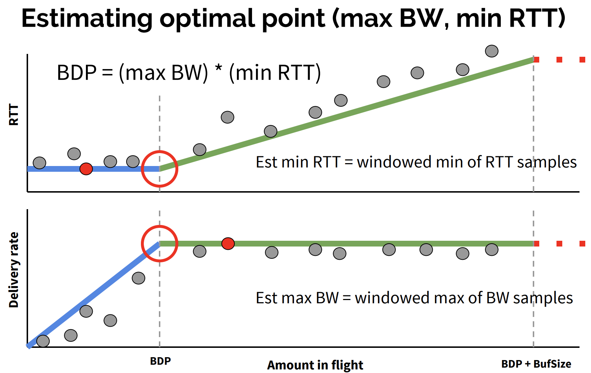

# 2.7 传输层优化之拥塞控制

笔者曾做过在弱网环境下提升视频播放流畅度的工作，其中一项实践细节是尝试切换了 TCP 拥塞控制算法，实践中由 Linux 默认的 Cubic 算法替换为 BBR 算法。测试时，在丢包率 5%，从日本到上海的网络环境中，大约提升了45%的网络吞吐量。调整上线后，用户播放体验改善明显。

实际上应用层的工程师很少能接触到拥塞控制，且拥塞控制是一个十分发散的话题。既然实践是我们的最终目的，那就先抛开理论，将实践与效果展示作为开篇。

## 2.7.1 使用 BBR 

BBR (Bottleneck Bandwidth and Round-trip propagation time)是 Google 在 2016 年发布的一套拥塞控制算法。它尤其适合在存在一定丢包率的弱网环境下使用，在这类环境下，BBR 的性能远超 Cubic 等传统的拥塞控制算法。

1. 查询系统所支持的拥塞控制算法。
```
$ sysctl net.ipv4.tcp_available_congestion_control
net.ipv4.tcp_congestion_control = bbr cubic reno
```
2. 查询正在使用中的拥塞控制算法。
```
$ sysctl net.ipv4.tcp_congestion_control
net.ipv4.tcp_congestion_control = cubic
```
3. 指定拥塞控制算法为 bbr。
```
$ echo net.ipv4.tcp_congestion_control=bbr >> /etc/sysctl.conf && sysctl -p
```

拥塞控制是单向生效，也就是说只要服务端调整了，下载速度即可提升。

4. 效果测试

先使用 tc 工具设置两台服务器的收发每个方向增加25ms的延迟以及1%的丢包率。
```
$ tc qdisc add dev eth0 root netem loss 1% latency 25ms
```
使用 iperf 来测试两个主机之间的 TCP 传输性能。
```
$ iperf3 -c 10.0.1.188 -p 8080
```
表2-3 为测试结果[^1]，可以看到，在存在丢包的场景下，BBR 的性能远远强于 Cubic。

表2-3 不同拥塞控制算法下的网络吞吐量测试
| 吞吐量 |拥塞控制算法 | 延迟 | 丢包率|
|:--|:--|:--|:--|
| 2.35 Gb/s| cubic | 0ms | 0%|
| 347 Mb/s| cubic | 140ms | 0%|
| 340 Mb/s| bbr | 140ms | 0%|
| 1.23 Mb/s| cubic | 140ms | 1.5%|
| 160 Mb/s| bbr | 140ms | 1.5%|
| 0.78 Mb/s| cubic | 140ms | 3%|
| 132 Mb/s| bbr | 140ms | 3%|


笔者在使用 BBR 时，参阅了 Google 发布在 ACM 杂志的一篇文章 《BBR: Congestion-Based Congestion Control》[^1]，内容有不少值得深入研究的地方，在本节，我们根据该篇文章聊一聊网络拥塞控制这个话题。

## 2.7.2 BBR 诞生的背景

互联网协议体系是基于使用 IP 协议实现无连接的端到端的包交换服务，无连接设计的优势灵活和健壮已经被充分证实，然而这些优势并非没有代价：“在高负载情况下提供优质服务需要更仔细的设计”。实际上，不重视动态包交换会导致严重的服务降级或“Internet熔化“，这个现象首先被观察到是在1980年中叶网络的早期发展阶段，在技术上称之为”拥塞崩溃“。

针对1980年代的拥塞崩溃，导致了1980年代的拥塞控制机制的出炉，某种意义上这属于见招拆招的策略。1980年代的拥塞控制算法分为四个部分：慢启动、拥塞避免、快速重传、快速恢复。

<div  align="center">
	
	<p>图2-21 早期拥塞控制</p>
</div>

这些机制完美适应了1980年代的网络特征：低带宽、浅缓存队列，美好持续到了2000年代。随后互联网大爆发，多媒体应用特别是图片，音视频类的应用促使带宽必须猛增，而摩尔定律促使存储设施趋于廉价而路由器队列缓存猛增，这便是BBR诞生的背景。换句话说，1980年代的拥塞控已经不适用了，2010年代需要另外的一次见招拆招。

如果说上一次1980年代的拥塞控制旨在收敛，那么这一次 BBR 则旨在效能最大化。


### 1. 基于丢包的拥塞控制算法缺陷

如图2-21所示，可以把网络链路想象为一根水管，路径上的中间设备（交换机、路由器等）会自带一个蓄水池（报文缓存队列），一般不会使用。而当水流变大时，蓄水池开始蓄水，如果超过蓄水极限，则水流会溢出(报文丢包)。当发送端感知到丢包时，传统的 TCP 拥塞控制算法会减小发送端的拥塞窗口 Cwnd，限制报文的发送。这类拥塞控制算法也被称为基于丢包（Loss-based）的拥塞控制算法。

<div  align="center">
	
	<p>图2-21 网络链路概念</p>
</div>

### 2. 网络拥塞与控制

来看一张来自 Google 文章内的设计图，如图2-22所示，通过该图我们先了解网络拥塞控制中的各个影响因素。

<div  align="center">
	
	<p>图2-22 网络链路环境因素概览</p>
</div>

图2-22从左到右可分为3个区域：

- **(0, BDP)** 该区间客户端发送的数据并未占满瓶颈带宽，称为“应用受限区（app limited）”。
- **(BDP, BtlneckBufSize)** 该区间已经达到链路瓶颈容量，但还未超过瓶颈容量+缓冲区容量，此时应用能发送的数据量受带宽限制，称为“带宽受限区（bandwidth limited）”。
- **(BDP + BtlneckBufSize, infinity)** 该区间实际发送速率已经超过瓶颈容量+缓冲区容量 ，多出来的数据会被丢弃，缓冲区大小决定了丢包多少，称为“缓冲区受限区（buffer limited）”。

拥塞控制的目的就是寻找网络工作中的最优点，如图2-23所示，红色圆圈所示即为网络工作的最优点，此时数据包的投递率=BtlBW(瓶颈链路带宽)，保证了瓶颈链路被100%利用；在途数据包总数=BDP(时延带宽积)，保证未占用 buffer。

<div  align="center">
	
	<p>图2-23 寻找网络中的最优点</p>
</div>

然而 max BW 和 min RTT 不能被同时测得，如图2-24所示。要测量最大带宽，就要把瓶颈链路填满，此时 buffer 中有一定量的数据包，延迟较高。要测量最低延迟，就要保证 buffer 为空，网络中数据包越少越好，但此时带宽较低。

<div  align="center">
	
	<p>图2-24</p>
</div>

### 3. BBR 设计思路

BBR 的设计思路是不再考虑丢包作为拥塞的判断条件，交替测量带宽和延迟，用一段时间内的带宽极大值（BtlBW）和延迟极小值（RTprop）作为估计值。

**控制时机提前，不再等到丢包时再进行暴力限制，而是控制稳定的发包速度，尽量榨干带宽，却又不让报文在中间设备的缓存队列上累积**。为了榨干带宽，BBR 会周期性地去探测是否链路条件变好了，如果是，则加大发送速率。为了不让报文在中间设备的缓存队列上累积，BBR 会周期性地探测链路的最小 RTT，并使用该最小 RTT 计算发包速率。


### 2. BBR 状态机

采用 BBR 进行拥塞控制的流在任一时刻都是处于以下四个状态之一：启动（Startup）、排空（Drain）、带宽探测（Probe Bandwidth）和 时延探测（Probe RTT）。其中 Probe Bandwidth 属于稳态，其他三个状态都是暂态，如图2-23所示，四个状态的转移图。

<div  align="center">
	
	<p>图2-23 BBR 状态转移关系</p>
</div>

- 启动阶段（Startup）：当连接建立时，BBR 采用类似标准 TCP 的慢启动方式，指数增加发送速率，目的也是尽可能快得探测到带宽极大值（BtlBW）。当判断连续三个 RTT 时间内发送速率不再增长，说明已到达瓶颈带宽，状态切换至排空阶段（Drain）。
- 排空阶段（Drain）：该阶段指数降低发送速率（相当于启动阶段的逆过程），将多占的 buffer 慢慢排空。
- 完成以上两个阶段后，BBR 进行带宽探测(PROBE_BW)状态，该状态是bbr的一个稳定状态，bbr的大部分时间都在该状态运行，当bbr测量到瓶颈带宽和最小rtt，并且inflight等于BDP后，便开始以一个稳定的匀速维护着网络状态，偶尔小幅提速探测是否有更大带宽，偶尔小幅降速公平的让出部分带宽。
- 时延探测(PROBE_RTT)，该状态下，每过10秒，如果估计延迟不变(未测量到比上周期最小RTT更小或等于的RTT值)，就进入延迟探测阶段，该状态下，cwnd被设置为4个MSS，并对RTT重新测量，持续200ms，超时后，根据网络带宽是否满载决定状态切换为STARTUP或PROBE_BW。


### 3. BBR 实践结论

BBR 算法对于大带宽长链路也就是高 BDP 网络环境中，例如跨海网络、尤其是在有轻微丢包的网络条件下，较传统的 cubic 算法，有一定的提升。

<div  align="center">
	
	<p>图2-29 BBR 性能测试</p>
</div>

笔者实践结论中，通过对 cubic 和 BBR 进行吞吐量测试，使用 BBR 提升了 30% ~ 45% 的吞吐率。表 2-2 综合使用不同拥塞控制算法、延迟和丢包参数所做的各种 TCP 吞吐量测试的全套测试，证明了在一定的丢包率（1.5%、3%）的情况下 BBR 的出色表现。

在书写本节内容时，BBR 迭代到了 v3 版本，相信再经过一段时间，BBRv3 也会被提交到 Linux 内核主线中。

[^1]: 参见 https://datatracker.ietf.org/doc/html/rfc896
[^1]: 参见 https://research.google/pubs/pub45646/
[^2]: 参见 https://en.wikipedia.org/wiki/TCP_pacing
[^2]: 参见 https://toonk.io/tcp-bbr-exploring-tcp-congestion-control/index.html

