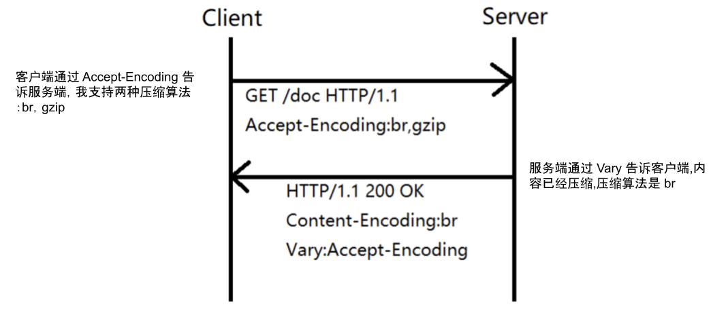

# 2.4.1 对传输内容进行压缩

对传输内容压缩是提升 HTTP 服务效率的必要手段。如果使用 Gzip 压缩，一个 100KB 的文件压缩之后通常会变成 30KB，体积降低 70%，这将大幅降低传输时间。

## 1. HTTP 压缩的原理

所有的现代浏览器、客户端及 HTTP 服务器软件都支持压缩技术，唯一需要协商的是客户端与服务端所采用的压缩算法。

为了选择采用的压缩算法，HTTP 客户端和服务器之间会使用主动协商机制：HTTP 客户端发送 Accept-Encoding 首部（其中包含它所支持的压缩算法，以及各自的优先级），服务器则从中选择一种，使用该算法对响应的消息主体进行压缩，并且发送 Content-Encoding 首部来告知 HTTP 客户端它选择了哪一种算法，如图 2-9 所示。

<div  align="center">
	
	<p>图2-9 HTTP 压缩协商流程</p>
</div>

## 2. 使用 Brotli 压缩

默认情况，一般使用 Gzip 对内容进行压缩，但 HTTP 类型的场景还有一个具有更高压缩率的算法 Brotli [^1]。Brotli 是 Google 推出的开源无损压缩算法，通过变种的 LZ77 算法、Huffman 编码以及二阶文本建模等方式进行数据压缩。Brotli 内部有一个预定义的字典，该字典包含超过 13000 个常用单词、短语和其他子字符串，在这种预定义字典下，一个词会作为一个整体被匹配，这种方式可以大大提升较小文件的压缩密度。


Brotli 侧重于 HTTP 应用类服务内容的压缩，压缩率比常使用的 Gzip 高 `17~30%`。如图 2-10 所示，各类型的压缩算法压缩率对比。

<div  align="center">
	
	<p>图2-10 Brotli 压缩效果对比</p>
</div>

使用 Brotli 时，服务端和客户端都需要额外安装软件支持，服务端安装后可以和 gzip 一同开启，客户端根据需要选择合适的压缩算法。

如下为 Nginx 中的 Brotli 配置示例：
```plain
http {
	brotli on;
    brotli_comp_level 6;
    brotli_buffers 16 8k;
    brotli_min_length 20;
    brotli_types text/plain text/css application/json application/x-javascript text/xml application/xml application/xml+rss text/javascript application/javascript image/svg+xml;	
}
```

[^1]: 参见 https://github.com/google/brotli