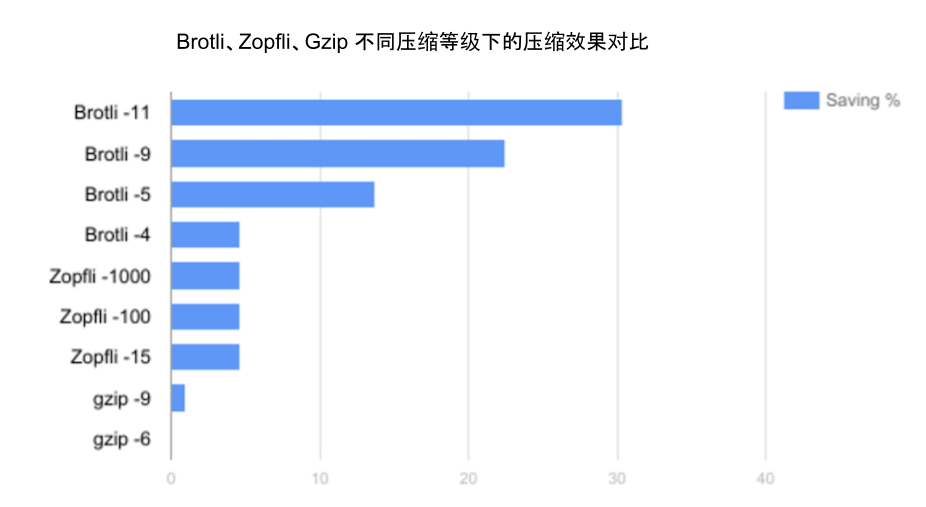

# 2.4 对传输内容进行压缩

对传输内容进行压缩是提升 HTTP 服务可用性的关键手段。如使用 Gzip 压缩后，一个 100KB 的文件通常会减少到 30KB，体积降低 70%。这不仅提高了网络传输效率，还能减少带宽成本。

所有现代浏览器、客户端和 HTTP 服务器软件都支持压缩技术。压缩算法的选择通过 HTTP 客户端和服务器之间的协商机制确定（如图 2-8 所示）：
- 首先，HTTP 客户端发送 Accept-Encoding 首部，其中列出它支持的压缩算法及其优先级；
- 服务器则从中选择一种兼容的算法对响应主体进行压缩，并通过 Content-Encoding 首部告知客户端所选的压缩算法。

:::center
  <br/>
  图 2-8 HTTP 压缩算法协商过程
:::

默认情况下，一般使用 Gzip 对内容进行压缩，但针对 HTTP 类型的文本内容还有一个更高压缩率的算法 Brotli。

Brotli 是 Google 推出的开源无损压缩算法，它内部有一个预定义的字典，涵盖了超过 1,300 个 HTTP 领域常用单词和短语。Brotli 在压缩过程中将这些常见的词汇和短语作为整体匹配，从而大幅提升文本型内容（ HTML、CSS 和 JavaScript 文件）的压缩密度。

如图 2-9 所示，各类型压缩算法在不同压缩等级下的效果对比。可以看到，Brotli 压缩效果比常用的 Gzip 高出 17% 至 30%。

:::center
  <br/>
  图 2-9 Brotli、Zopfli、gzip 不同压缩等级下的压缩率对比
:::

在服务端安装了 Brotli 模块（如 ngx_brotli）后，可以与 gzip 一同启用，以最大化兼容性。以下是 Nginx 中启用 Brotli 的配置示例：

```nginx
http {
	brotli on; // 开启 brotli 压缩
    brotli_comp_level 6;  // 设置压缩等级
    brotli_buffers 16 8k; // 设置缓冲的数量和大小
    brotli_min_length 20; // 压缩的最小长度
    brotli_types text/plain text/css application/json application/x-javascript text/xml application/xml application/xml+rss text/javascript application/javascript image/svg+xml; // 压缩类型

    // gzip 配置
    ...
}
```