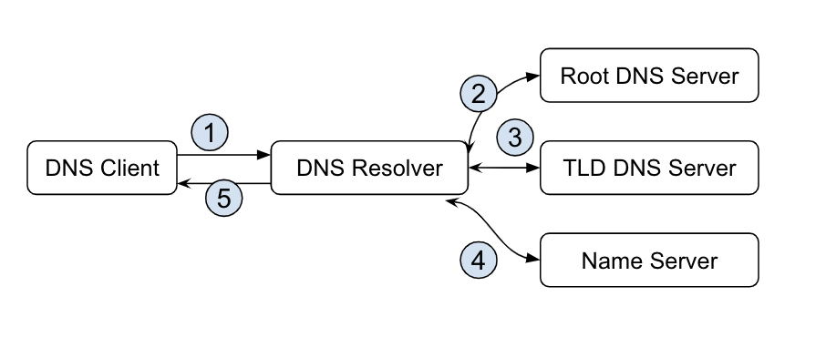

# 3.3 DNS 的原理与应用

DNS（Domain Name System）本质是一个分布式的树状命名系统，就像一个去中心化的分布式数据库，存储着从域名到 IP 地址的映射。

从 DNS 的定义来看，DNS 还是一种服务发现的手段，虽然服务器的 IP 地址可能会经常变动，但是通过相对不会变动的域名，我们总是可以找到提供对应服务的服务器。 在应用案例上如： Kubernetes 中做服务注册的 CoreDNS 也是一种 DNS 服务。

移动场景下DNS解析开销是整个网络请求中不可忽略的一部分。 在弱网环境中，基于 UDP的 LocalDNS解析非常容易出现解析超时的问题，这将直接影响客户端的用户体验。

## 1. 域名解析工作原理

在对DNS简单了解之后，我们继续进入 DNS 工作原理的部分。

<div  align="center">
	<p>图：DNS解析流程</p>
	
</div>


- 本地的 DNS 客户端向 DNS 解析器发出解析 thebyte.com.cn 域名的请求；
- DNS 解析器首先会向就近的根 DNS 服务器 . 请求顶级域名 DNS 服务的地址；
- 拿到顶级域名 DNS 服务 com.cn. 的地址之后会向顶级域名服务请求负责 thebyte.com.cn. 域名解析的命名服务；
得到授权的 DNS 命名服务时，就可以根据请求的具体的主机记录直接向该服务请求域名对应的 IP 地址

对于 DNS 解析器，这里使用的 DNS 查询方式是迭代查询，DNS 服务并不会直接返回 DNS 信息，而是会返回另一台 DNS 服务器的位置，由客户端依次询问不同级别的 DNS 服务直到查询得到了预期的结果；另一种查询方式叫做递归查询，也就是 DNS 服务器收到客户端的请求之后会直接返回准确的结果，如果当前服务器没有存储 DNS 信息，就会访问其他的服务器并将结果返回给客户端。

## 2. 域名信息查询

DNS 是互联网一个最重要的服务，如果 DNS 解析失败，任何高可用、负载均衡等等设计都不会起到作用。Meta 2021年10月产生了一个大范围的宕机就是 Meta的 BGP 撤销了 DNS 权威 DNS 服务器 IP。导致 外界无法获取 Meta 域名解析信息。 

如果碰到网络故障、 DNS 解析错误时，第一步，我们可以用 nslookup 命令查询域名解析的基本信息。

命令格式：nslookup domain [dns-server] ，解析示例：

```
$ nslookup thebyte.com.cn        
Server:		10.5.188.9
Address:	10.5.188.9#53

Non-authoritative answer:
Name:	thebyte.com.cn
Address: 110.40.229.45
```

### 2.1 返回信息说明

- 第一行的Server 为负责此次解析的 LocalDNS
- Non-authoritative answer 为缓存中获取域名解析结果。非实际存储 DNS Server中 域名解析，所以为非权威应答
- Address 为域名所对应的IP，上面的解析可以看到是一个 A记录的 110.40.229.45

## 3. 使用 dig 查询域名解析

我们使用dig命令可以查询更具体的信息， 如果判断 Local DNS 解析错误，可以指定 DNS解析服务器 如: dig @1.1.1.1 thebyte.com.cn

```
$ dig thebyte.com.cn

; <<>> DiG 9.10.6 <<>> thebyte.com.cn
;; global options: +cmd
;; Got answer:
;; ->>HEADER<<- opcode: QUERY, status: NOERROR, id: 63697
;; flags: qr rd ra; QUERY: 1, ANSWER: 1, AUTHORITY: 0, ADDITIONAL: 1

;; OPT PSEUDOSECTION:
; EDNS: version: 0, flags:; udp: 4096
;; QUESTION SECTION:
;thebyte.com.cn.			IN	A

;; ANSWER SECTION:
thebyte.com.cn.		599	IN	A	110.40.229.45

;; Query time: 14 msec
;; SERVER: 10.5.188.10#53(10.5.188.10)
;; WHEN: Fri May 12 15:22:33 CST 2023
;; MSG SIZE  rcvd: 59
```

dig返回内容的第一部分，主要包括dig的版本信息，以及本次命令执行结果的摘要。其中 opcode：QUERY，表示执行查询操作。status：NOERROR。解析成功。

**QUESTION SECTION部分** 展示发起的 DNS 请求参数。其中 A 表示我们默认查询 A 类型的记录。**ANSWER SECTION 部分** 为DNS的查询结果，以上显示 thebyte.com.cn. 的解析结果为  110.40.229.45。

Meta 2021年10月 宕机故障时，运维人员使用 dig 查询 各个公共 DNS服务器解析 Facebook相关的域名， 全部出现 SERVFAIL 错误。

```
➜  ~ dig @1.1.1.1 facebook.com
;; ->>HEADER<<- opcode: QUERY, status: SERVFAIL, id: 31322
;facebook.com.            IN    A
➜  ~ dig @1.1.1.1 whatsapp.com
;; ->>HEADER<<- opcode: QUERY, status: SERVFAIL, id: 31322
;whatsapp.com.            IN    A
..
```