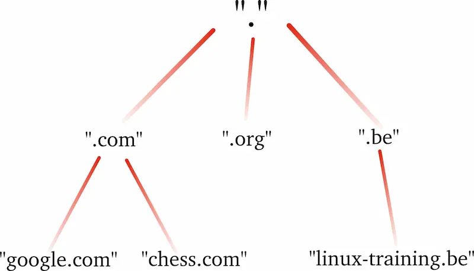
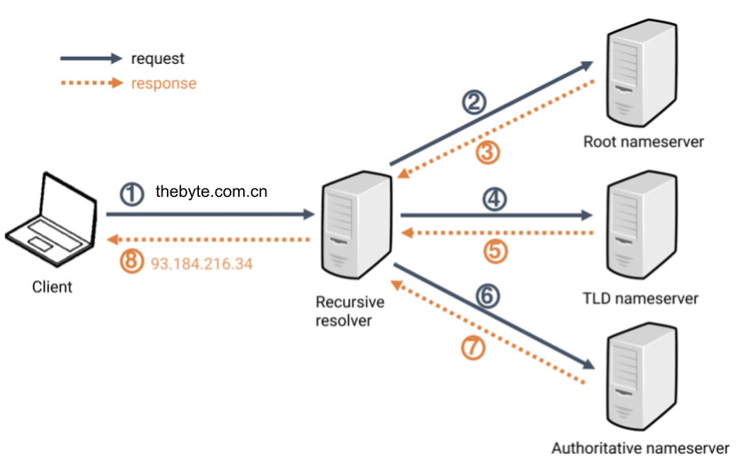

# 2.3 域名解析环节实践

2021 年期间互联网发生了几起影响颇大的服务宕机故障：7月22日 Aakamai Edge DNS 故障，造成 PlayStation Network、HBO、UPS、Airbnb、Salesforce 等众多知名网站宕机[^1]。不久之后的10月4日，社交网络平台 Facebook 及旗下服务 Messenger、Instagram、WhatsApp、Mapillary 与 Oculus 发生全球性宕机[^2]。

这些故障是怎么引起的？影响范围为何如此广泛？带着这些问题，我们开始域名解析篇节。

## 2.3.1 域名解析的工作原理

域名解析靠的是 DNS，我们在浏览器输入一个域名时，DNS 负责将该域名解析为相应的 IP 地址，以便后续与目标服务器建立 TCP/IP 连接。探寻 DNS 工作原理之前，我们先了解域名的结构。如图 2-3 所示，域名是一种树状结构，最顶层的域名是根域名（注意是一个点“.”，它是 .root 的含义），然后是顶级域名（top-level domain，简写 TLD），再是一级域名、二级域名、三级域名。

<div  align="center">
	
	<p>图 2-3 DNS域名结构</p>
</div>

了解域名结构之后，我们再看看域名是如何进行解析，DNS 解析流程如图2-4所示。

<div  align="center">
	
	<p>图 2-4 DNS解析流程</p>
</div>

- 用户向 `DNS 解析器`（也称为递归解析器，例如电信运营商的 114.114.114.114）发出解析 example.com 域名请求。
- `DNS解析器` 判断是否存在解析缓存，如存在返回缓存结果。如无则就近向 `Root nameserver` (根域名服务器)请求所属 `TLD 域名服务器`。
- 获取 com.域的 `TLD 域名服务器`后， 向该地址请求 example.com. 的 `权威解析服务器`（Authoritative nameserver）。
- 得到`权威解析服务器`地址后，向该服务获取域名对应的 IP 地址，域名解析过程结束。 

DNS 解析流程中有两个环节容易发生问题：一个是 DNS 解析器存在较多中间环节容易出现解析污染或者 DNS 解析器宕机，这种情况会导致域名解析出现局部不可用；另外一个是权威解析服务器出现故障，这种情况会导致全局域名解析不可用，但出现故障的概率极低。

下面我们继续看看如果 DNS 解析出现故障了该如何排查。

## 2.3.2 DNS 故障排查

如果碰到服务不可用、Unknown host 等错误时，我们可以先用几个运维命令确认是否为 DNS 解析阶段出现问题。

1. 使用 nslookup 命令

第一个介绍的是 nslookup 命令，该命令用于查询 DNS 的记录、域名解析是否正常等。

nslookup 命令示例：
```
$ nslookup thebyte.com.cn        
Server:		8.8.8.8
Address:	8.8.8.8#53

Non-authoritative answer:
Name:	thebyte.com.cn
Address: 110.40.229.45
```
返回信息说明：

- 第一行的 Server 为当前使用的 DNS解析器。
- Non-authoritative answer 因为 DNS 解析器只是转发权威解析服务器的记录，所以为非权威应答。
- Address 为解析结果，上面的解析可以看到是一个A记录 110.40.229.45。

2. 使用 dig 命令

nslookup 返回的结果比较简单，如果想获取更多的信息，可以尝试使用 dig 命令。

dig命令示例：
```
$ dig thebyte.com.cn

; <<>> DiG 9.10.6 <<>> thebyte.com.cn
;; global options: +cmd
;; Got answer:
;; ->>HEADER<<- opcode: QUERY, status: NOERROR, id: 63697
;; flags: qr rd ra; QUERY: 1, ANSWER: 1, AUTHORITY: 0, ADDITIONAL: 1

;; OPT PSEUDOSECTION:
; EDNS: version: 0, flags:; udp: 4096
;; QUESTION SECTION:
;thebyte.com.cn.			IN	A

;; ANSWER SECTION:
thebyte.com.cn.		599	IN	A	110.40.229.45

;; Query time: 14 msec
;; SERVER: 8.8.8.8#53(8.8.8.8)
;; WHEN: Fri May 12 15:22:33 CST 2023
;; MSG SIZE  rcvd: 59
```

返回信息说明：

- 第一段 opcode 为 QUERY，表示执行查询操作，status 为 NOERROR，表示解析成功。
- 第二段 QUESTION SECTION 部分显示了发起的 DNS 请求参数，A 表示我们默认查询 A 类型记录。
- 第三段 ANSWER SECTION 部分为 DNS 查询结果，可以看到 thebyte.com.cn. 的解析结果为 110.40.229.45。
- 最后一段为查询所用的DNS解析器、耗时等信息。

Facebook 2021年10月宕机故障中，使用 dig 排查各个公共DNS解析器，全部出现 SERVFAIL 错误，这说明是权威解析服务器出现了问题。
```
➜  ~ dig @1.1.1.1 facebook.com
;; ->>HEADER<<- opcode: QUERY, status: SERVFAIL, id: 31322
;facebook.com.            IN    A
➜  ~ dig @1.1.1.1 whatsapp.com
;; ->>HEADER<<- opcode: QUERY, status: SERVFAIL, id: 31322
;whatsapp.com.            IN    A
..
```
[^1]: 参见 https://www.akamai.com/blog/news/akamai-summarizes-service-disruption-resolved
[^2]: 参见 https://en.wikipedia.org/wiki/2021_Facebook_outage
