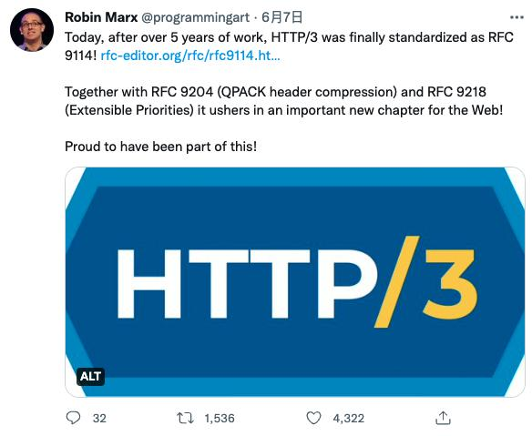
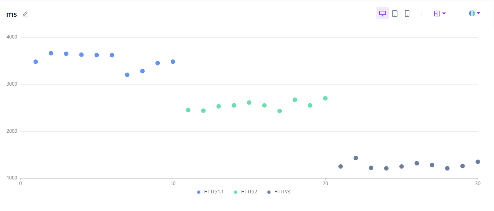

# 2.5 QUIC协议的理解与实践

2022年6月6日，IETF QUIC和HTTP工作组成员Robin Mark在推特上宣布，历时5年，HTTP/3终于被标准化为 RFC 9114，这是HTTP超文本传输协议的第三个主要版本，HTTP/3 终于标准化。

	
	
图2-11 HTTP/3 正式发布

 

HTTP/3 发布之后，有网友对各个版本的HTTP进行时延测试（从上海请求旧金山HTTP服务器）。最后的测试结果如下， HTTP/1.1 平均在 3500 ms, HTTP/2 平均在 2500 ms, 而 HTTP/3 平均在 1300 ms, 可以看到 HTTP/3 带来的性能提升还是很明显的。

	
	
图2-12 HTTP3 测试

 

HTTP/3 为何性能提升如此明显？想知道这个问题，你得先了解什么是QUIC。