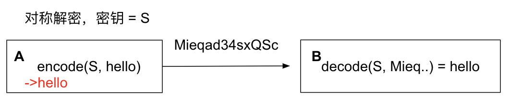
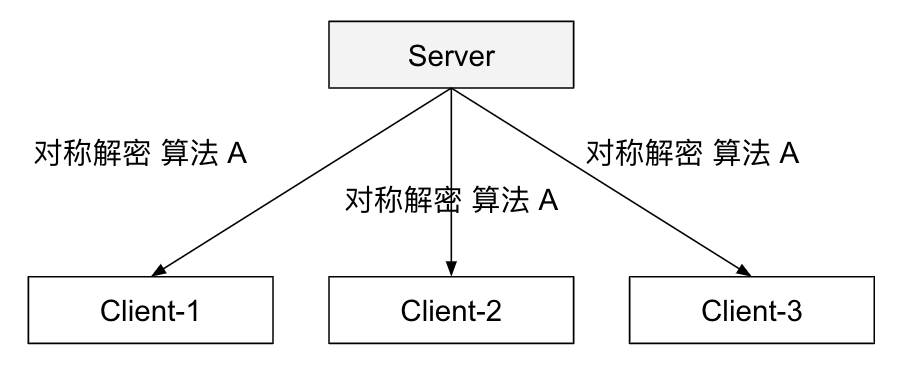
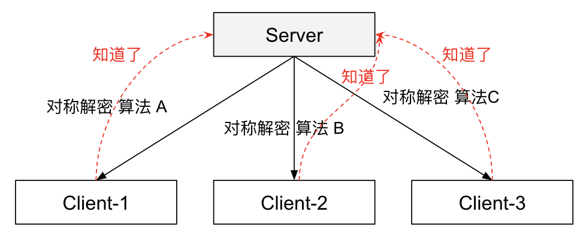
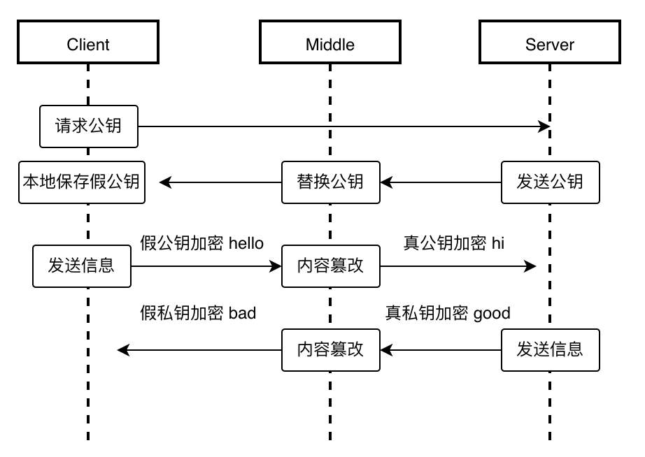
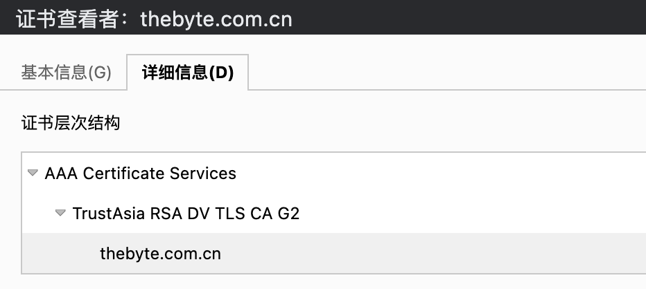

# 2.5.1  理解 HTTPS 流程

HTTPS 流程中涉及了证书、CA、TLS、对称/非对称加密等繁杂的环节。为了理解 HTTPS 完整的逻辑脉络，我们尝试从零开始设计一个“绝对”安全的信息传输机制，以理解 HTTPS 为何有这么多环节。

## 1. 解决信息传递的安全性

首先，HTTP 添加 SSL 层的本质是为了实现信息传递“绝对”的安全性。如图 2-12 所示，如果是一个 1 v 1 的通信模型，想实现信息传递安全性，使用对称加密就可以。只要保证密钥的安全，不让第三者知道，信息安全的问题就能解决！

	
	
图2-12 对称加密示例

对称加密方式在 HTTP 服务场景下就出现问题了，如图 2-13 所示。对称加密的关键操作是如何保证秘钥的安全性，而 HTTP 通信模型是 1 v N，使用对称加密这种方式等同没有加密。 

	
	
图2-13 对称加密 1v N 模式

为了解决使用一个秘钥暴露的问题，我们尝试改进，使每个客户端使用不同的算法/密钥，并在增加一个协商的过程，用于双方协商采用何种对称加密算法/密钥（这个协商的过程就是 TLS 协议做的事情），流程如图 2-14 所示。

	
	
图2-14 对称加密模式下密钥协商过程

不过问题还是存在，虽然协商过程解决了对称加密算法或秘钥独立性问题，但协商过程依旧是明文的，密钥仍然存在被截获的可能性。为了解决这个问题，只能继续对协商过程的数据进行加密。这个环节必须换一种思路，如果仍然采用对称加密方式，就会产生无限套娃的情况。

我们引入一个新的概念：非对称加密算法。

:::tip 非对称加密
非对称加密有两个密钥：公钥、私钥，私钥加密的密文只能公钥解，公钥加密的密文只能私钥解。
:::

这里我们提一个既要又要的要求：”即要降低加解密的耗时，又要保证密钥传输的安全性“。**由于对称加解密效率远比非对称加解密效率高得多，所以我们对 HTTP 内容使用对称加密，对称加密的密钥则通过非对称加密得到。后续协商流程中，通过一个随机数确定对称加密算法/密钥，然后使用非对称加密算法的私钥对其加密，客户端用公钥解密后获得对称加密的密钥，再用该密钥解密 HTTP 内容，从而获得明文**。

但问题还没有结束，公钥如何传输给客户端呢？

## 2.证书认证机构

如图 2-15 所示，如果服务端直接发送公钥证书给客户端，仍然无法避免中间被截获的可能性。此时，**我们引入一个双方都信任的第三方机构，使用第三方机构的私钥将服务器公钥加密后传输给客户端，客户端再使用第三方公钥进行解密。虽然流程绕了些，但至少离我们的目标”绝对“安全又近了些**。

	
	
图2-15 公钥存在被截获的可能性

这个双方都信任的机构就是 HTTPS 中的 CA（CA，Certificate Authority，证书认证机构）。HTTPS 中把公钥规范成数字证书的形式由 CA 签发（数字证书通常包含服务端公钥、持有者信息、CA 的信息以及过期信息等）。服务端向 CA 申请数字证书，再把数字证书下发给客户端。**至于第三方 CA 公钥的问题，解决方案就是提前预装在系统内，这就是系统内根证书的由来**。

至此，信息传递的”绝对“安全性目标基本得到实现。

## 3.证书验证链

客户端从服务端下载证书之后，需要根据本地的根证书校验是否合法，因为服务端向 CA 申请的证书一般不是最顶级的 CA 机构签发，而是由中间二级 CA 机构签发，所以还有一个证书信任链的验证环节。如图 2-16 所示，thebyte.com.cn 证书的层级有三级。

	
	
图2-16 CA 证书层次结构

这种三级层级关系的证书会先由本地根证书验证中间证书，验证通过后再用中间证书验证服务端证书，全部验证通过后，则表示服务器证书是可信任的。**从整个流程来看，HTTPS 关键在于根证书的安全性，如果根证书被修改了，那么信息传递也不再是“绝对”安全**。

理解了 HTTPS 的原理之后，我们继续下一节，看看 SSL 层有哪些可以优化的措施，以便让 HTTPS 请求更快。
