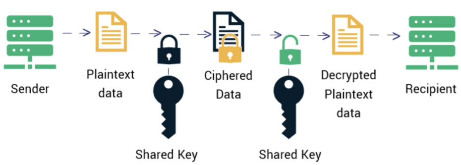
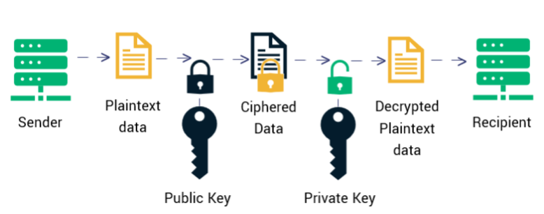

# 2.5.1 HTTPS 加密原理

本节，笔者以问题的形式，逐步解开 HTTPS 的面纱，帮助你彻底搞懂 HTTPS 加密原理。

## 1. 为什么需要加密

HTTP 内容以明文传输，经过中间代理服务器、路由器、WIFI 热点或通信服务运营商节点时，传输的内容完全暴露。以明文传输，中间人还能篡改内容，且不被双方察觉。为防止“中间人攻击”（MITM），我们需要对信息进行加密。最容易理解的加密方式就是对称加密！

## 2. 什么是对称加密
加密和解密使用同一个密钥，密钥必须严格保密。换句话说，只有知道密钥的人才能解密密文，只要密钥不被中间人获取，两方通信的机密性就能得到保证。常用的对称加密算法有 AES、ChaCha20、DES 等。

:::center
   
 图 2-11 对称加密示例
:::

## 3. 只用对称加密是否可行

对称加密的关键在于保护密钥不被泄露。但是，HTTP 通信模型是 1 对 N，所有客户端共享同一个密钥，实际等同于没有加密。如果由每个客户端随机生成一个密钥，并传输给服务端，那是否解决了共享密钥的问题呢？但难题是，如何将随机密钥传给服务端，同时不被别人知道。

此时，我们必须换一种思路，只使用对称加密就会陷入无限循环的死胡同。现在，“非对称加密算法”登场！

:::center
   
 图 2-13 对称加密模式下密钥协商过程
:::

## 4. 什么是非对称加密

简单说，加密和解密使用不同的密钥，两个密钥相互关联。一把密钥可以公开，称作公钥（Public Key）；另一把称私钥（Private Key），必须保密。用公钥加密的内容必须用对应的私钥才能解密，同样，私钥加密的内容只有对应的公钥才能解密。

:::center
   
 图 2-11 非对称加密
:::

相比对称加密算法，非对称加密算法需要更多的计算资源！因此，我们使用计算效率高的对称加密算法加密 HTTP 内容，使用非对称加密算法加密对称加密算法的密钥。请看下面的过程：

- 首先，客户端与服务端进行协商，确定一个双方都支持的对称加密算法，例如 AES。
- 确认对称加密算法后，客户端随机生成一个对称加密密钥 K。
- 客户端使用公钥加密密钥 K，然后将密文传输给服务端。此时，只要服务端有私钥，就能能解密，得到密钥 K。
 
如此，我们实现了降低加/解密耗时，同时保证密钥传输的安全性，达成既安全又高效的目标。

现在，继续讨论新的问题，客户端如何获取公钥？

## 5. 公钥仍有被劫持的可能性

如果服务端直接将公钥发送给浏览器，无法避免中间被截获的风险。请看下面的过程：

-  浏览器发起请求，服务器把公钥 A 明文给传输浏览器。
- 中间人劫持公钥 A，把数据包中的公钥 A 替换成自己伪造的公钥 B（它当然也拥有公钥 B 对应的私钥 B）。
- 浏览器生成用于对称加密的密钥 X，用公钥 B（浏览器无法得知公钥被替换了）加密后传给服务器。
- 中间人劫持密文，使用私钥 B 解密得到密钥 X。同时，密文继续转发给服务器。
- 服务器收到密文，用私钥 A 解密得到密钥 X。

:::center
   
 图 2-14 公钥存在被截获的可能性
:::

中间人在双方毫无察觉的情况下，通过一套“狸猫换太子”的操作，掉包了服务器传来的公钥，进而得到了密钥 X。这个问题的根本原因是，浏览器无法确认收到的公钥是不是网站自己的。公钥本身是明文传输的，难道还得对公钥的传输进行加密？

## 6. 证明浏览器收到的公钥一定是该网站的公钥

其实所有证明的源头都是一条或多条不证自明的“公理”，由它推导出一切。比如现实生活中，若想证明某身份证号一定是小明的，可以看他身份证，而身份证是由政府作证的，这里的“公理”就是“政府机构可信”，这也是社会正常运作的前提。

那能不能类似地有个机构充当互联网世界的“公理”呢？让它作为一切证明的源头，给网站颁发一个“身份证”？它就是 CA 机构（CA，Certificate Authority，证书认证机构），它是如今互联网世界正常运作的前提，而 CA 机构颁发的“身份证”就是数字证书。

## 7. 什么是数字证书

网站在使用 HTTPS 前，需要向 CA 机构申领一份数字证书，数字证书里含有证书持有者、域名、公钥、过期时间等信息。服务器把证书传输给浏览器，浏览器从证书里获取公钥就行了。

数字证书就如身份证，证明“该公钥对应该网站”。而这里又有一个显而易见的问题，传输证书过程中，如何防止被篡改？即如何证明证书本身的真实性。请看证书的“防伪技术”，也就是数字签名的处理过程：

1. CA 机构持有一对非对称加密的私钥和公钥。
2. CA 机构对证书的明文数据 T 进行哈希处理。
3. 使用私钥对哈希值进行加密，生成数字签名 S。

接收方根据证书内容重新计算哈希值，并与数字签名 S 比对。如果两者一致，就说明数据未被篡改。

## 8. 中间人有可能篡改数字证书么

既然无法篡改证书，那么如果证书被替换呢？假设另一个网站 B 也持有 CA 机构认证的证书，它试图劫持网站 A 的通信。假设 B 成为中间人，拦截了 A 发送给浏览器的证书，然后将其替换为自己的证书传递给浏览器。

实际上，这种情况不会发生，因为证书中包含了网站 A 的相关信息，包括域名。浏览器会将证书中的域名与实际请求的域名进行比对，如果二者不匹配，浏览器就能发现证书已被替换，从而避免中间人攻击。

## 9. 怎么证明 CA 机构的公钥是可信的？

让我们回顾一下数字证书的作用：它的目的是验证某个公钥的可信度，即确认“该公钥是否属于指定的网站”。那么，CA 机构的公钥是否也可以通过数字证书来验证呢？没错，操作系统和浏览器通常会预装一些信任的根证书，其中就包括 CA 机构的根证书。

实际上，证书的认证可以是多层次的：例如，A 信任 B，B 信任 C，依此类推。这种层层认证构成了信任链或数字证书链，根证书作为起点，通过一层层的信任传递，使终端实体证书的持有者能够获得转授的信任。从整个流程来看，HTTPS 的安全性关键在于根证书是否被篡改。如果根证书被篡改，信息传输的安全性将不再得到保证。

总结 HTTPS 的通信加密逻辑，如图 2-16 所示：服务端向 CA 机构申请证书，并在 TLS 握手阶段将证书发送给客户端，客户端随后验证证书的合法性。接下来，服务器为每个客户端维护一个 session ID 。浏览器生成好密钥传给服务器后，服务器会把该密钥存到相应的 session ID 下，之后浏览器每次请求都会携带 session ID，服务器会根据 session ID 找到相应的密钥并进行解密加密操作，这样就不必要每次重新制作、传输密钥了！

:::center
   
图 2-16 HTTPS 通信流程
:::

